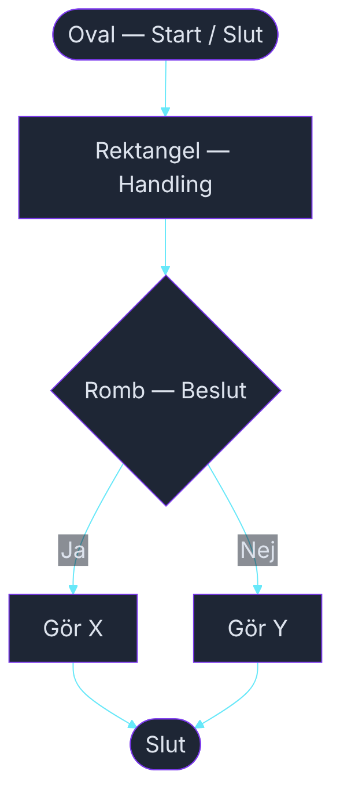

# Rita och debugga flödesscheman — Parövning

**Tid:** 45–60 minuter  
**Gruppstorlek:** Par om 2  
**Material:** Papper och penna (eller whiteboard)  
**Ingen kod krävs**

---

## Kom ihåg — de fyra formerna

<!-- mermaid: diagrams/ovning_flödesscheman_debug_1.mmd -->

---

## Del 1 — Rita (20 min)

Välj **ett scenario** nedan. Rita ett flödesschema på papper — tydligt nog att ett annat par ska kunna följa det.

Tänk på:
- Varje ruta gör **en sak**
- Varje romb ger **två pilar** — Ja och Nej
- Alla pilar leder någonstans — inga lösa ändar
- Alla flöden måste nå ett Slut

---

### Scenario A — Miniräknaren 🔢

Programmet frågar användaren efter **två tal** och en **operation** (+, -, ×, ÷).  
Det utför beräkningen och skriver ut svaret.  
Om användaren väljer ÷ och täljaren är 0 — skriv ut ett felmeddelande istället.

---

### Scenario B — Inloggningen 🔑

Programmet frågar efter ett lösenord.  
Rätt lösenord: skriv ut "Välkommen!" och avsluta.  
Fel lösenord: låt användaren försöka igen.  
Efter **3 misslyckade försök**: lås kontot och avsluta.

---

### Scenario C — Jackan ☁️

Programmet frågar: "Hur många grader är det ute?"  
Under 10 grader: "Ta på dig jacka."  
Mellan 10 och 20: "Kanske ta med jackan."  
Över 20 grader: "Ingen jacka behövs."  
Skriv sedan alltid ut: "Ha en bra dag!" och avsluta.

---

### Scenario D — Biofilmen 🎬

Programmet frågar om man är minst 15 år, om filmen är åldersmärkt 15, och om man har råd (biljettpriset är 120 kr).  
Bara om **alla tre** villkor är uppfyllda: "Du kan se filmen."  
Annars: skriv ut **vilket** villkor som inte är uppfyllt och avsluta.

---

## Del 2 — Byt och debugga (20 min)

Byt schema med ett annat par.

Läs igenom deras schema och leta efter **buggar** — precis som man granskar kod.

Frågor att ställa:
- Går det att följa alla pilar hela vägen till Slut?
- Finns det fall som schemat inte hanterar?
- Är något beslut otydligt — vad räknas som Ja och vad räknas som Nej?
- Är någon ruta för stor — gör den flera saker på en gång?

Skriv ner era kommentarer direkt på pappret (eller på ett post-it bredvid).  
Inga snälla omskrivningar — en bugg är en bugg.

---

## Del 3 — Diskutera med originalparet (10 min)

Återlämna schemat. Gå igenom kommentarerna tillsammans.

- Håller ni med om buggarna? Varför / varför inte?
- Vad skulle ni ändra om ni fick rita om det?
- Hittade ni en bugg som ni inte tänkt på själva?

---

## Avslutning — Hela klassen

Läraren samlar ihop: vilka buggar hittade ni?  
Vad var svårast att rita rätt från början?

> 💡 Det ni precis gjorde kallas **kod-granskning** — code review.  
> Det är en av de viktigaste sakerna en professionell utvecklare gör varje dag.

---

*Läraren leder avslutningsdiskussionen.*
