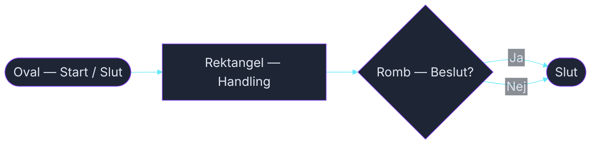

<!-- _class: title -->

# Rita och debugga flödesscheman

### Parövning — penna och papper

_Kurs 01 · Vecka 1 · Nion Education_

---

## Kom ihåg — de fyra formerna

<!-- mermaid: diagrams/ovning_flödesscheman_debug_marp_1.mmd -->

- **Oval** — start och slut
- **Rektangel** — en handling (beräkna, skriva ut, spara)
- **Romb** — ett beslut, en fråga med ja/nej
- **Pil** — flödet, vart vi går härnäst

---

## Del 1 — Rita (20 min)

Välj **ett eller flera scenarion** nedan.  
Rita flödesschema på papper — tydligt nog att ett annat par kan följa det.

**Tänk på:**
- Varje ruta gör **en sak**
- Varje romb ger **två pilar** — Ja och Nej
- Alla pilar leder någonstans — inga lösa ändar
- Alla flöden måste nå ett Slut

---

## Scenario A — Miniräknaren 🔢

Programmet frågar användaren efter **två tal** och en **operation** (+, -, ×, ÷).

Det utför beräkningen och skriver ut svaret.

Om användaren väljer ÷ och nämnaren är 0 — skriv ut ett felmeddelande istället.

---

## Scenario B — Inloggningen 🔑

Programmet frågar efter ett lösenord.

- Rätt lösenord → skriv ut "Välkommen!" och avsluta
- Fel lösenord → låt användaren försöka igen
- Efter **3 misslyckade försök** → lås kontot och avsluta

---

## Scenario C — Jackan ☁️

Programmet frågar: "Hur många grader är det ute?"

- Under 10° → "Ta på dig jacka"
- Mellan 10–20° → "Kanske ta med jackan"
- Över 20° → "Ingen jacka behövs"

Skriv sedan alltid ut: "Ha en bra dag!" och avsluta.

---

## Scenario D — Biofilmen 🎬

Programmet kontrollerar tre villkor:
- Är du minst 15 år?
- Är filmen åldersmärkt 15?
- Har du råd? (biljettpriset är 120 kr)

Bara om **alla tre** stämmer → "Du kan se filmen."

Annars → skriv ut **vilket** villkor som inte är uppfyllt och avsluta.

---

## Del 2 — Byt och debugga (20 min)

Byt **alla era scheman** med ett annat par.

Läs igenom deras scheman och leta efter buggar:

- Går det att följa alla pilar hela vägen till Slut?
- Finns det fall som schemat inte hanterar?
- Är något beslut otydligt — vad räknas som Ja och Nej?
- Gör någon ruta för många saker på en gång?

Skriv kommentarer direkt på pappret.  
**Inga snälla omskrivningar — en bugg är en bugg.**

---

## Del 3 — Diskutera med originalparet (10 min)

Återlämna **alla scheman**. Gå igenom kommentarerna tillsammans.

- Håller ni med om buggarna?
- Vad skulle ni ändra om ni fick rita om?
- Hittade de en bugg ni inte sett själva?

---

<!-- _class: title -->

## Det ni precis gjorde kallas **code review**

### Det är en av de viktigaste sakerna en professionell utvecklare gör varje dag.

---

## Avslutning — Hela klassen

Läraren samlar ihop:

- Vilka buggar hittade ni?
- Vilket scenario var svårast att rita rätt?
- Vad lärde ni er om att tänka **innan** ni kodar?
