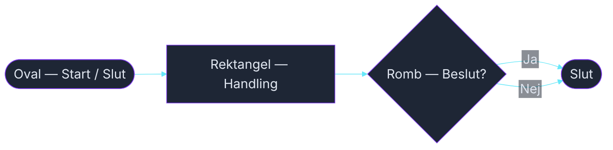
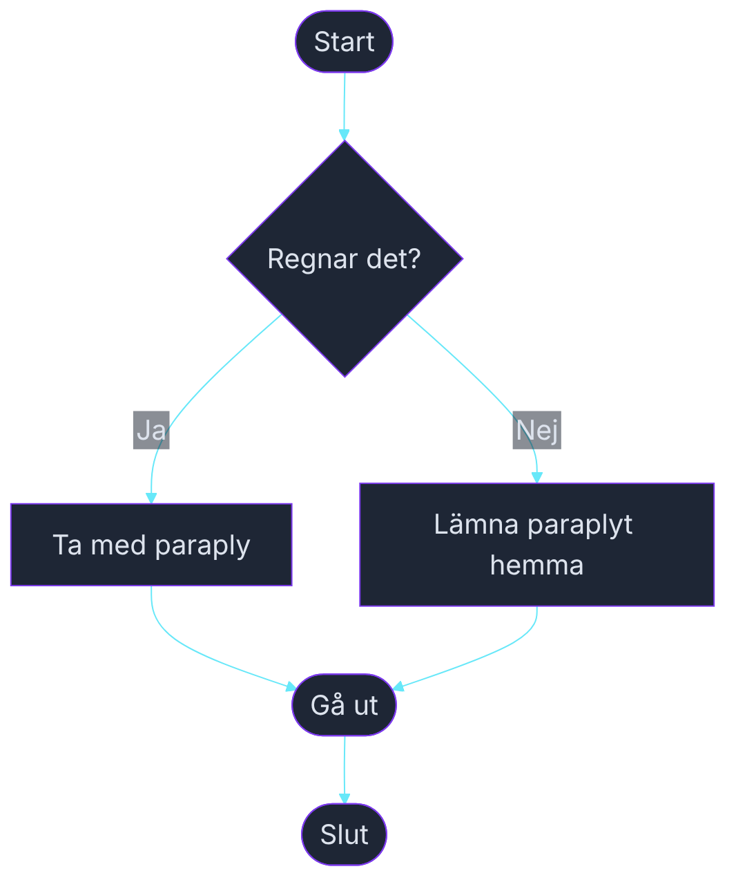
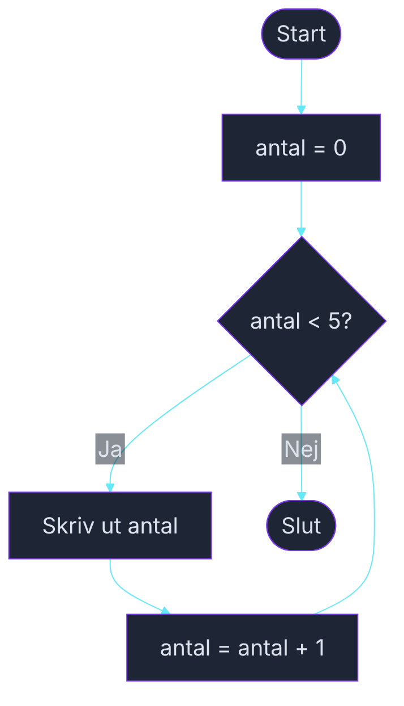

<!-- _class: title -->

# Flödesscheman och pseudokod

### Planera koden innan du skriver den

_Kurs 01 · Vecka 1 · Nion Education_

---

## Varför planera?

En bra programmerare skriver inte direkt kod.
De **tänker igenom problemet först**.

```
Problem → Plan → Kod
```

Det är mycket lättare att rätta till en plan på papper
än att rätta till kod som inte fungerar.

> 💬 _"Planera två gånger, koda en gång."_

---

## Flödesschema — en karta över logiken

Ett flödesschema visar **vad programmet gör, steg för steg**.

Fyra grundformer:



<!-- mermaid: diagrams/flödesscheman_marp_1.mmd -->

- **Oval** — start och slut
- **Rektangel** — en handling (beräkna, skriva ut, spara)
- **Romb** — ett beslut, en fråga med ja/nej
- **Pil** — flödet, vart vi går härnäst

---

## Exempel: Ska jag ta med paraply?



<!-- mermaid: diagrams/flödesscheman_marp_2.mmd -->

---

## Pseudokod — kod på svenska

Pseudokod är ett mellansteg mellan flödesschema och riktig kod.
Skriv **logiken med ord**, inte syntax.

```
START
  Om det regnar
    Ta med paraply
  Annars
    Lämna paraplyt hemma
  Slut om
  Gå ut
SLUT
```

Ingen kompilator kan läsa det — men **du** kan.
Det är poängen.

---

## Från pseudokod till C#

```
// Pseudokod:
// Om det regnar
//   Skriv ut "Ta med paraply"
// Annars
//   Skriv ut "Lämna paraplyt hemma"
```

```csharp
bool regnar = true;

if (regnar)
{
    Console.WriteLine("Ta med paraply!");
}
else
{
    Console.WriteLine("Lämna paraplyt hemma.");
}
```

Strukturen är **exakt densamma**.
Pseudokoden blev kod — ord för ord.

---

## Övning — Rita ett flödesschema

**Scenario:** Ett program som avgör om man får köra bil.

Regler:
- Man måste vara minst 18 år
- Man måste ha körkort

Gör så här:
1. Rita flödesschemat på papper (eller whiteboard)
2. Skriv pseudokoden
3. Vi jämför lösningar tillsammans

_Det finns inget rätt svar på hur man ritar — bara tydliga och otydliga._

---

## Loops i flödesscheman

En loop är en pil som **går tillbaka**.



<!-- mermaid: diagrams/flödesscheman_marp_3.mmd -->

---

## Vad har vi lärt oss?

- **Flödesschema** — rita logiken visuellt innan du kodar
- **Pseudokod** — skriv logiken på svenska (eller engelska)
- **Beslut** = romb, **Handling** = rektangel, **Start/Slut** = oval
- En **loop** är en pil som vänder tillbaka

Nästa steg: Git — och sedan kodar vi det för riktigt.

---

<!-- _class: title -->

# Rita på papper

### Det är inte fusk — det är proffsigt

_Alla bra programmerare planerar innan de kodar._
