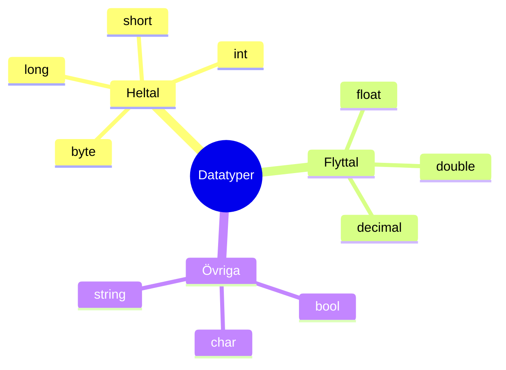
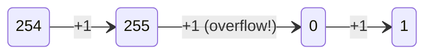

# Programmeringstermer — Datatyper

Tänk på en datatyp som en burk. Olika burkar rymmer olika saker och olika mängder. Välj fel burk och du får antingen slöseri med plats eller en burk som spricker när du fyller den för mycket.



---

## byte

Den minsta vanliga heltalsburken. Rymmer bara **0 till 255** — 256 möjliga värden totalt (en byte är 8 bitar, och 2⁸ = 256).

```csharp
byte ålder = 25;
Console.WriteLine(ålder);
```

### Output
```plaintext
25
```

Används sällan i vardaglig kod numera (minne är billigt), men dyker upp när du jobbar med rådata, bilder, eller filer — saker som faktiskt är byte för byte.

<details><summary>Vad händer om jag fyller burken för mycket?</summary>

```csharp
byte b = 255;
b = (byte)(b + 1); // (byte)-castet tvingar resultatet tillbaka in i burken
Console.WriteLine(b);
```

### Output
```plaintext
0
```

Den "spiller över" och börjar om på 0. Det kallas **overflow**. Lägg märke till att `(byte)`-castet behövs — `b + 1` räknas annars ut som en `int` i bakgrunden, C# gör heltalsräkning i minst `int`-storlek av säkerhetsskäl.



</details>

**Se även:** [short](#short) — nästa burk-storlek upp.

---

## short

En något större burk: **-32 768 till 32 767**.

```csharp
short temperatur = -15;
Console.WriteLine(temperatur);
```

### Output
```plaintext
-15
```

Lägg märke till att `short` (till skillnad från `byte`) kan vara negativ — halva utrymmet går till negativa tal, halva till positiva.

**Se även:** [byte](#byte), [int](#int).

---

## int

**Standardburken.** Om du inte vet vilken heltalstyp du ska välja — välj `int`. Rymmer **-2 147 483 648 till 2 147 483 647**, vilket räcker för nästan allt du stöter på i vanlig kod (folkmängder, poäng, antal rader i en fil, åldrar, ja allt).

```csharp
int poäng = 1500000;
Console.WriteLine(poäng);
```

### Output
```plaintext
1500000
```

<details><summary>Vad händer om jag verkligen fyller burken för mycket?</summary>

```csharp
int max = int.MaxValue;
Console.WriteLine(max);
Console.WriteLine(max + 1);
```

### Output
```plaintext
2147483647
-2147483648
```

Samma overflow-fenomen som hos `byte`, bara i större skala — burken spiller över och hamnar längst ner på den negativa sidan istället för att krascha. Det är värt att veta att det finns, även om du sällan kommer nära gränsen i praktiken.

</details>

**Se även:** [long](#long) — när `int` inte räcker.

---

## long

Jätteburken. **-9 223 372 036 854 775 808 till 9 223 372 036 854 775 807**. Du tar till `long` när talen blir så stora att `int` helt enkelt inte får plats — folkräkningar i miljarder, filstorlekar i byte, eller stora ID-nummer.

```csharp
long världsbefolkning = 8200000000; // 8,2 miljarder — för stort för int
Console.WriteLine(världsbefolkning);
```

### Output
```plaintext
8200000000
```

Om du försökt spara samma tal i en `int` hade du fått ett kompilatorfel direkt — `int` kan inte ens innehålla värdet, så C# stoppar dig innan programmet ens körs.

---

## float

Den mindre precisa flyttalsburken — cirka 6-7 siffrors precision. Snabbare och tar mindre minne än `double`, men det är sällan värt det i vanlig kod nuförtiden. Skrivs med ett `f` efter talet: `3.14f`.

```csharp
float pi = 3.14159265f;
Console.WriteLine(pi);
```

### Output
```plaintext
3.1415927
```

Lägg märke till att talet redan tappat några decimaler jämfört med vad du skrev in — det är `float`s begränsade precision i praktiken. *(Exakt hur många siffror som visas kan skilja lite mellan .NET-versioner — kör gärna själv och jämför.)*

**Se även:** [double](#double) — samma idé, mer precision.

---

## double

**Standardflyttalet** i C#. Dubbel precision jämfört med `float` (namnet är ingen slump) — cirka 15-17 siffrors precision. Om du inte har en specifik anledning att välja något annat flyttal, välj `double`.

```csharp
double a = 0.1;
double b = 0.2;
Console.WriteLine(a + b);
```

### Output
```plaintext
0.30000000000000004
```

<details><summary>Vänta, det är ju inte 0.3?</summary>

Nej — och det är inte ett buggat exempel, det är hur flyttal fungerar i *alla* programmeringsspråk (samma sak händer i Python, JavaScript, Java...). Datorn lagrar flyttal i binärt format, och precis som `1/3` inte går att skriva exakt i decimaltal (0,3333...), går vissa "enkla" decimaltal inte att skriva exakt i binärt format. Det blir en superliten avrundningsfel som ibland syns.

**Lärdomen:** jämför aldrig flyttal med `==` om du kan undvika det, och använd `decimal` istället för pengar (se nedan).

</details>

**Se även:** [decimal](#decimal) — flyttal som faktiskt är exakt, byggt för pengar.

---

## decimal

Flyttal byggt specifikt för **pengar och exakta beräkningar** — ingen av `double`s avrundningsknöl. Mindre minneseffektiv och något långsammare, men det spelar ingen roll när du räknar ören. Skrivs med ett `m` efter talet: `19.99m`.

```csharp
decimal pris = 19.99m;
decimal moms = pris * 0.25m;
Console.WriteLine(moms);
```

### Output
```plaintext
4.9975
```

Exakt, varje gång. Regel: pengar → `decimal`. Allt annat flyttal → `double`, om du inte har en specifik anledning till `float`.

---

## bool

Den enklaste burken av alla — den rymmer exakt två värden: `true` eller `false`. Inget annat får plats, inga gråzoner.

```csharp
bool ärKlar = true;
Console.WriteLine(ärKlar);
```

### Output
```plaintext
True
```

Lägg märke till stort **T** i outputen — C# skriver `True`/`False` med versal första bokstav när den skriver ut en `bool`, även om du skriver `true`/`false` med gemener i koden.

---

## char

Ett **enda** tecken — bokstav, siffertecken eller symbol. Skrivs inom **enkla** citattecken (`'A'`), till skillnad från `string` som använder dubbla (`"A"`).

```csharp
char bokstav = 'A';
Console.WriteLine(bokstav);
Console.WriteLine((int)bokstav);
```

### Output
```plaintext
A
65
```

<details><summary>Varför blev "A" plötsligt 65?</summary>

Varje tecken har ett nummer bakom kulisserna (en teckenkod) — `'A'` är 65, `'B'` är 66, och så vidare enligt en standard som kallas Unicode (en utbyggnad av den äldre ASCII-standarden). `char` är egentligen ett tal som C# *visar* som ett tecken. Castet `(int)bokstav` plockar fram talet som ligger under ytan.

</details>

**Se även:** [string](#string) — en kedja av flera `char`.

---

## string

Text — tekniskt sett en ordnad sekvens av `char`. Till skillnad från alla typer ovan är `string` inte en värdetyp utan en **referenstyp** (mer om den skillnaden i en egen post senare).

```csharp
string namn = "Cecilia";
Console.WriteLine(namn);
Console.WriteLine(namn.Length);
```

### Output
```plaintext
Cecilia
7
```

`string` har ett helt eget universum av metoder (`Trim`, `Replace`, `Split`, string interpolation med `$"{}"`...) — se en egen kategorifil för det, `strangar.md`, när den finns.

**Se även:** [char](#char).
