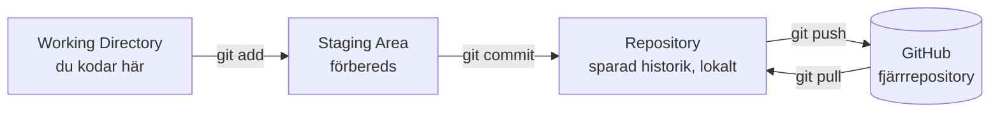
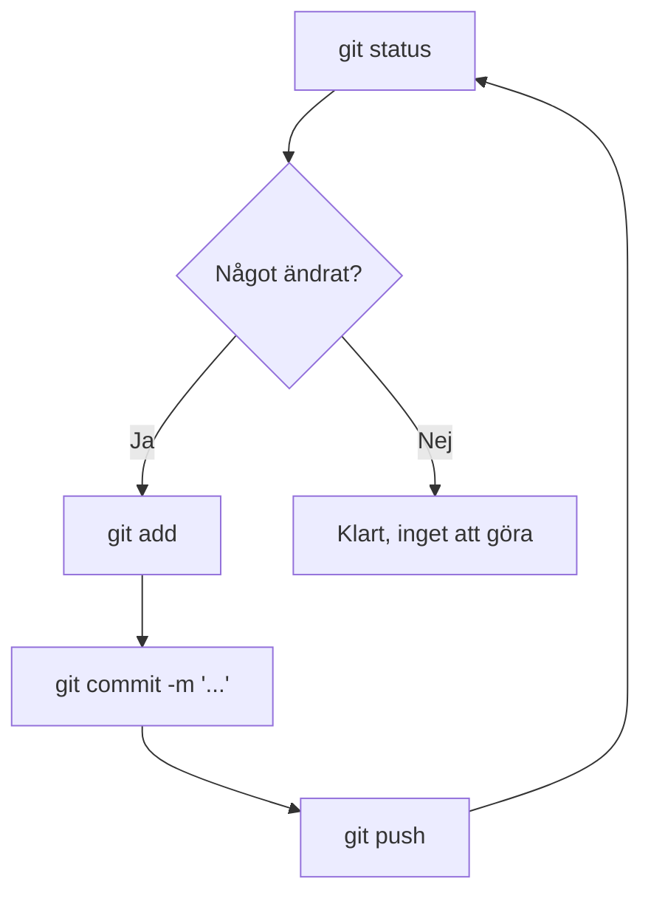
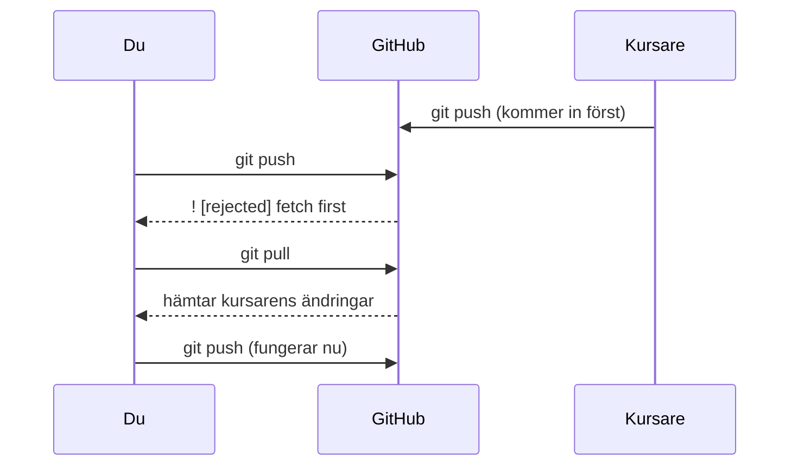

# Programmeringstermer — Git

## Git

Git är ett versionshanteringssystem — en tidsmaskin för din kod. Det håller koll på varje ändring du gör, så du alltid kan gå tillbaka och se hur ett projekt såg ut igår, förra veckan, eller dagen innan allt gick sönder.

Utan Git slutar det ofta såhär:

```plaintext
projekt/
├── Program.cs
├── Program_gammal.cs
├── Program_fungerar.cs
├── Program_final.cs
└── Program_final_RIKTIG.cs
```

Med Git finns det alltid bara **en** version av varje fil. Historiken sparas i bakgrunden — du behöver aldrig döpa en fil till "RIKTIG" igen.

**Se även:** [De tre områdena](#de-tre-omradena), [git Bash](verktyg.md#git-bash).

---

## De tre områdena

Tre begrepp förklarar hela Git-flödet:

- **Working Directory** — mappen där du faktiskt kodar. Vanlig redigering, som vanligt.
- **Staging Area** — en förberedelseplats. Du väljer vilka filer som ska ingå i nästa sparning (`git add`).
- **Repository** — den faktiska historiken. `git commit` skapar en permanent ögonblicksbild av allt som är stagat.



GitHub är ett **fjärrrepository** — en kopia av historiken som ligger online. Du synkar dit med `git push` (ladda upp) och hämtar med `git pull` (ladda ner).

**Se även:** [git add](#git-add), [git commit](#git-commit), [git push / git pull](#git-push--git-pull).

---

## git status

Den kommandot du ska köra **innan** du gör något annat. Det visar exakt vad som ändrats sedan senaste commit.

```bash
git status
```

### Output
```plaintext
On branch main
Changes not staged for commit:
  modified:   Program.cs
```

**Ritualen:** `git status` → `git add` → `git commit` → `git push`. Varje gång. Det blir en ryggmärgsreflex efter ett par veckor.



---

## git add

Flyttar en ändring från Working Directory till Staging Area — du säger "ja, den här filen ska vara med i nästa sparning."

```bash
git add Program.cs    # en specifik fil
git add .              # alla ändrade filer
```

---

## git commit

Tar allt som är stagat och skapar en permanent ögonblicksbild i historiken.

```bash
git commit -m "Lägg till validering av e-postadress"
```

<details><summary>Vad gör ett bra commit-meddelande?</summary>

Det förklarar **vad** och **varför** — koden visar redan **hur**.

```bash
# Bra
git commit -m "Fixa krasch när lista är tom"

# Dåligt — säger ingenting
git commit -m "fix"
git commit -m "asdf"
```

Commit-historiken är din dokumentation. Tre månader senare, när du undrar varför ett beslut togs, är ett bra meddelande guld värt — "asdf" hjälper ingen.

</details>

---

## git push / git pull

`git push` skickar din lokala historik till GitHub. `git pull` hämtar ner det som finns där men inte hos dig.

```bash
git push    # ladda upp dina commits
git pull    # hämta andras commits
```

<details><summary>Varför blir push ibland avvisad?</summary>

Om GitHub har commits du inte har lokalt (t.ex. en kursare pushat före dig) säger Git nej:

```plaintext
! [rejected] main -> main (fetch first)
```



Lösningen är alltid samma: `git pull` innan `git push`. Ännu bättre vana — pulla *innan* du börjar jobba, inte bara innan du pushar.

</details>

**Se även:** Krånglar det till sig på riktigt? Se [`git_konflikter.md`](../notes/git_konflikter.md).

---

## git clone

Hämtar ett befintligt repo från GitHub ner till din dator — en fullständig kopia, historik och allt.

```bash
git clone git@github.com:anvandarnamn/repo-namn.git
cd repo-namn
```

---

## git init

Förvandlar en vanlig mapp till ett Git-repo. Används när du startar ett helt nytt projekt som inte finns på GitHub än.

```bash
git init
git remote add origin git@github.com:dittnamn/repo-namn.git
git add .
git commit -m "Initial commit"
git push -u origin main
```

`-u origin main` behövs bara den första gången — efteråt räcker `git push`.

---

## .gitignore

En fil i projektets rot som talar om för Git vilka filer som aldrig ska sparas i historiken.

```plaintext
bin/
obj/
.vs/
*.user
.env
secrets.json
```

`bin/` och `obj/` kan vara hundratals megabyte och genereras om automatiskt — ingen anledning att spara dem. `.env` och `secrets.json` kan innehålla lösenord och API-nycklar — om de hamnar på GitHub kan de missbrukas av automatiserade bottar inom minuter. Skapa `.gitignore` **innan** din första commit, inte efteråt.

---

## SSH-nyckel

Ett par av filer — en privat (stannar på din dator) och en publik (läggs på GitHub) — som låter dig ansluta till GitHub utan att skriva lösenord varje gång.

```bash
ssh-keygen -t ed25519 -C "din@email.com"
cat ~/.ssh/id_ed25519.pub
ssh -T git@github.com
```

### Output
```plaintext
Hi dittnamn! You've successfully authenticated
```

Behövs framför allt om du hanterar mer än ett GitHub-konto på samma dator. En enda inloggning räcker det att logga in via webbläsaren när Git frågar första gången.

---

## Merge-konflikt

Uppstår när Git inte kan avgöra automatiskt vilken av två ändringar som ska gälla — t.ex. om du och en kursare ändrat samma rad i samma fil på varandras versioner.

Det är inte ett misstag, det är Git som ber dig fatta ett beslut den inte kan fatta själv.

**Se även:** Fullständig genomgång med exempel i [`git_konflikter.md`](../notes/git_konflikter.md).
