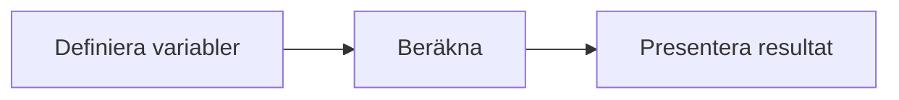

# Övning — Katten Mjukis

Din katt heter Mjukis. Han väger 12 kg.

En normalviktig katt väger 4–5 kg.
Veterinären rekommenderar 40 gram torrfoder per kg kroppsvikt och dag.
En påse torrfoder väger 2 kg och kostar 89 kr.


Din uppgift: räkna ut vad Mjukis kostar att mata — och hur lång tid dieten tar.

## Flödesschema



## Kodning

---

## Steg 1: Deklarera variabler

```csharp
int mjukisVikt = 12;         // kg
int normalVikt = 5;          // kg
int forderGramPerKg = 40;    // gram per kg och dag
int påsVikt = 2000;          // gram (2 kg)
int påsPris = 89;            // kr
```

Skriv ut Mjukis vikt och hur många kg övervikt han har.

### Förväntad output
```plaintext
Mjukis väger: 12 kg
Normalvikt: 5 kg
Övervikt: ### kg
```

<details><summary>Hur räknar jag ut övervikt?</summary>

```csharp
int övervikt = mjukisVikt - normalVikt;
```

</details>

---

## Steg 2: Daglig matportion

Hur många gram torrfoder ska Mjukis ha per dag?

### Förväntad output
```plaintext
Daglig portion: ### gram
```

<details><summary>Formel</summary>

```csharp
int dagligPortion = mjukisVikt * forderGramPerKg;
```

</details>

---

## Steg 3: Hur länge räcker en påse?

En påse väger 2000 gram. Hur många dagar räcker den för Mjukis?

### Förväntad output
```plaintext
En påse räcker: ### dagar
```

<details><summary>Heltalsdivision igen</summary>

```csharp
int dagarPerPåse = påsVikt / dagligPortion;
```

Kom ihåg: int / int kapar decimalen. 2000 / 480 = 4 (inte 4.16).

</details>

---

## Steg 4: Månadskostnad

Hur många påsar går det på en månad (30 dagar) och vad kostar det?

### Förväntad output
```plaintext
Påsar per månad: ### st
Månadskostnad: ### kr
```

<details><summary>Hur många påsar på 30 dagar?</summary>

```csharp
int påsarPerMånad = 30 / dagarPerPåse;
int månadskostnad = påsarPerMånad * påsPris;
```

</details>

---

## Steg 5: Dieten

Veterinären sätter Mjukis på diet. Han ska gå ner 0.1 kg per vecka tills han når normalvikt.

Hur många veckor tar det?

### Förväntad output
```plaintext
Mjukis ska gå ner: ### kg
Det tar ### veckor
```

<details><summary>Tips</summary>

```plaintext
Övervikten vet du redan.
0.1 kg per vecka — men int hanterar inte decimaler.

Lösningen: räkna i tiondels-kg istället.
Övervikt i tiondels-kg = övervikt * 10
Veckor = övervikt * 10 / 1   (en tiondel per vecka)
```

</details>

<details><summary>Lösningsförslag</summary>

```csharp
int mjukisVikt = 12;
int normalVikt = 5;
int forderGramPerKg = 40;
int påsVikt = 2000;
int påsPris = 89;

int övervikt = mjukisVikt - normalVikt;
int dagligPortion = mjukisVikt * forderGramPerKg;
int dagarPerPåse = påsVikt / dagligPortion;
int påsarPerMånad = 30 / dagarPerPåse;
int månadskostnad = påsarPerMånad * påsPris;
int dietVeckor = övervikt * 10;

Console.WriteLine($"Mjukis väger: {mjukisVikt} kg");
Console.WriteLine($"Normalvikt: {normalVikt} kg");
Console.WriteLine($"Övervikt: {övervikt} kg");
Console.WriteLine();
Console.WriteLine($"Daglig portion: {dagligPortion} gram");
Console.WriteLine($"En påse räcker: {dagarPerPåse} dagar");
Console.WriteLine($"Påsar per månad: {påsarPerMånad} st");
Console.WriteLine($"Månadskostnad: {månadskostnad} kr");
Console.WriteLine();
Console.WriteLine($"Mjukis ska gå ner: {övervikt} kg");
Console.WriteLine($"Det tar {dietVeckor} veckor");
```

Dieten tar alltså ### veckor. Mjukis är inte glad.

</details>
