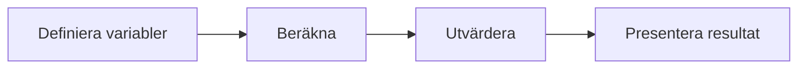

# Övning — Rabattkoden

Du vill köpa en jacka på Zara. Den kostar 799 kr men det är 30% rea.
Du har också ett presentkort på 150 kr som du fick i julklapp och aldrig använt.

Problemet: du har bara 500 kr på kontot.

## Flödesschema



## Kodning

---

## Steg 1: Deklarera variabler och skriv ut dem

```csharp
int ursprungspris = 799;
int rabattProcent = 30;
int presentkort = 150;
int saldo = 500;
```

Det här kallas att **deklarera** variabler. `int` betyder att vi jobbar med heltal. `ursprungspris` är namnet vi ger värdet — från och med nu kan vi skriva `ursprungspris` i koden och C# vet att det är 799.

Skriv ut ursprungspriset och hur stor rabatten är i procent.

### Förväntad output
```plaintext
Ursprungspris: 799 kr
Rabatt: 30%
```

<details><summary>Hur skriver jag ut ett procenttecken?</summary>

```csharp
Console.WriteLine($"Rabatt: {rabattProcent}%");
```

`$` framför citattecknet talar om för C# att det kan finnas variabler i texten. Variabelnamnet skrivs innanför måsvingar `{}` — det som är därinne bearbetas innan texten skrivs ut. `%` utanför är bara ett vanligt tecken.

Det coola: du kan till och med göra beräkningar inuti måsvingarna — `{pris - rabatt}` räknas ut direkt. Det kommer vi använda senare.

</details>

---

## Steg 2: Räkna ut rabattbeloppet i kronor

30% av 799 kr — hur många kronor är det?

### Förväntad output
```plaintext
Rabattbelopp: ### kr
```

<details><summary>Hur räknar jag ut procent i kod?</summary>

Tänk som i matten: 799 × 30 ÷ 100.

```csharp
int rabattBelopp = ursprungspris * rabattProcent / 100;
```

</details>

<details><summary>Division i C#</summary>

```plaintext
799 * 30 / 100 = 23970 / 100 = 239  (inte 239.7)
```

När du delar två `int` på varandra kapar C# bort decimalen helt — det kallas heltalsdivision. Här spelar det ingen roll för resultatet, men det är bra att veta till nästa gång.

</details>

Varje rad är en instruktion till kompilatorn. Den läser uppifrån och ner, en rad i taget, och utför exakt vad du skrivit. Inga antaganden, inga gissningar — bara det du faktiskt bad om.

---

## Steg 3: Priset efter rabatt

Dra av rabattbeloppet från ursprungspriset.

### Förväntad output
```plaintext
Pris efter rabatt: ### kr
```

<details><summary>Hur drar jag av ett belopp?</summary>

```csharp
int prisEfterRabatt = ursprungspris - rabattBelopp;
```

</details>

---

## Steg 4: Dra av presentkortet

Nu har du fått ner priset med rabatten. Dags att använda presentkortet.

### Förväntad output
```plaintext
Slutpris efter presentkort: ### kr
```

<details><summary>Samma princip som steg 3</summary>

```csharp
int slutpris = prisEfterRabatt - presentkort;
```

</details>

---

## Steg 5: Har du råd?

Jämför slutpriset med ditt saldo. Hur mycket är kvar — eller hur mycket saknas?

### Förväntad output
```plaintext
Ditt saldo: 500 kr
###
```

<details><summary>Hur räknar jag ut vad som är kvar?</summary>

```csharp
int kvar = saldo - slutpris;
```

Om `kvar` är positivt har du råd och kan köpa jackan.
Om `kvar` är negativt har du inte råd — och talet berättar precis hur mycket som saknas.

</details>

<details><summary>Lösningsförslag</summary>

```csharp
int ursprungspris = 799;
int rabattProcent = 30;
int presentkort = 150;
int saldo = 500;

int rabattBelopp = ursprungspris * rabattProcent / 100;
int prisEfterRabatt = ursprungspris - rabattBelopp;
int slutpris = prisEfterRabatt - presentkort;
int kvar = saldo - slutpris;

Console.WriteLine($"Ursprungspris:              {ursprungspris} kr");
Console.WriteLine($"Rabatt ({rabattProcent}%):             {rabattBelopp} kr");
Console.WriteLine($"Pris efter rabatt:          {prisEfterRabatt} kr");
Console.WriteLine($"Slutpris efter presentkort: {slutpris} kr");
Console.WriteLine();
Console.WriteLine($"Ditt saldo: {saldo} kr");
Console.WriteLine($"Kvar efter köp: {kvar} kr");
```


</details>
