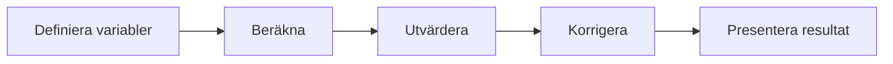

# Övning — Den saknade kronan

Alex, Sam och Kim beställer en pizza på Pizzeria Napoli. Den kostar 125 kr. <br>
Ingen har Swish — de betalar kontant. Var och en lägger fram sin 50-lapp. <br>

Kassan tar emot 150 kr och ger tillbaka 25 kr i växel. <br>
De kan inte dela 25 jämnt på tre — de tar 5 kr var och lämnar 10 kr i dricks. <br>
 <br>
På hemvägen börjar Alex räkna: <br>
 <br>
-"Vi betalade 50 kr var och fick 5 kr tillbaka, alltså betalade vi 45 kr var." <br>
-"45 × 3 = 135 kr." <br>
-"Plus de 10 kronorna i dricks... 135 + 10 = 145 kr." <br>
-"Men vi lade fram 150 kr. **Var är de fem kronorna?**" <br>


## Flödeschema



## Kod

Koden nedan räknar precis som Alex. Kör programmet, se vad som händer — och ta sedan reda på vart de fem kronorna tog vägen.

```csharp
int pizza = 125;
int alex = 50;
int sam = 50;
int kim = 50;
int dricks = 0;

Console.WriteLine($"Pizzan kostar {pizza} kr");
Console.WriteLine($"Alex har {alex} kr");
Console.WriteLine($"Sam har {sam} kr");
Console.WriteLine($"Kim har {kim} kr");
Console.WriteLine();

Console.WriteLine($"De betalar {alex + sam + kim} kr");
int växel = (alex + sam + kim) - pizza;

alex -= 50;
sam -= 50;
kim -= 50;

Console.WriteLine($"Kassan ger tillbaka {växel} kr");
Console.WriteLine();

Console.WriteLine("De delar upp växeln:");
alex += 5;
sam += 5;
kim += 5;
växel -= 15;
dricks = växel;

Console.WriteLine($"Alex har nu {alex} kr");
Console.WriteLine($"Sam har nu {sam} kr");
Console.WriteLine($"Kim har nu {kim} kr");
Console.WriteLine($"Och lämnar {dricks} kr i dricks");
Console.WriteLine();

Console.WriteLine("Summa summarum:");
int nettoBetalning = (50 - 5) * 3;
Console.WriteLine($"De betalade 50 - 5 kr var, alltså 45 × 3 = {nettoBetalning} kr");
Console.WriteLine($"Och lämnade {dricks} kr i dricks");
nettoBetalning += dricks;
Console.WriteLine($"Summan blir: {nettoBetalning} kr");

if (nettoBetalning != 150)
    Console.WriteLine("Error 404: Kronor not found");
```

### Förväntad output
```plaintext
Pizzan kostar 125 kr
Alex har 50 kr
Sam har 50 kr
Kim har 50 kr

De betalar 150 kr
Kassan ger tillbaka 25 kr

De delar upp växeln:
Alex har nu 5 kr
Sam har nu 5 kr
Kim har nu 5 kr
Och lämnar 10 kr i dricks

Summa summarum:
De betalade 50 - 5 kr var, alltså 45 × 3 = 135 kr
Och lämnade 10 kr i dricks
Summan blir: 145 kr
Error 404: Kronor not found
```

## Utmanande frågor

Vad hände med pengarna? Hur kan summan bli mindre? Var det en skum Pizzabagare eller någon av killarna som försöker lura till sig pengar?
<br>Vad tror du?
<br>Hur skulle du lösa detta dilemma?

Kopiera koden till din Visual Studio och kör den, se om du får samma resultat, ändra i koden om så mycket du vill tills du får fram ett bra resultat.

<details><summary>Tips 1</summary>

```plaintext
Koden fungerar — den kraschar inte.
Men något i beräkningarna stämmer inte.

Rita flödet på papper: vart tar varje krona vägen
från att de lägger fram sina 50-lappar till att
programmet skriver ut summan?
```

</details>

<details><summary>Tips 2</summary>

```plaintext
Titta på den sista beräkningen.

nettoBetalning = 45 × 3 = 135 kr

Vad ingår egentligen i de 135 kronorna?
Bara pizzan, eller något mer?
```

</details>

<details><summary>Tips 3</summary>

```plaintext
135 = 125 (pizza) + 10 (dricks)

Dricksen är redan inräknad i nettot.
Ska du verkligen addera dricks en gång till?
```

</details>

<details><summary>Lösningsförslag</summary>

För att förstå felet behöver vi tänka på vad de 135 kronorna faktiskt representerar.

45 × 3 = 135 är vad de betalade netto — alltså pizzapriset **plus** dricksen redan inräknad (125 + 10 = 135). Att sedan addera dricksen igen ger 145, inte 150.

Kronan är inte saknad. Matematiken var fel.

Det rätta sättet att kontrollera är att se till att alla pengar är redovisade:

```csharp
// pizza + tillbaka till personerna + dricks = totalt betalt
int kontroll = pizza + (alex + sam + kim) + dricks;
Console.WriteLine($"Kontroll: {pizza} + {alex + sam + kim} + {dricks} = {kontroll} kr");

if (kontroll == 150)
    Console.WriteLine("Alla kronor är redovisade.");
```

Felet heter **double counting** — dricksen räknades in två gånger. Det är ett klassiskt logikfel: koden körde utan krasch, men svaret var fel ändå.

Även om koden fungerar kan logiken vara kass.

</details>
