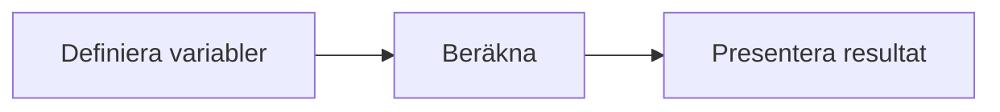

# Övning — Streaming vs bio

Du betalar varje månad för ett gäng streamingtjänster utan att tänka på det.
Men vad kostar det egentligen — och hur förhåller det sig till en biobiljett på Filmstaden?

## Flödesschema



## Kodning

---

## Steg 1: Definiera variabler och skriv ut dem

```csharp
int netflix = 169;
int spotify = 119;
int disney = 89;
int biobiljett = 169;
```

Skriv ut varje abonnemang med dess pris.

### Förväntad output
```plaintext
Netflix:  169 kr/mån
Spotify:  ### kr/mån
Disney+:  ### kr/mån
```

<details><summary>Hur skriver jag ut en variabel?</summary>

```plaintext
Console.WriteLine($"Netflix:  {netflix} kr/mån");
```

Dollartecknet + klamrar låter dig baka in en variabel direkt i texten.
Det kallas string interpolation.
</details>

---

## Steg 2: Total kostnad per månad

Räkna ihop vad alla tre abonnemang kostar per månad.

### Förväntad output
```plaintext
Totalt per månad: ### kr
```

<details><summary>Hur räknar jag ihop tre variabler?</summary>

```plaintext
int totalMånad = netflix + spotify + disney;
```

</details>

---

## Steg 3: Total kostnad per år

Ett år har 12 månader.

### Förväntad output
```plaintext
Totalt per år: ### kr
```

<details><summary>Hur multiplicerar jag?</summary>

```plaintext
int totalÅr = totalMånad * 12;
```

</details>

---

## Steg 4: Hur många biobesök är det?

Dela årsbeloppet med priset på en biobiljett.

### Förväntad output
```plaintext
Det motsvarar ### biobiljetter på Filmstaden.
```

<details><summary>Division i C#</summary>

```plaintext
int antalBio = totalÅr / biobiljett;
```

När du delar två int på varandra i C# får du ett heltal tillbaka.
26,8 biobesök avrundas automatiskt till 26 — decimalen försvinner.
Det kallas heltalsdivision.
</details>

<details><summary>Vad händer om du byter biljettpriser?</summary>

```plaintext
Testa biobiljett = 99  (billigaste plats)
Testa biobiljett = 269 (IMAX)

Hur förändras antalet?
```

</details>

<details><summary>Lösningsförslag</summary>

```csharp
int netflix = 169;
int spotify = 119;
int disney = 89;
int biobiljett = 169;

int totalMånad = netflix + spotify + disney;
int totalÅr = totalMånad * 12;
int antalBio = totalÅr / biobiljett;

Console.WriteLine($"Netflix:  {netflix} kr/mån");
Console.WriteLine($"Spotify:  {spotify} kr/mån");
Console.WriteLine($"Disney+:  {disney} kr/mån");
Console.WriteLine();
Console.WriteLine($"Totalt per månad: {totalMånad} kr");
Console.WriteLine($"Totalt per år:    {totalÅr} kr");
Console.WriteLine();
Console.WriteLine($"Det motsvarar {antalBio} biobiljetter på Filmstaden.");
```


</details>

## Bonusuppgift

Om du är en filmfantast och kollar på minst 3 filmer i veckan:
1. Vad skulle det kosta om du gick på bio istället?
2. Hur många filmer hinner du streama på ett år?

Vi deklarerar

```csharp
int filmerPerVecka = 3;
int veckorPerÅr = 52;
int bioKostnadPerFilm = 169;
```

och beräknar

```csharp
int filmerPerÅr = ?
int bioKostnadPerÅr = ?
int streamingKostnadPerÅr = totalÅr; // från övningen ovan
```

<details><summary>Fuskis</summary>

```csharp
int filmerPerÅr = filmerPerVecka * veckorPerÅr;
int bioKostnadPerÅr = filmerPerÅr * bioKostnadPerFilm;
int streamingKostnadPerÅr = totalÅr; // från övningen ovan
```

</details>


och nu räknar vi vad vi kommer att spara

```csharp
int sparadePengar = ?
```

<details><summary>Fuskis</summary>

```csharp
int sparadePengar = bioKostnadPerÅr - streamingKostnadPerÅr;
```
</details>


och slutligen skriver vi ut resultatet

```csharp
Console.WriteLine($"Filmer per år: {filmerPerÅr}");
Console.WriteLine($"Biokostnad per år: {bioKostnadPerÅr} kr");
Console.WriteLine($"Streamingkostnad per år: {streamingKostnadPerÅr} kr");
Console.WriteLine($"Du sparar: {sparadePengar} kr på streaming");
```

## Förväntad output

```plaintext
Filmer per år: ###
Biokostnad per år: ###
Streamingkostnad per år: ###
Du sparar: ### kr på streaming");
```

Bläh! Även om jag hade velat gå på bio till sådana priser, så många bra skräckfilmer släpps inte per år... ack. 