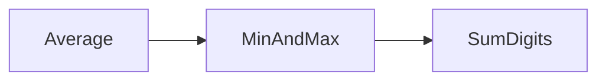

# Övning — BasicAlgorithms

Testa dina grundkunskaper i C#. Du ska implementera tre metoder — en som
räknar ut medelvärdet, en som hittar min- och maxvärdet, och en som summerar
siffrorna i en sträng.

**params-tricket:** Med `params` kan metoden ta emot antingen en kommaseparerad
lista eller en hel array — den som anropar bestämmer:

```csharp
int result1 = calc.Average(10, 11, 12, 13, 17);

int[] list = new int[] { 10, 20, 30, 42, 5, 9 };
int result2 = calc.Average(list);
```

Hur smidigt som helst för den som använder koden — lite mer att tänka på för
den som skriver den, men man kan inte få allt!

## Flödesschema



## Kodning

Börja med skelettklassen:

```csharp
namespace Algorithms
{
    public class BasicAlgorithms
    {
        public int Average(params int[] numbers)
        {
            int result = 0;
            // skriv din kod här

            Console.WriteLine("Medelvärdet är: " + result);
            return result;
        }

        public (int min, int max) MinAndMax(params int[] numbers)
        {
            int max = int.MinValue;
            int min = int.MaxValue;
            // skriv din kod här

            Console.WriteLine("Min och max: " + (min, max));
            return (min, max);
        }

        public int SumDigits(string number)
        {
            int sum = 0;
            // skriv din kod här

            Console.WriteLine("Summa: " + sum);
            return sum;
        }
    }
}
```

---

## Steg 1: Average — Medelvärdet

Beräkna medelvärdet av alla tal i `numbers`. Returnera ett heltal.

### Förväntad output

```plaintext
calc.Average(10, 20, 30)    → Medelvärdet är: 20
calc.Average(1, 2, 3, 4)    → Medelvärdet är: 2
```

<details><summary>Pseudokod</summary>

```plaintext
sum = 0
för varje tal i numbers:
    lägg till talet till sum
return sum / numbers.Length
```

</details>

<details><summary>Vanlig fallgrop</summary>

Om alla tal är positiva och du börjar med `sum = 0` funkar det — men tänk på
att `int / int` kapar decimalen. `7 / 2 = 3`, inte 3.5.

Finns det inga tal alls i arrayen (`numbers.Length == 0`) skulle du få
`DivideByZeroException`. Du behöver inte hantera det nu, men bra att veta om.

</details>

---

## Steg 2: MinAndMax — Minsta och största

Hitta det minsta och det största talet i `numbers`. Returnera båda som en tuple.

### Förväntad output

```plaintext
calc.MinAndMax(3, 1, 7, 2)    → Min och max: (1, 7)
calc.MinAndMax(-5, 0, 5)      → Min och max: (-5, 5)
```

<details><summary>Pseudokod</summary>

```plaintext
max = int.MinValue    // det minsta möjliga heltal — allt är större
min = int.MaxValue    // det största möjliga heltal — allt är mindre

för varje tal i numbers:
    om tal > max → max = tal
    om tal < min → min = tal

return (min, max)
```

</details>

<details><summary>Varför int.MinValue och int.MaxValue?</summary>

Om du börjar med `max = 0` och alla tal är negativa hittar du aldrig något
riktigt max — 0 vinner alltid. Börja istället med det absolut minsta tänkbara
värdet (`int.MinValue = -2 147 483 648`) så vinner alltid det första riktiga talet.

Samma logik fast omvänt för `min`.

</details>

---

## Steg 3: SumDigits — Summera siffror i en sträng

Gå igenom varje tecken i strängen `number`. Lägg till tecknet i summan om det
är en siffra. Bokstäver, punkter och andra tecken ska ignoreras.

### Förväntad output

```plaintext
calc.SumDigits("1234")       → Summa: 10
calc.SumDigits("abc123")     → Summa: 6
calc.SumDigits("3.14")       → Summa: 8
```

<details><summary>Pseudokod</summary>

```plaintext
sum = 0
för varje tecken ch i number:
    om ch kan tolkas som ett heltal:
        lägg till det i sum
return sum
```

</details>

<details><summary>Hur testar man om ett tecken är en siffra?</summary>

Använd `int.TryParse` på ett tecken i taget:

```csharp
string ch = number.Substring(i, 1);
if (int.TryParse(ch, out int n))
    sum += n;
```

`TryParse` returnerar `true` om det gick att tolka — och lägger resultatet i `n`.
Punkt, bokstäver och mellanslag ger `false` och ignoreras automatiskt.

</details>

---

<details>
<summary><strong>Lösningsförslag — hela klassen</strong></summary>

```csharp
namespace Algorithms
{
    public class BasicAlgorithms
    {
        public int Average(params int[] numbers)
        {
            int sum = 0;
            for (int i = 0; i < numbers.Length; i++)
                sum += numbers[i];
            int result = sum / numbers.Length;
            Console.WriteLine("Medelvärdet är: " + result);
            return result;
        }

        public (int min, int max) MinAndMax(params int[] numbers)
        {
            int max = int.MinValue;
            int min = int.MaxValue;
            for (int i = 0; i < numbers.Length; i++)
            {
                if (numbers[i] > max) max = numbers[i];
                if (numbers[i] < min) min = numbers[i];
            }
            Console.WriteLine("Min och max: " + (min, max));
            return (min, max);
        }

        public int SumDigits(string number)
        {
            int sum = 0;
            for (int i = 0; i < number.Length; i++)
            {
                string ch = number.Substring(i, 1);
                if (int.TryParse(ch, out int n))
                    sum += n;
            }
            Console.WriteLine("Summa: " + sum);
            return sum;
        }
    }
}
```

**Vad lösningen gör:**
- **Average:** En for-loop summerar alla tal, sen divideras med `numbers.Length`.
- **MinAndMax:** Samma loop, men två `if`-satser inuti. `int.MinValue` och `int.MaxValue`
  som startvärden gör att det alltid fungerar oavsett om talen är positiva eller negativa.
- **SumDigits:** Varje tecken testas med `int.TryParse`. Bara siffror (0–9) adderas —
  allt annat ignoreras automatiskt.

</details>
