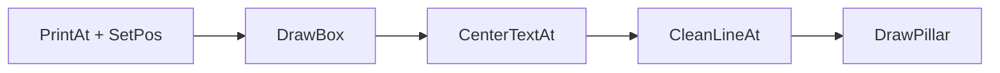

# Övning — ConsoleGUI

Du ska bygga en klass som ritar en snygg box i konsolen och placerar text på
valfria positioner. Klassen används av `NiceDebug` och flera andra övningar —
så den måste fungera exakt som specen säger.

**Tänk så här:** Du har jobbat med `Console.WriteLine` och `Console.SetCursorPosition`.
Nu ska du paketera den logiken i en klass så att all konsolgrafik går via samma ställe.
Det gör koden återanvändbar och lättare att ändra sen.

## Flödesschema



## Kodning

Börja med skelettklassen:

```csharp
namespace CSharpRepetition.MarcusKod
{
    using System;

    public class ConsoleGUI
    {
        public int X { get; set; } = 0;
        public int Y { get; set; } = 0;
        public int MaxWidth { get; set; } = 120;

        // Skriv dina metoder nedan
    }
}
```

---

## Steg 1: PrintAt — Placera text

Implementera två overloads:

```csharp
public void PrintAt(int y, string text)          // x = 0
public void PrintAt(int x, int y, string text)   // valfri position
```

Båda använder `Console.SetCursorPosition` och `Console.Write`.

### Förväntad output

```plaintext
gui.PrintAt(5, "Hej");       // skriver "Hej" på rad 5, kolumn 0
gui.PrintAt(10, 3, "Hej");  // skriver "Hej" på rad 3, kolumn 10
```

<details><summary>Tips</summary>

```csharp
public void PrintAt(int y, string text)
{
    Console.SetCursorPosition(0, y);
    Console.Write(text);
}
```

Andra overloaden gör samma sak men skickar in `x` istället för 0.

</details>

---

## Steg 2: SetPos — Kom ihåg positionen

```csharp
public void SetPos(int x = -1, int y = -1)
```

Sätter cursorns position. Om `x` eller `y` är negativt — använd klassens egna
`X`- och `Y`-properties istället.

<details><summary>Tips</summary>

```csharp
if (x < 0) x = X;
if (y < 0) y = Y;
Console.SetCursorPosition(x, y);
X = x;
Y = y;
```

</details>

---

## Steg 3: DrawBox — Rita boxen

```csharp
public void DrawBox(bool clearScreen = true)
```

Ritar en box som är 120 tecken bred och ~28 rader hög. Sätt fönsterstorlek först.

### Förväntad output

```plaintext
 ╔══════════════════════════════════════════════════╗
 ║                                                  ║
 ║                                                  ║
 ║                                                  ║
 ╠══════════════════════════════════════════════════╣
 ║                                                  ║
 ║                                                  ║
 ╠══════════════════════════════════════════════════╣
 ...
 ╚══════════════════════════════════════════════════╝
```

<details><summary>Tecken och uppbyggnad</summary>

Tecken att använda:
- Hörn: `╔` `╗` `╚` `╝`
- Väggar: `║` och `═`
- Horisontella linjer: `╠` och `╣`

```csharp
Console.WindowHeight = 30;
Console.WindowWidth = 120;

string ceiling  = " ╔" + new string('═', MaxWidth - 4) + "╗ ";
string sides    = " ║" + new string(' ', MaxWidth - 4) + "║ ";
string sideLine = " ╠" + new string('═', MaxWidth - 4) + "╣ ";
string floor    = " ╚" + new string('═', MaxWidth - 4) + "╝ ";
```

Rita `ceiling`, loopa 25 varv (`sideLine` på radindex 3, 6 och 22), rita `floor`.

</details>

---

## Steg 4: CenterTextAt — Centrera text

```csharp
public void CenterTextAt(int y, string text, bool clearLine = false)
```

Beräkna x-positionen så att texten hamnar i mitten. Om `clearLine` är `true`,
anropa `CleanLineAt` istället för `PrintAt`.

**Formel:** `x = (MaxWidth / 2) - (text.Length / 2)`

<details><summary>Tips</summary>

```csharp
int x = (MaxWidth / 2) - (text.Length / 2);
if (clearLine)
    CleanLineAt(x, y, text);
else
    PrintAt(x, y, text);
```

</details>

---

## Steg 5: CleanLineAt — Rensa och skriv

```csharp
public void CleanLineAt(int y, string text)          // x = 3
public void CleanLineAt(int x, int y, string text)   // valfri x
```

Skapar en tom box-rad och bäddar in texten på rätt plats — så gammal text
inte syns kvar när du uppdaterar skärmen.

<details><summary>Ledtråd</summary>

Börja med en "tom" rad av boxens fulla bredd:

```csharp
string line = " ║" + new string(' ', MaxWidth - 4) + "║ ";
```

Byt sedan ut en bit i mitten med din text:

```csharp
string output = line.Substring(0, pos) + text + line.Substring(pos + text.Length);
PrintAt(y, output);
```

- Enkel-versionen (utan x): `pos = 3`
- X-versionen: `pos = x + 3`

</details>

---

## Steg 6: DrawPillar, ClearLine och ClearScreen

```csharp
public void DrawPillar(int x, int y, int height)
public void ClearLine(int y) => PrintAt(y, new string(' ', 100));
public void ClearScreen() => Console.Clear();
```

`DrawPillar` ritar en vertikal pelare: `╦` överst, `║` i mitten (height−1 rader), `╩` i botten.

<details><summary>Tips för DrawPillar</summary>

```csharp
PrintAt(x, y, "╦");
for (int i = 1; i < height; i++)
    PrintAt(x, i + y, "║");
PrintAt(x, y + height, "╩");
```

</details>

---

<details>
<summary><strong>Lösningsförslag — hela klassen</strong></summary>

```csharp
namespace CSharpRepetition.MarcusKod
{
    using System;

    public class ConsoleGUI
    {
        public int X { get; set; } = 0;
        public int Y { get; set; } = 0;
        public int MaxWidth { get; set; } = 120;

        public void CenterTextAt(int y, string text, bool clearLine = false)
        {
            int x = (MaxWidth / 2) - (text.Length / 2);
            if (clearLine)
                CleanLineAt(x, y, text);
            else
                PrintAt(x, y, text);
        }

        public void CleanLineAt(int y, string text)
        {
            string line = " ║" + new string(' ', MaxWidth - 4) + "║ ";
            string output = line.Substring(0, 3) + text + line[(3 + text.Length)..];
            PrintAt(y, output);
        }

        public void CleanLineAt(int x, int y, string text)
        {
            string line = " ║" + new string(' ', MaxWidth - 4) + "║ ";
            int pos = x + 3;
            string output = line.Substring(0, pos) + text + line[(pos + text.Length)..];
            PrintAt(y, output);
        }

        public void DrawPillar(int x, int y, int height)
        {
            PrintAt(x, y, "╦");
            for (int i = 1; i < height; i++)
                PrintAt(x, i + y, "║");
            PrintAt(x, y + height, "╩");
        }

        public void ClearLine(int y) => PrintAt(y, new string(' ', 100));

        public void ClearScreen() => Console.Clear();

        public void DrawBox(bool clearScreen = true)
        {
            Console.WindowHeight = 30;
            Console.WindowWidth = 120;
            if (clearScreen) ClearScreen();

            Console.WriteLine("");
            string ceiling  = " ╔" + new string('═', MaxWidth - 4) + "╗ ";
            string sides    = " ║" + new string(' ', MaxWidth - 4) + "║ ";
            string sideLine = " ╠" + new string('═', MaxWidth - 4) + "╣ ";
            string floor    = " ╚" + new string('═', MaxWidth - 4) + "╝ ";
            SetPos(0, 0);
            Console.WriteLine(ceiling);
            for (int i = 0; i < 25; i++)
            {
                if (i == 3 || i == 6 || i == 22) Console.WriteLine(sideLine);
                Console.WriteLine(sides);
            }
            Console.Write(floor);
        }

        public void PrintAt(int y, string text)
        {
            Console.SetCursorPosition(0, y);
            Console.Write(text);
        }

        public void PrintAt(int x, int y, string text)
        {
            Console.SetCursorPosition(x, y);
            Console.Write(text);
        }

        public void SetPos(int x = -1, int y = -1)
        {
            if (x < 0) x = X;
            if (y < 0) y = Y;
            Console.SetCursorPosition(x, y);
            X = x;
            Y = y;
        }
    }
}
```

**Vanliga fallgropar:**
- Att hårdkoda 120 istället för `MaxWidth` — det ger problem om bredden ändras.
- Att blanda ihop overloads: `PrintAt(y, text)` vs `PrintAt(x, y, text)`.
- Att tecknen `╔╗╚╝║═╠╣╦╩` måste vara exakt rätt unicode — kopiera dem.
- `CleanLineAt` utan x: `pos = 3`. Med x: `pos = x + 3`.
- `CenterTextAt` med `clearLine = true` ska anropa `CleanLineAt`, annars `PrintAt`.

</details>

---

## Repetition v2 — Skriv om från minnet

Gör om hela klassen **utan att kolla tillbaka**. Den enda restriktionen: använd `var`
istället för explicita typer där du kan. Blir koden identisk?

```csharp
using System;

namespace CSharpRepetition.MarcusKod
{
    public class ConsoleGUI
    {
        public int MaxWidth { get; set; } = 120;
        public int X { get; set; } = 0;
        public int Y { get; set; } = 0;

        // Skriv dina metoder nedan
    }
}
```

<details><summary>Lösningsförslag v2</summary>

Funktionellt identisk med v1. Skillnaden är `var` och `Substring` istället för
index-from-end (`[..]`):

```csharp
var line   = " ║" + new string(' ', MaxWidth - 4) + "║ ";
var pos    = x + 3;
var output = line.Substring(0, pos) + text + line.Substring(pos + text.Length);
```

Resten av koden ser likadan ut.

</details>
