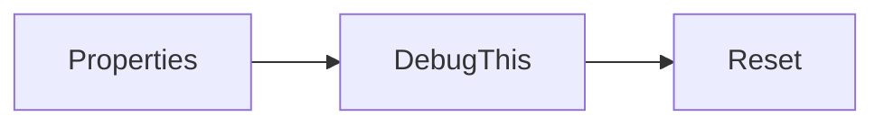

# Övning — NiceDebug

> **Krav:** Gör `console_gui.md` först — `NiceDebug` bygger på `ConsoleGUI`.

Du ska bygga en statisk klass som använder `ConsoleGUI` för att skriva ut
felsökningsmeddelanden på en fast plats i konsol-boxen.

**Tanken:** Istället för att sprida `Console.WriteLine` i all kod (som förstör
boxen som redan är ritad) anropar du `NiceDebug.DebugThis("...")`. Den placerar
texten automatiskt på nästa lediga rad i en debug-zon — och ökar raden inför
nästa anrop.

## Flödesschema



## Kodning

Börja med skelettklassen:

```csharp
namespace CSharpRepetition.MarcusKod
{
    public static class NiceDebug
    {
        // Skriv dina properties och metoder nedan
    }
}
```

---

## Steg 1: Properties

Klassen behöver tre statiska properties med defaultvärden:

| Property | Typ | Defaultvärde | Beskrivning |
|----------|-----|-------------|-------------|
| `StartX` | `int` | `3` | Kolumn där debug-texten börjar |
| `StartY` | `int` | `10` | Rad där debug-texten börjar |
| `MaxLength` | `int` | `32` | Max antal tecken per rad |

<details><summary>Tips</summary>

```csharp
public static int StartX { get; set; } = 3;
public static int StartY { get; set; } = 10;
public static int MaxLength { get; set; } = 32;
```

</details>

---

## Steg 2: DebugThis

```csharp
public static void DebugThis(string text)
```

1. Skapa en ny `ConsoleGUI`.
2. Om `text` är längre än `MaxLength` — kapa den.
3. Skriv ut texten med `gui.PrintAt(StartX, StartY, text)`.
4. Öka `StartY` med 1 så nästa anrop hamnar på nästa rad.

### Förväntad output

```plaintext
NiceDebug.DebugThis("Medelvärdet är: 42");   // skriver på rad 10
NiceDebug.DebugThis("Min: 1, Max: 99");       // skriver på rad 11
```

<details><summary>Tips — post-increment</summary>

```csharp
gui.PrintAt(StartX, StartY++, text);
```

`StartY++` används **efter** att värdet skickats in — rad 10 skrivs ut, sen ökas till 11.

</details>

<details><summary>Tips — kapa texten</summary>

```csharp
if (text.Length > MaxLength)
    text = text.Substring(0, MaxLength);
```

</details>

---

## Steg 3: Reset

```csharp
public static void Reset(int x)
```

Återställer `StartY` till 9 och sätter `StartX` till det angivna värdet.
Används för att börja om i en ny kolumn när en debug-zon är full.

<details><summary>Tips</summary>

```csharp
public static void Reset(int x)
{
    StartY = 9;
    StartX = x;
}
```

</details>

---

<details>
<summary><strong>Lösningsförslag — hela klassen</strong></summary>

```csharp
namespace CSharpRepetition.MarcusKod
{
    public static class NiceDebug
    {
        public static int StartX { get; set; } = 3;
        public static int StartY { get; set; } = 10;
        public static int MaxLength { get; set; } = 32;

        public static void DebugThis(string text)
        {
            ConsoleGUI gui = new ConsoleGUI();
            if (text.Length > MaxLength)
                text = text.Substring(0, MaxLength);
            gui.PrintAt(StartX, StartY++, text);
        }

        public static void Reset(int x)
        {
            StartY = 9;
            StartX = x;
        }
    }
}
```

**Vanliga fallgropar:**
- Att glömma `MaxLength`-kapningen — utan den kraschar `PrintAt` om texten är för lång.
- Att använda `++StartY` (pre-increment) istället för `StartY++` (post-increment) — då skrivs
  första raden på rad 11 istället för 10.

</details>

---

## Repetition v2 — Skriv om från minnet

Gör om hela klassen **utan att kolla tillbaka**. Enda skillnaden mot v1:
`MaxLength` ska ha defaultvärdet `34` istället för `32`.

```csharp
namespace CSharpRepetition.MarcusKod
{
    public static class NiceDebug
    {
        // Skriv dina properties och metoder nedan
    }
}
```

<details><summary>Lösningsförslag v2</summary>

```csharp
namespace CSharpRepetition.MarcusKod
{
    public static class NiceDebug
    {
        public static int MaxLength { get; set; } = 34;
        public static int StartX { get; set; } = 3;
        public static int StartY { get; set; } = 10;

        public static void DebugThis(string text)
        {
            var gui = new ConsoleGUI();
            if (text.Length > MaxLength) text = text.Substring(0, MaxLength);
            gui.PrintAt(StartX, StartY++, text);
        }

        public static void Reset(int x)
        {
            StartY = 9;
            StartX = x;
        }
    }
}
```

</details>
