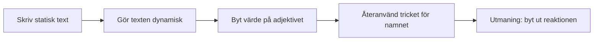

# Övning — Fredrik Åkare och fröken Cecilia Lind

> Inspirerad av visan om herr Fredrik Åkare och den söta fröken Cecilia Lind, skriven av den underbare Cornelis Vreeswijk på 1960-talet. Av respekt för hans text citerar vi inte balladen — vi skriver vår egen rad i samma anda. Du kommer snart förstå varför det inte gör något att vi bytte ut texten.

## Flödesschema



## Kodning

---

## Steg 1: Skriv ut raden

```csharp
Console.WriteLine("Vacker var hon, fröken Cecilia Lind,\noch förundrad stod herr Fredrik Åkare på logen den natten.");
```

### Förväntad output
```plaintext
Vacker var hon, fröken Cecilia Lind,
och förundrad stod herr Fredrik Åkare på logen den natten.
```

<details><summary>Vad gör `\n`?</summary>

`\n` betyder "ny rad" (newline). Det är ett **escape-tecken** — backslash (`\`) talar om för C# att nästa tecken inte ska tolkas bokstavligt utan som en specialinstruktion. `\n` skriver inte ut bokstaven n, det skriver ut en radbrytning.

Du kan ha flera `\n` i samma sträng — varje en ger en ny radbrytning i outputen, men i koden är det fortfarande en enda rad text.

</details>

---

## Steg 2: Gör texten dynamisk

Just nu är "Vacker" inbränt i strängen. Om vi vill kunna byta ordet utan att skriva om hela meningen behöver vi en **variabel** och **string interpolation**.

```csharp
string adjektiv = "vacker";
Console.WriteLine($"{adjektiv} var hon, fröken Cecilia Lind,\noch förundrad stod herr Fredrik Åkare på logen den natten.");
```

### Förväntad output
```plaintext
vacker var hon, fröken Cecilia Lind,
och förundrad stod herr Fredrik Åkare på logen den natten.
```

<details><summary>Vad gör `$` och `{}`?</summary>

`$` framför citattecknet kallas **string interpolation** — det talar om för C# att texten kan innehålla variabler. Allt innanför måsvingarna `{}` bearbetas innan texten skrivs ut: C# letar upp variabeln `adjektiv`, hämtar dess värde, och klistrar in det på den platsen i strängen.

Lägg märke till att outputen blev exakt likadan som i steg 1 — bara med litet "v". Det är meningen. Vi har inte ändrat *resultatet* än, bara *hur* koden producerar det. Nu styr variabeln ordet, inte den hårdkodade texten.

</details>

---

## Steg 3: Byt värde — samma kod, nytt resultat

Ändra bara värdet på `adjektiv`. Koden i `Console.WriteLine` rör du inte.

```csharp
string adjektiv = "hårig";
```

### Förväntad output
```plaintext
hårig var hon, fröken Cecilia Lind,
och förundrad stod herr Fredrik Åkare på logen den natten.
```

<details><summary>Testa fler ord</summary>

Prova `"högljudd"`, `"söt"`, eller vad du vill. `Console.WriteLine`-raden är orörd — bara värdet i variabeln ändras, och hela meningen följer med automatiskt.

```csharp
string adjektiv = "högljudd";
// Output: högljudd var hon, fröken Cecilia Lind, ...
```

Det är poängen med variabler: ändra på ett ställe, effekten syns på alla ställen variabeln används.

</details>

---

## Steg 4: Gör samma trick med namnet

Nu vet du mönstret. Gör likadant med `Cecilia Lind` — gör om den till en variabel också.

### Förväntad output
```plaintext
hårig var hon, fröken Kajsa Anka,
och förundrad stod herr Fredrik Åkare på logen den natten.
```

<details><summary>Hur många variabler kan jag stoppa in?</summary>

Lika många du vill — varje `{namn}` i strängen är sitt eget utbyte.

```csharp
string adjektiv = "hårig";
string namn = "Kajsa Anka";
Console.WriteLine($"{adjektiv} var hon, fröken {namn},\noch förundrad stod herr Fredrik Åkare på logen den natten.");
```

</details>

> 🎙️ **Easter egg:** Lyssnar du på Creepypodden? Byt ut `Kajsa Anka` mot [`Isadora Cordée`](https://www.creepypasta.se/poddmanuskript/halloweenspecial-isadora-cordee/) och se vad som händer med stämningen.

---

## Steg 5: Utmaningen — byt ut reaktionen också

"Förundrad" beskriver Fredriks **reaktion**. Gör exakt samma trick med det ordet som du gjorde med adjektivet — extrahera det till en egen variabel.

### Förväntad output
```plaintext
hårig var hon, fröken Kajsa Anka,
och skräckslagen stod herr Fredrik Åkare på logen den natten.
```

<details><summary>Innan du kollar lösningen...</summary>

Tänk tillbaka på steg 2: hur gjorde du när du bytte ut "vacker" mot `{adjektiv}`? Gör exakt samma rörelse, bara med "förundrad" och en ny variabel som heter `reaktion`.

</details>

<details><summary>Lösningsförslag</summary>

```csharp
string adjektiv = "hårig";
string namn = "Kajsa Anka";
string reaktion = "skräckslagen";

Console.WriteLine($"{adjektiv} var hon, fröken {namn},\noch {reaktion} stod herr Fredrik Åkare på logen den natten.");
```

Byt ut alla tre värden och kör om — testa "söt", "Pippi Långstrump" och "extatisk", eller vad du själv hittar på. Samma kod, oändligt många (och garanterat löjliga) visor.

Det är hela poängen med variabler och string interpolation: koden som *producerar* texten är stabil, det som *fyller i* den är flexibelt.

**Spara den här övningen i bakhuvudet** — när vi kommer till arrays bygger vi listor av adjektiv, namn och reaktioner och låter koden slumpa fram en ny rad varje gång. Då blir det riktigt absurt skoj.

Redan klar och sugen på mer? Kolla [`fredrik_akare_bonus.md`](fredrik_akare_bonus.md) — en 🥷 ninja-bonus där du gör exakt detta med arrays och `Random`.

</details>

---

## Summan av kardemumman

Du har faktiskt redan sett den här tekniken i verkligheten — fler gånger än du tror.

Varje gång du fått ett mail som börjar med "Hej **{ditt namn}**!" har ett företag gjort exakt det du gjort här: skrivit en mall en gång, och låtit variabler fylla i resten. Mallen kan se ut ungefär så här:

```plaintext
Hej {namn}!

{vänlig hälsning}

Tack för att du beställde {antal} st {produkt}.

Med vänlig hälsning,
{företag}
```

Och så fylls den i, automatiskt, för var och en av tusentals kunder — utan att en människa skriver ett enda mail för hand:

```plaintext
Hej Jens!

Hoppas du har en alldeles strålande dag!

Tack för att du beställde 150 st par sockor i plast för vuxna.

Med vänlig hälsning,
Sock-Is-Us!
```

Det kallas ofta **mail merge** eller mallbaserad textgenerering, och bygger på exakt samma princip som `adjektiv`, `namn` och `reaktion` ovan — bara i mycket större skala. Nästa gång du får ett sådant mail vet du precis vad som händer under huven: en sträng med `{}`-platshållare och en rad variabler som fyller i dem, en gång per mottagare.
