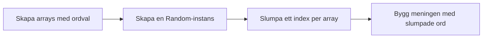

# 🥷 Ninja-bonus — Fredrik Åkare slumpar visan själv

> Klar med [`fredrik_akare.md`](fredrik_akare.md)? Då har du redan bytt ut adjektiv, namn och reaktion för hand. Den här bonusövningen låter **programmet** göra bytet slumpmässigt istället.

## Flödesschema



## Kodning

---

## Steg 1: Skapa arrays istället för enstaka variabler

I `fredrik_akare.md` hade du en variabel per ord — `adjektiv`, `namn`, `reaktion`. Nu byter vi ut varje variabel mot en **array**: en lista av flera ord att välja mellan.

```csharp
string[] adjektiv = { "hårig", "högljudd", "söt", "skräckslagen", "vacker" };
string[] namn = { "Kajsa Anka", "Pippi Långstrump", "Isadora Cordée" };
string[] reaktioner = { "skräckslagen", "extatisk", "mållös", "paff" };
```

### Förväntad output
```plaintext
(Inget skrivs ut än — koden bara kompilerar)
```

<details><summary>Vad är skillnaden mot en vanlig variabel?</summary>

`string namn = "Kajsa Anka";` håller **ett** värde. `string[] namn = { ... };` håller **flera** värden i en ordnad lista — måsvingarna `{ }` (inte att blanda ihop med string interpolations `{}`!) listar innehållet, kommaseparerat.

Varje ord i arrayen har ett **index** — en plats i listan, numrerad från 0. `namn[0]` är "Kajsa Anka", `namn[1]` är "Pippi Långstrump", och så vidare.

</details>

---

## Steg 2: Skapa en slumpgenerator

C# har en inbyggd klass för slumptal: `Random`.

```csharp
Random slump = new Random();
```

### Förväntad output
```plaintext
(Fortfarande inget att skriva ut — bara förberedelse)
```

<details><summary>Vad gör `new Random()`?</summary>

Det skapar ett objekt som kan generera slumptal. Du skapar bara **en** `Random`-instans och återanvänder den — skapa inte en ny för varje slumptal du behöver, det är ett vanligt nybörjarmisstag som kan ge sämre slumpkvalitet.

</details>

---

## Steg 3: Slumpa ett index per array

```csharp
int adjIndex = slump.Next(adjektiv.Length); // välj ett tal mellan 0 och max antal adjektiv
int namnIndex = slump.Next(namn.Length); 
int reaktionIndex = slump.Next(reaktioner.Length);
```

### Förväntad output
```plaintext
(Fortfarande inget synligt resultat — index finns nu i minnet)
```

<details><summary>Varför `.Length` och inte ett fast tal?</summary>

`slump.Next(n)` ger ett heltal mellan `0` och `n - 1` — alltså alltid ett giltigt index för en array med `n` element. Om du skrev `slump.Next(5)` på en array med bara 3 ord skulle du riskera att fråga efter ett index som inte finns (`IndexOutOfRangeException`). `.Length` garanterar att du alltid frågar om rätt antal.

</details>

---

## Steg 4: Bygg meningen med de slumpade orden

```csharp
Console.WriteLine($"{adjektiv[adjIndex]} var hon, fröken {namn[namnIndex]},\noch {reaktioner[reaktionIndex]} stod herr Fredrik Åkare på logen den natten.");
```

### Förväntad output
```plaintext
(Olika varje gång du kör — t.ex:)
söt var hon, fröken Isadora Cordée,
och mållös stod herr Fredrik Åkare på logen den natten.
```

<details><summary>Varför blir outputen olika varje gång?</summary>

Varje gång programmet körs anropas `slump.Next(...)` på nytt och kan ge olika index. Det är hela poängen — samma kod, men `Random` väljer ett nytt ord ur arrayen varje körning istället för att du väljer det för hand.

</details>

<details><summary>Lösningsförslag</summary>

```csharp
string[] adjektiv = { "hårig", "högljudd", "söt", "skräckslagen", "vacker" };
string[] namn = { "Kajsa Anka", "Pippi Långstrump", "Isadora Cordée" };
string[] reaktioner = { "skräckslagen", "extatisk", "mållös", "paff" };

Random slump = new Random();

int adjIndex = slump.Next(adjektiv.Length);
int namnIndex = slump.Next(namn.Length);
int reaktionIndex = slump.Next(reaktioner.Length);

Console.WriteLine($"{adjektiv[adjIndex]} var hon, fröken {namn[namnIndex]},\noch {reaktioner[reaktionIndex]} stod herr Fredrik Åkare på logen den natten.");
```

Kör programmet flera gånger i rad — varje körning ger en ny slumpad visa. Lägg gärna till fler ord i arrayerna: med 5 adjektiv, 3 namn och 4 reaktioner finns redan 60 unika kombinationer, utan att du skrivit en enda extra rad kod.

**Senare i kursen, när vi lärt oss loopar**, kommer du kunna skriva ut flera slumpade visor i en och samma körning istället för att starta om programmet varje gång — spara den tanken.

</details>
