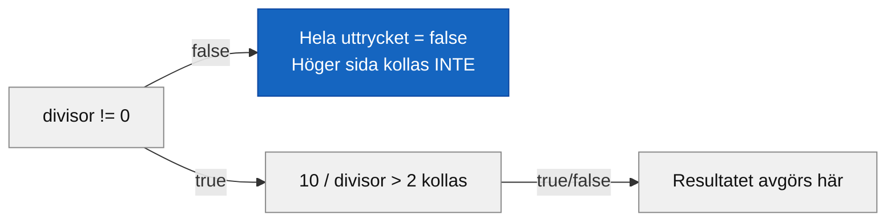

# Programmeringstermer — Bool och logik

`bool` är den enklaste typen i C# — den rymmer exakt ett av två möjliga värden: `true` eller `false`. Men ur den enkelheten växer hela logiken i ett program. Varje if-sats, varje loop, varje kontroll — allt bottnar till sist i en fråga vars svar är sant eller falskt.

**Se även:** [datatyper.md](datatyper.md) — `bool` i korthet bland övriga typer, [../../../03_villkor_och_loopar/programmeringstermer/if_else.md](../../../03_villkor_och_loopar/programmeringstermer/if_else.md) — där bool används i praktiken.

---

## bool

Typen som lagrar sant eller falskt. Ingenting däremellan.

```csharp
bool ärVuxen = true;
bool harBetalt = false;

Console.WriteLine(ärVuxen);
Console.WriteLine(harBetalt);
```

### Output
```plaintext
True
False
```

Notera stor bokstav i outputen — C# skriver `True`/`False`, inte `true`/`false`. I koden skriver du `true`/`false` med gemener. Det är konvention.

Namnge bool-variabler som påståenden som kan vara sanna eller falska: `ärVuxen`, `harBetalt`, `ärÖppen` — inte `vuxen` eller `betalt`. Det gör koden lättare att läsa: `if (ärVuxen)` läser nästan som svenska.

---

## Jämförelseoperatorer

Jämför två värden och ger tillbaka `true` eller `false`. Det är så du ställer frågor i koden.

```csharp
int ålder = 20;

Console.WriteLine(ålder == 20);   // lika med?
Console.WriteLine(ålder != 18);   // inte lika med?
Console.WriteLine(ålder > 18);    // större än?
Console.WriteLine(ålder < 18);    // mindre än?
Console.WriteLine(ålder >= 18);   // större än eller lika med?
Console.WriteLine(ålder <= 20);   // mindre än eller lika med?
```

### Output
```plaintext
True
True
True
False
True
True
```

Hela tabellen:

| Operator | Betydelse | Exempel | Resultat |
|----------|-----------|---------|---------|
| `==` | lika med | `ålder == 20` | `true` |
| `!=` | inte lika med | `ålder != 18` | `true` |
| `>` | större än | `ålder > 18` | `true` |
| `<` | mindre än | `ålder < 18` | `false` |
| `>=` | större än eller lika med | `ålder >= 18` | `true` |
| `<=` | mindre än eller lika med | `ålder <= 20` | `true` |

Resultatet av en jämförelse är alltid en `bool` — du kan spara det direkt i en bool-variabel:

```csharp
int ålder = 20;
bool ärVuxen = ålder >= 18;
Console.WriteLine(ärVuxen);
```

### Output
```plaintext
True
```

<details><summary>Klassisk fallgrop: = vs ==</summary>

`=` tilldelar ett värde. `==` jämför två värden. Det är lätt att råka blanda ihop dem:

```csharp
int ålder = 20;
// if (ålder = 18)   // Kompilatorfel — = är inte en jämförelse
if (ålder == 18)     // Rätt — jämför om ålder är 18
{
    Console.WriteLine("Precis 18!");
}
```

C# är snäll nog att ge kompilatorfel om du råkar skriva `=` i en if-sats — i en del andra språk smiter det igenom tyst och ger konstiga buggar. I C# stoppas det direkt.

</details>

---

## Logiska operatorer

Kombinerar flera bool-uttryck till ett. Tre operatorer täcker det mesta: `&&` (och), `||` (eller), `!` (inte).

```csharp
int ålder = 20;
bool harKörkort = true;

bool fårKöra = ålder >= 18 && harKörkort;
bool kanTesta = ålder >= 18 || harKörkort;
bool ärMindreårig = !(ålder >= 18);

Console.WriteLine(fårKöra);
Console.WriteLine(kanTesta);
Console.WriteLine(ärMindreårig);
```

### Output
```plaintext
True
True
False
```

---

## `&&` — OCH

Båda sidor måste vara `true` för att hela uttrycket ska bli `true`. Är en sida `false` är hela uttrycket `false`.

```csharp
bool harBiljett = true;
bool ärÖver18 = true;
bool ärÖver18MenInteHarBiljett = false;

Console.WriteLine(harBiljett && ärÖver18);
Console.WriteLine(harBiljett && ärÖver18MenInteHarBiljett);
```

### Output
```plaintext
True
False
```

Tänk: **båda** kraven måste uppfyllas.

---

## `||` — ELLER

Minst en sida måste vara `true` för att hela uttrycket ska bli `true`. Båda kan vara `true` — det är OK. Bara om båda är `false` blir resultatet `false`.

```csharp
bool harStudentrabatt = false;
bool harSeniorrabatt = true;

Console.WriteLine(harStudentrabatt || harSeniorrabatt);
Console.WriteLine(harStudentrabatt || false);
```

### Output
```plaintext
True
False
```

Tänk: **minst ett** av kraven räcker.

---

## `!` — INTE

Vänder på ett bool-värde. `true` blir `false`, `false` blir `true`.

```csharp
bool ärStängt = false;
Console.WriteLine(!ärStängt);   // ärStängt är false, !false är true
```

### Output
```plaintext
True
```

Vanligast som ett sätt att göra en kontroll mer läsbar: `if (!harBetalt)` läser som "om inte harBetalt" — tydligare än `if (harBetalt == false)`.

---

## Short-circuit evaluation

C# utvärderar inte mer av ett logiskt uttryck än nödvändigt. Det kallas short-circuit — kortslutning.

Med `&&`: om den **vänstra** sidan är `false`, vet C# redan att hela uttrycket är `false`. Den högra sidan kollas aldrig.

Med `||`: om den **vänstra** sidan är `true`, vet C# redan att hela uttrycket är `true`. Den högra sidan kollas aldrig.

```csharp
int divisor = 0;
bool resultat = divisor != 0 && 10 / divisor > 2;
Console.WriteLine(resultat);
```

### Output
```plaintext
False
```

`divisor != 0` är `false` — C# stannar där och returnerar `false` direkt. `10 / divisor` utvärderas aldrig — vilket är tur, för `10 / 0` hade kraschat programmet. Short-circuit skyddar dig i det fallet.

<details><summary>Spelar ordningen roll när jag skriver &&?</summary>

Ja — lägg den billigaste (enklaste) kontrollen till vänster. Den snabba kontrollen sparar C# från att ens titta på den dyrare höger sida. Det kallas "fail fast": om den enkla kontrollen är `false` stänger `&&` av tidigt, om den enkla kontrollen är `true` med `||` stänger det av tidigt. I enkel kod märks det inte — men det är en bra vana att bygga.

</details>


