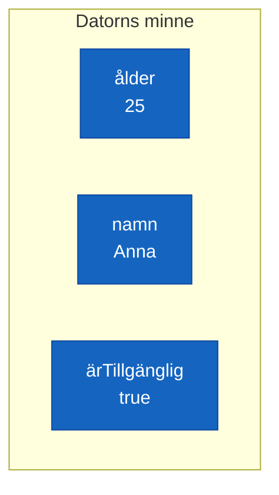
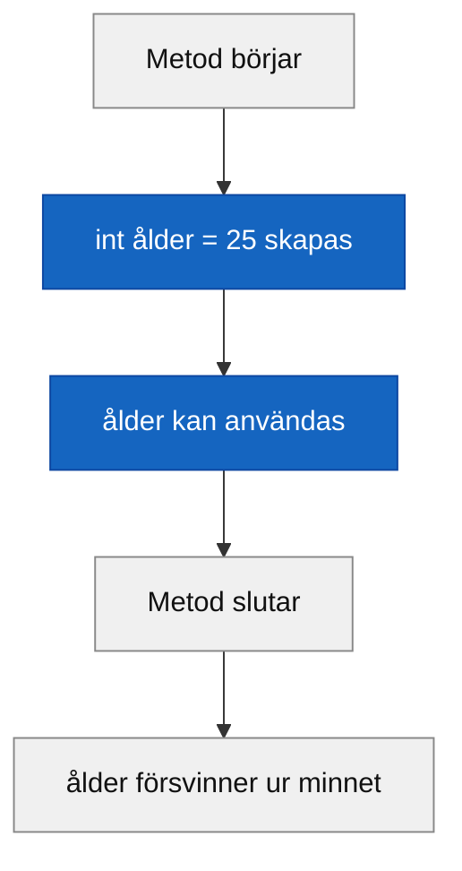

# Programmeringstermer — Variabler

En variabel är ett namn på en plats i minnet. Tänk dig en etikett du sätter på en låda — etiketten är namnet, lådan är platsen i minnet, och det du lade i lådan är värdet. Utan variabler skulle du behöva skriva varje värde direkt i koden, varenda gång det behövs.



**Se även:** [datatyper.md](datatyper.md) — vad som avgör hur stor "lådan" är.

---

## Variabel

En namngiven lagringsplats för ett värde som kan variera under programmets körning. "Variabel" — värdet kan ändras.

```csharp
int ålder = 25;
string namn = "Anna";
bool ärTillgänglig = true;
```

### Output
```plaintext
(ingen utskrift — tre variabler skapas, men inget skrivs ut än)
```

---

## Deklaration

Att **deklarera** en variabel betyder att du berättar för C# att variabeln finns — du bestämmer dess typ och namn. Utan deklaration vet inte C# om variabeln.

```csharp
int ålder;
string namn;
```

Variabeln existerar nu, men den har inget värde än. Det kallas att den är **odeklarerad** i minnesteknisk mening — i C# är lokala variabler inte automatiskt noll eller tomma, du måste ge dem ett värde innan du kan använda dem.

<details><summary>Vad händer om jag försöker använda en odeklarerad variabel?</summary>

```csharp
int ålder;
Console.WriteLine(ålder); // Kompilatorfel!
```

C# stoppar dig redan innan programmet körs:

```plaintext
error CS0165: Use of unassigned local variable 'ålder'
```

Det är avsiktligt — kompilatorn skyddar dig från att råka läsa skräpdata ur minnet. Ge alltid lokala variabler ett värde innan du använder dem.

</details>

---

## Initialisering

Att **initalisera** en variabel betyder att du ger den sitt första värde. Ofta sker deklaration och initialisering på samma rad.

```csharp
int ålder = 25;         // deklaration + initialisering på en gång
string namn = "Anna";   // detsamma för string
bool ärTillgänglig = true;
```

Du kan också separera dem:

```csharp
int ålder;       // deklaration
ålder = 25;      // initialisering (sker lite senare)
```

Regeln är enkel: du måste ha initialiserat en variabel innan du läser från den.

---

## Datatyp

Typen bestämmer **vad** som får plats i variabeln — en `int` kan bara hålla heltal, en `string` bara text, en `bool` bara `true` eller `false`. Typen styr också hur stor "lådan" är i minnet.

```csharp
int ålder = 25;
string namn = "Anna";
bool ärTillgänglig = true;

Console.WriteLine(ålder);
Console.WriteLine(namn);
Console.WriteLine(ärTillgänglig);
```

### Output
```plaintext
25
Anna
True
```

**Se även:** [datatyper.md](datatyper.md) — en genomgång av de vanligaste typerna med exempel.

---

## Identifierare

Det tekniska namnet på ett namn du hittar på själv i koden — variabelnamn, metodnamn, klassnamn. Allt du döper till något är en identifierare.

Reglerna för identifierare i C#:
- Får innehålla bokstäver (inkl. å, ä, ö), siffror och `_`
- Får **inte** börja med en siffra
- Får **inte** vara ett reserverat nyckelord (`int`, `string`, `class`...)

```csharp
int ålder = 25;           // "ålder" är identifieraren
string förnamn = "Anna";  // "förnamn" är identifieraren
```

Tekniskt funkar svenska bokstäver i identifierare — men i professionell kod är engelska standard. I den här kursen använder vi svenska, så att det är lättare att se vad som är kod och vad som är namn.

---

## Namnkonvention — camelCase

C# har en överenskommelse för hur variabler ska namnges: **camelCase**. Det betyder att det första ordet börjar med liten bokstav, och varje nytt ord börjar med stor bokstav — precis som en pucklig kamelrygg.

```csharp
int ålder = 25;
string förnamn = "Anna";
bool ärTillgänglig = true;
double maxHastighet = 120.5;
```

camelCase gäller lokala variabler och parametrar. Klasser och metoder följer PascalCase (varje ord med stor bokstav) — det lär vi oss mer om i OOP-avsnittet.

<details><summary>Vad är skillnaden mot snake_case och SCREAMING_CASE?</summary>

I Python är `max_hastighet` (snake_case) vanligt för variabler. I C# är det ovanligt och ser ut som ett importerat spår från ett annat språk. `MAX_HASTIGHET` (SCREAMING_CASE) dyker upp för konstanter i en del språk, men i C# skriver vi konstanter med PascalCase med ett `const`-nyckelord. Håll dig till camelCase för variabler i C# — koden ser ut som alla andras, och det är poängen med konventioner.

</details>

---

## Scope (räckvidd)

Scope bestämmer **var** i koden en variabel finns och kan användas. En variabel som deklareras inuti ett block (`{ }`) lever bara inom det blocket — utanför vet C# inte om den.

```csharp
{
    int ålder = 25;
    Console.WriteLine(ålder); // fungerar — vi är inne i blocket
}
// Console.WriteLine(ålder); // Kompilatorfel! ålder finns inte här
```

I en metod kallas variablerna **lokala variabler** — de lever från deklarationen till metodens slut. Det här gäller för alla block: loopar, if-satser, metoder.



<details><summary>Varför finns scope överhuvudtaget?</summary>

Utan scope skulle alla variabler i hela programmet behöva ha unika namn — och de skulle ligga kvar i minnet hela körningen, oavsett om de fortfarande behövs. Scope håller variabler levande precis så länge de behövs, inte längre. Det gör minnet effektivare och koden lättare att läsa.

</details>

---

## Tilldelningsoperatorn `=`

I matematik betyder `=` "är lika med". I C# betyder `=` "tilldela värdet på höger sida till variabeln på vänster sida". Det är inte en jämförelse — det är en instruktion.

```csharp
int ålder = 25;     // ålder får värdet 25
ålder = 26;         // ålder ges ett nytt värde — 25 försvinner
Console.WriteLine(ålder);
```

### Output
```plaintext
26
```

Det gamla värdet skrivs över — C# minns inte att ålder var 25 innan. För att jämföra om två saker är lika används `==` (dubbelt likhetstecken), inte `=`.

**Se även:** [bool.md](bool.md) — där `==` som jämförelseoperator tas upp.
