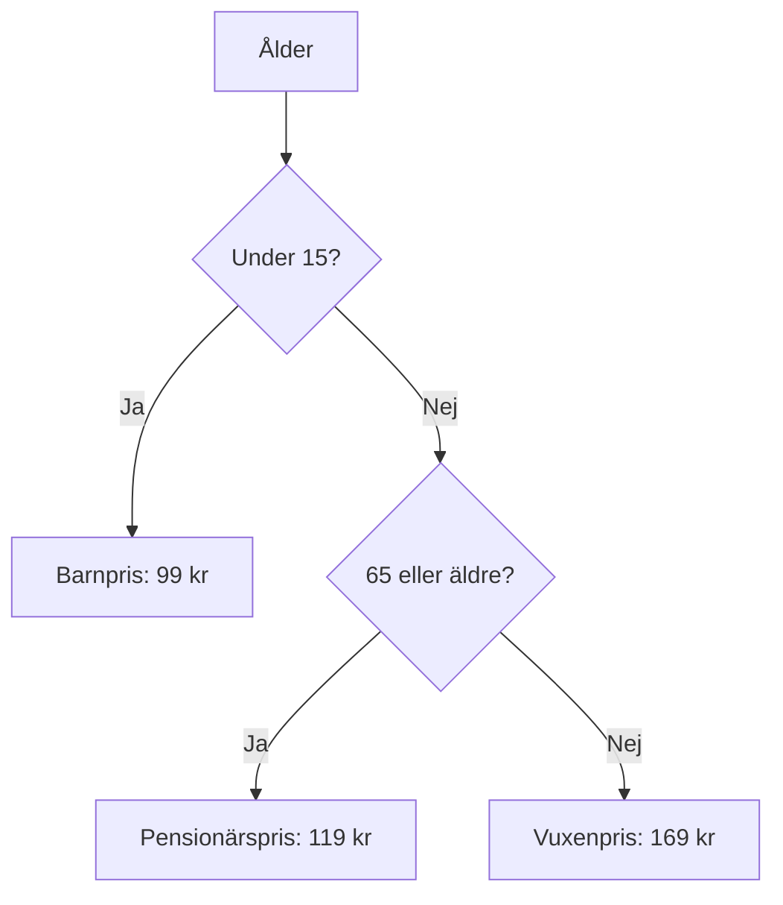

# Övning — Biobiljetten

> 🗺️ **Rita ett flödesschema innan du kodar.** Skissa upp programflödet på papper — vilka steg tas? Vilka beslut fattas? Rita klart, lägg ner pennan, öppna sedan VS Code.

Filmstaden har tre prisklasser. Programmet ska ta emot en ålder och skriva ut rätt biljettpris.

| Kategori | Ålder | Pris |
|----------|-------|------|
| Barn | Under 15 | 99 kr |
| Vuxen | 15–64 | 169 kr |
| Pensionär | 65 och äldre | 119 kr |

---

## Flödesschema



## Kodning

---

## Steg 1: Deklarera variabler

```csharp
int ålder = 34;
int barnPris = 99;
int vuxenPris = 169;
int pensionärsPris = 119;
```

---

## Steg 2: Skriv en if-kedja

Skriv en `if / else if / else` som väljer rätt pris baserat på `ålder`.

### Förväntad output (för ålder = 34)
```plaintext
Ålder: 34 år
Biljettpris: 169 kr
Kategori: Vuxen
```

<details><summary>Hur strukturerar jag if-kedjan?</summary>

```csharp
if (ålder < 15)
{
    // barnpris
}
else if (ålder >= 65)
{
    // pensionärspris
}
else
{
    // vuxenpris
}
```

Ordningen spelar roll. Kontrollera det mest specifika fallet först.

</details>

---

## Steg 3: Testa alla kategorier

Byt ut värdet på `ålder` och verifiera att alla tre kategorier ger rätt output:
- `ålder = 12`
- `ålder = 34`
- `ålder = 70`

---

## Steg 4: Grupp på fyra

En familj går på bio: ett barn (8 år), två vuxna (38 år) och en morsa (67 år). Räkna ut totalpriset.

### Förväntad output
```plaintext
Barn (8 år):     ### kr
Vuxen (38 år):   169 kr
Vuxen (38 år):   169 kr
Pensionär (67):  ### kr
-----------------------
Totalt:          ### kr
```

<details><summary>Tips — du behöver inte en loop</summary>

Deklarera fyra separata variabler (en per person) och summera dem. Det är fullt okej för fyra värden.

</details>

<details><summary>Lösningsförslag</summary>

```csharp
int barnPris = 99;
int vuxenPris = 169;
int pensionärsPris = 119;

// Enskild biljett
int ålder = 34;
int pris;
string kategori;

if (ålder < 15)
{
    pris = barnPris;
    kategori = "Barn";
}
else if (ålder >= 65)
{
    pris = pensionärsPris;
    kategori = "Pensionär";
}
else
{
    pris = vuxenPris;
    kategori = "Vuxen";
}

Console.WriteLine($"Ålder: {ålder} år");
Console.WriteLine($"Biljettpris: {pris} kr");
Console.WriteLine($"Kategori: {kategori}");
Console.WriteLine();

// Familjen
int barn = barnPris;      // 8 år
int vuxen1 = vuxenPris;   // 38 år
int vuxen2 = vuxenPris;   // 38 år
int morsa = pensionärsPris; // 67 år
int totalt = barn + vuxen1 + vuxen2 + morsa;

Console.WriteLine($"Barn (8 år):     {barn} kr");
Console.WriteLine($"Vuxen (38 år):   {vuxen1} kr");
Console.WriteLine($"Vuxen (38 år):   {vuxen2} kr");
Console.WriteLine($"Pensionär (67):  {morsa} kr");
Console.WriteLine("-----------------------");
Console.WriteLine($"Totalt:          {totalt} kr");
```

</details>
