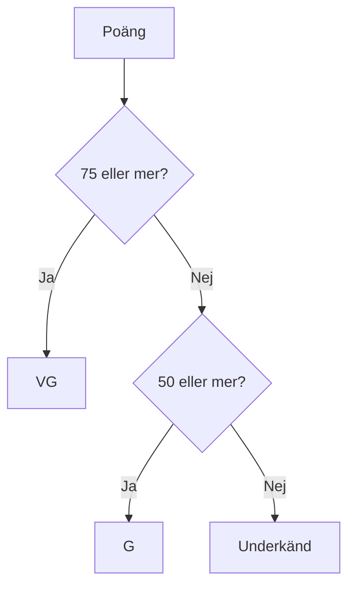

# Övning — Tentabetyget

> 🗺️ **Rita ett flödesschema innan du kodar.** Skissa upp programflödet på papper — vilka steg tas? Vilka beslut fattas? Rita klart, lägg ner pennan, öppna sedan VS Code.

Du ska skriva ett program som tar en tentapoäng och skriver ut rätt betyg.

| Poäng | Betyg |
|-------|-------|
| 75–100 | VG |
| 50–74 | G |
| 0–49 | Underkänd |

Tentan har 100 poäng totalt.

---

## Flödesschema



## Kodning

---

## Steg 1: Deklarera och skriv if-kedjan

```csharp
int poäng = 67;
int maxPoäng = 100;
```

Skriv en `if / else if / else` som skriver ut betyget.

### Förväntad output (poäng = 67)
```plaintext
Poäng: 67 / 100
Betyg: G
```

<details><summary>Tips — var börjar du?</summary>

Kontrollera den högsta gränsen (`>= 75`) först. Om den inte uppfylls, kolla nästa (`>= 50`). Annars är det underkänt.

</details>

---

## Steg 2: Procent

Räkna ut hur många procent av maxpoängen studenten fick.

### Förväntad output
```plaintext
Poäng: 67 / 100
Resultat: 67%
Betyg: G
```

<details><summary>Hur räknar jag procent med int?</summary>

```csharp
int procent = poäng * 100 / maxPoäng;
```

Multiplicera INNAN du dividerar — annars förlorar du decimalen (67/100 = 0 i heltalsdivision).

</details>

---

## Steg 3: Klass på 12 studerande

Här är resultaten från klassen:

```csharp
int[] resultat = { 92, 45, 78, 55, 83, 30, 61, 74, 88, 49, 66, 71 };
```

(Vi har inte pratat om arrayer och loopar än — så gör detta manuellt: deklarera 12 separata int-variabler och kör din if-sats på var och en. Det är upprepande med avsikt — du ska känna av varför loopar finns.)

Skriv ut varje studerandes poäng och betyg.

<details><summary>Lösningsförslag — en studerande</summary>

```csharp
int maxPoäng = 100;

int p1 = 92;
int procent1 = p1 * 100 / maxPoäng;
string betyg1;

if (p1 >= 75)
    betyg1 = "VG";
else if (p1 >= 50)
    betyg1 = "G";
else
    betyg1 = "Underkänd";

Console.WriteLine($"Poäng: {p1} / {maxPoäng}  ({procent1}%)  →  {betyg1}");
```

Upprepa för p2 till p12. Notera hur tröttsamt det blir — och varför du vill lära dig loopar.

</details>

## Bonusuppgift

Kan du räkna ut hur många som fick VG, G respektive underkänt — och skriva ut det som en summering i slutet?

(Ledning: du behöver räknarvariablerna `int antalVG = 0;`, `int antalG = 0;` etc. och plussar på dem inne i varje if-gren.)
