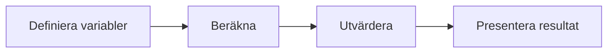

# Övning — Varberg vs Sisjön

> 🗺️ **Rita ett flödesschema innan du kodar.** Skissa upp programflödet på papper — vilka steg tas? Vilka beslut fattas? Rita klart, lägg ner pennan, öppna sedan VS Code.

Du bor i Mölndal och vill köpa en Samsung 65" TV.

NetOnNet i Varberg säljer den för 9 490 kr. Elgiganten på Sisjön säljer samma TV för 9 590 kr.
Varberg är billigare — men är det verkligen värt resan?

Bensinpriset är 17 kr/litern. Bilen drar 15 liter tur och retur till Varberg, och 2 liter till Sisjön.

## Flödesschema



## Kodning

---

## Steg 1: Deklarera variabler och skriv ut TV-priserna

```csharp
int tvVarberg = 9490;
int tvSisjön = 9590;
int bensinPerLiter = 17;
int literVarberg = 15;
int literSisjön = 2;
```

### Förväntad output
```plaintext
NetOnNet Varberg:    9490 kr
Elgiganten Sisjön:  9590 kr
```

<details><summary>String interpolation-påminnelse</summary>

```csharp
Console.WriteLine($"NetOnNet Varberg:    {tvVarberg} kr");
```

</details>

---

## Steg 2: Räkna ut bensinkostnaden för varje alternativ

Hur mycket kostar bensinen för varje resa?

### Förväntad output
```plaintext
Bensin till Varberg: ### kr
Bensin till Sisjön:  ### kr
```

<details><summary>Hur multiplicerar jag liter × pris?</summary>

```csharp
int bensinVarberg = literVarberg * bensinPerLiter;
```

</details>

---

## Steg 3: Räkna ut totalkostnaden

TV-priset plus bensinen — vad blir det totalt för varje alternativ?

### Förväntad output
```plaintext
Totalt Varberg: ### kr
Totalt Sisjön:  ### kr
```

<details><summary>Tips</summary>

```csharp
int totalVarberg = tvVarberg + bensinVarberg;
```

</details>

---

## Steg 4: Vilket alternativ är billigast?

Nu har du allt du behöver. Skriv en if-sats som jämför de två totalpriserna och skriver ut vilket alternativ som är billigast — och hur mycket du sparar.

### Förväntad output
```plaintext
###
```

<details><summary>Hur skriver jag en if-sats med två alternativ?</summary>

```csharp
if (totalVarberg < totalSisjön)
    Console.WriteLine("...");
else
    Console.WriteLine("...");
```

If-satsen kör det första blocket om villkoret är sant — annars kör den else-blocket.

</details>

<details><summary>Lösningsförslag</summary>

```csharp
int tvVarberg = 9490;
int tvSisjön = 9590;
int bensinPerLiter = 17;
int literVarberg = 15;
int literSisjön = 2;

int bensinVarberg = literVarberg * bensinPerLiter;
int bensinSisjön = literSisjön * bensinPerLiter;

int totalVarberg = tvVarberg + bensinVarberg;
int totalSisjön = tvSisjön + bensinSisjön;

Console.WriteLine($"NetOnNet Varberg:    {tvVarberg} kr");
Console.WriteLine($"Elgiganten Sisjön:  {tvSisjön} kr");
Console.WriteLine();
Console.WriteLine($"Bensin till Varberg: {bensinVarberg} kr");
Console.WriteLine($"Bensin till Sisjön:  {bensinSisjön} kr");
Console.WriteLine();
Console.WriteLine($"Totalt Varberg: {totalVarberg} kr");
Console.WriteLine($"Totalt Sisjön:  {totalSisjön} kr");
Console.WriteLine();

if (totalVarberg < totalSisjön)
    Console.WriteLine($"Kör till Varberg! Du sparar {totalSisjön - totalVarberg} kr.");
else
    Console.WriteLine($"Köp på Sisjön! Du sparar {totalVarberg - totalSisjön} kr.");
```


</details>
