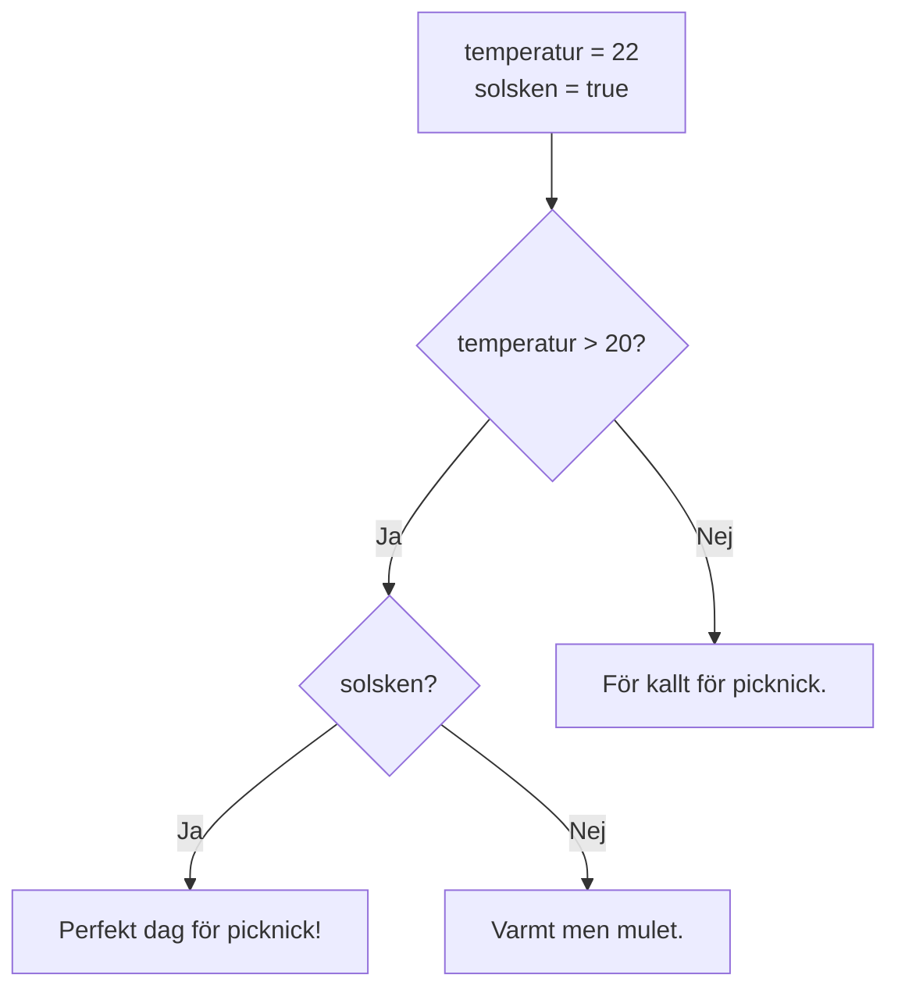

# Programmeringstermer — If-satser

En if-sats låter programmet fatta ett beslut. Beroende på om ett villkor är sant eller falskt körs olika kod. Det är den mest grundläggande formen av kontrollflöde i C#.

**Se även:** [Operatorer](operatorer.md) — för hur villkoren (`>`, `==`, `&&`) byggs upp.

---

## if

Nyckelordet `if` startar en villkorssats. Om villkoret inom parenteserna är sant (`true`) körs koden innanför måsvingarna — annars hoppas den helt över.

```csharp
int temperatur = 25;

if (temperatur > 20)
{
    Console.WriteLine("Det är varmt ute.");
}
```

### Output
```plaintext
Det är varmt ute.
```

Om `temperatur` hade varit 15 hade ingenting skrivits ut — koden innanför `{}` hoppas över när villkoret är falskt.

---

## else if

`else if` lägger till ett nytt villkor som testas om det föregående var falskt. Du kan ha hur många `else if` som helst i rad — de testas uppifrån och ned, och det första som är sant körs. Resten ignoreras.

```csharp
int temperatur = 15;

if (temperatur > 20)
{
    Console.WriteLine("Varmt");
}
else if (temperatur >= 10)
{
    Console.WriteLine("Lagom");
}
else if (temperatur >= 0)
{
    Console.WriteLine("Kallt");
}
```

### Output
```plaintext
Lagom
```

C# testar villkoren i ordning. `temperatur > 20` är falskt (15 är inte över 20), så den hoppar till `else if (temperatur >= 10)` — det är sant, så "Lagom" skrivs ut. De efterföljande grenarna testas aldrig.

---

## else

`else` är den sista utvägen — koden här körs om **inget** av de föregående villkoren var sant. `else` har inget eget villkor.

```csharp
int temperatur = -5;

if (temperatur > 20)
{
    Console.WriteLine("Varmt");
}
else if (temperatur >= 10)
{
    Console.WriteLine("Lagom");
}
else if (temperatur >= 0)
{
    Console.WriteLine("Kallt");
}
else
{
    Console.WriteLine("Minusgrader — ta på mössa!");
}
```

### Output
```plaintext
Minusgrader — ta på mössa!
```

`else` är alltid sist. Du kan ha en `if` helt utan `else` — det är helt OK. En `else` utan en `if` före är däremot ett kompileringsfel.

---

## Villkor (condition)

Villkoret är uttrycket innanför parenteserna efter `if`. Det måste alltid resultera i ett booleskt värde — antingen `true` eller `false`.

```csharp
int poäng = 42;

if (poäng >= 50)   // villkoret: är poäng större än eller lika med 50?
{
    Console.WriteLine("Godkänd");
}
```

Villkoret `poäng >= 50` evalueras till `false` (42 är inte >= 50), så blocket körs inte. Vanliga operatorer i villkor: `==`, `!=`, `<`, `>`, `<=`, `>=` — se [operatorer.md](operatorer.md) för en fullständig genomgång.

---

## Block `{}`

Måsvingarna `{}` avgränsar ett block — en grupp rader som hör ihop. Allt innanför blocket körs som en enhet om villkoret är sant.

```csharp
int ålder = 20;

if (ålder >= 18)
{
    Console.WriteLine("Du är myndig.");
    Console.WriteLine("Du får köpa alkohol.");
    Console.WriteLine("Du kan ta körkort.");
}
```

### Output
```plaintext
Du är myndig.
Du får köpa alkohol.
Du kan ta körkort.
```

Alla tre rader hör till `if`-blocket. Om `ålder` hade varit 16 hade ingen av dem körts.

<details><summary>Kan man skippa måsvingarna?</summary>

Ja — om blocket bara innehåller en enda rad kan du utelämna `{}`:

```csharp
if (ålder >= 18)
    Console.WriteLine("Myndig.");
```

Det fungerar, men är en källa till subtila buggar. Om du sen lägger till en rad tror du kanske att den också hör till `if`-satsen — det gör den inte. Rekommendationen för nybörjare: **använd alltid `{}`**.

</details>

---

## Nästlade if-satser

En if-sats innanför en annan if-sats kallas nästlad. Det låter dig kombinera flera villkor som alla måste vara uppfyllda.

```csharp
int temperatur = 22;
bool solsken = true;

if (temperatur > 20)
{
    if (solsken)
    {
        Console.WriteLine("Perfekt dag för picknick!");
    }
    else
    {
        Console.WriteLine("Varmt men mulet.");
    }
}
else
{
    Console.WriteLine("För kallt för picknick.");
}
```

### Output
```plaintext
Perfekt dag för picknick!
```

## Flödesschema



<details><summary>Nästlade if-satser vs logiska operatorer</summary>

Nästlade if-satser kan ofta skrivas kortare med `&&`:

```csharp
if (temperatur > 20 && solsken)
{
    Console.WriteLine("Perfekt dag för picknick!");
}
```

Båda fungerar. `&&`-varianten är kompaktare. Nästlad är ibland lättare att läsa när varje villkor har sin egen `else`-gren.

</details>

---

## Nästa steg

När det är många möjliga värden att jämföra mot — t.ex. veckodagar eller menyval — kan [`switch`](switch.md) vara ett tydligare alternativ än en lång rad `else if`.
