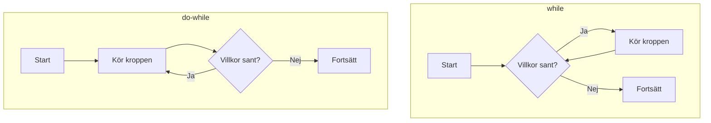

# Programmeringstermer — Loopar

En loop upprepar ett kodblock. Istället för att skriva samma rader tio gånger låter en loop datorn göra det åt dig. Det finns fyra looptyper i C# — varje typ passar olika situationer.

**Se även:** [if_else.md](if_else.md) — villkor används inuti loopar för att styra flödet.

---

## Iteration

Varje "varv" i en loop kallas en iteration. Om en loop körs tio gånger utför den tio iterationer.

---

## while

`while` kontrollerar sitt villkor **innan** varje iteration. Om villkoret är falskt redan från start körs loopen noll gånger.

```csharp
int räknare = 1;

while (räknare <= 5)
{
    Console.WriteLine($"Varv {räknare}");
    räknare++;
}
```

### Output
```plaintext
Varv 1
Varv 2
Varv 3
Varv 4
Varv 5
```

`räknare++` ökar variabeln med 1 efter varje varv. Utan den ökningen hade villkoret aldrig blivit falskt — loopen hade fortsatt för evigt.

---

## do-while

`do-while` kör koden **en gång först** och kontrollerar sedan villkoret. Det garanterar att loopkroppen alltid körs minst en gång.

```csharp
int räknare = 10;

do
{
    Console.WriteLine($"Räknare är: {räknare}");
    räknare++;
}
while (räknare < 10);
```

### Output
```plaintext
Räknare är: 10
```

`räknare` är redan 10 när loopen börjar — ett vanlig `while` hade aldrig kört alls. `do-while` kör kroppen en gång, kontrollerar sedan villkoret (`10 < 10` är falskt) och avslutar.

## Diagram: while vs do-while



Skillnaden: `while` kollar **före**, `do-while` kollar **efter**.

---

## for

`for` är kompaktast när du vet exakt hur många varv loopen ska göra. Tre delar ryms på en rad: startvärde, villkor och steguttryck.

```csharp
for (int i = 0; i < 5; i++)
{
    Console.WriteLine($"i är {i}");
}
```

### Output
```plaintext
i är 0
i är 1
i är 2
i är 3
i är 4
```

Delarna i `for`-satsen:
- `int i = 0` — loopvariabeln deklareras och ges startvärdet 0
- `i < 5` — villkoret som kontrolleras innan varje varv
- `i++` — körs efter varje varv (ökar `i` med 1)

---

## Loopvariabel

Variabeln som håller reda på vilket varv loopen är på kallas loopvariabel. I en `for`-loop deklareras den vanligtvis direkt i `for`-satsen och lever bara innanför loopen.

```csharp
for (int steg = 1; steg <= 3; steg++)
{
    Console.WriteLine($"Steg {steg} av 3");
}
```

### Output
```plaintext
Steg 1 av 3
Steg 2 av 3
Steg 3 av 3
```

`steg` existerar bara innanför loopen — du kan inte använda den utanför.

---

## foreach

`foreach` är gjord för att gå igenom en samling — en array eller lista — ett element i taget. Du behöver inte hålla koll på index.

```csharp
string[] frukter = { "Äpple", "Banan", "Mango" };

foreach (string frukt in frukter)
{
    Console.WriteLine(frukt);
}
```

### Output
```plaintext
Äpple
Banan
Mango
```

`frukt` är en tillfällig variabel som tar värdet av ett element per varv. `in frukter` talar om vilken samling vi itererar över.

<details><summary>Varför inte använda for-loop med index istället?</summary>

Du kan absolut skriva:
```csharp
for (int i = 0; i < frukter.Length; i++)
{
    Console.WriteLine(frukter[i]);
}
```

Båda fungerar. `foreach` är kortare och läsbarare när du bara behöver läsa elementen i ordning och inte behöver indexet. Behöver du indexet (t.ex. `frukter[i] = ...`) väljer du `for`.

</details>

---

## break

`break` avslutar loopen omedelbart och hoppar till koden direkt efter loopblocket — oavsett om villkoret fortfarande är sant.

```csharp
for (int i = 1; i <= 10; i++)
{
    if (i == 5)
    {
        break;
    }
    Console.WriteLine(i);
}

Console.WriteLine("Klart!");
```

### Output
```plaintext
1
2
3
4
Klart!
```

När `i` är 5 träffar koden `break` och hoppar direkt till "Klart!". Talen 5–10 skrivs aldrig ut.

---

## continue

`continue` hoppar över resten av det aktuella varvet och går direkt till nästa iteration — utan att avsluta hela loopen.

```csharp
for (int i = 1; i <= 5; i++)
{
    if (i == 3)
    {
        continue;
    }
    Console.WriteLine(i);
}
```

### Output
```plaintext
1
2
4
5
```

När `i` är 3 hoppar koden över `Console.WriteLine` och går direkt till nästa varv (i = 4). Loopen fortsätter — det är skillnaden från `break`.

---

## Oändlig loop

En oändlig loop är en loop vars villkor aldrig blir falskt — programmet fastnar och körs för evigt (eller tills du stänger det).

```csharp
// Oändlig loop — kör INTE detta
while (true)
{
    Console.WriteLine("Hjälp, jag kan inte sluta!");
}
```

Vanliga orsaker:
- Glömt att ändra loopvariabeln (`räknare++` saknas)
- Villkoret är alltid sant (`while (true)` utan `break`)

I Visual Studio Code: tryck `Ctrl+C` i terminalen för att avbryta ett program som hänger.

<details><summary>När är while(true) faktiskt rätt?</summary>

`while (true)` med en `break` inuti är ett legitimt mönster när du inte vet i förväg när loopen ska sluta — t.ex. en meny som ska fortsätta tills användaren väljer "Avsluta". Nyckelordet `break` är då din utväg.

</details>

---

## Nästa steg

Loopar och villkor hänger ihop — `break` och `continue` bygger på if-satser inuti loopar. Se [if_else.md](if_else.md) om du vill repetera hur villkor byggs upp.
