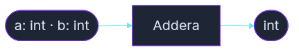

<!-- _class: title -->

# Metoder

### Sluta skriva samma kod två gånger

_Kurs 01 · Vecka 4 · Nion Education_

---

## Vad är en metod?

En metod är ett **namngivet kodblock** som du kan anropa när du vill.

```csharp
// Utan metod — du upprepar dig
Console.WriteLine("Välkommen, Alex!");
Console.WriteLine("Välkommen, Sam!");
Console.WriteLine("Välkommen, Kim!");

// Med metod — du skriver logiken en gång
SkrivHälsning("Alex");
SkrivHälsning("Sam");
SkrivHälsning("Kim");
```

Metoder gör koden kortare, tydligare och lättare att ändra.
Ändra ett ställe — och det gäller överallt.

> 💬 _"En metod är ett löfte: den gör en sak, och den gör den rätt varje gång."_

---

## Metodens delar

```csharp
static void SkrivHälsning(string namn)
{
    Console.WriteLine("Hej, " + namn + "!");
}
```

- `static` — metoden tillhör klassen, inte ett objekt (mer om det vecka 5)
- `void` — metoden returnerar **inget värde**
- `SkrivHälsning` — metodens namn, alltid PascalCase
- `string namn` — en parameter: namn och typ

> 💡 Precis som i alla andra fall med måsvingar — variabler som skapas inuti metoden dör när metoden är klar. Det enda som lever vidare är det värde som returneras.

---

## Metodens flöde

Indata in → metoden gör sitt jobb → utdata tillbaka




- Stadionform `( )` = start och slut — **parametrar** och **returvärde**
- Rektangel `[ ]` = vad metoden gör inuti
- `void` = inget returvärde (metoden gör något men ger dig inget tillbaka)

---

## void — gör något, returnerar inget

`void` betyder att metoden utför en handling och sedan är klar.
Den ger dig inget tillbaka.

```csharp
static void SkrivHälsning(string namn)
{
    Console.WriteLine("Hej, " + namn + "!");
}

static void Main()
{
    SkrivHälsning("Alex");   // Utskrift: Hej, Alex!
    SkrivHälsning("Sam");    // Utskrift: Hej, Sam!
}
```

Tänk på `void` som en maskin som bara **gör** — som en skrivare.
Du trycker på knappen, något händer, men du får inget tillbaka i handen.

---

## Returvärde — beräkna och skicka tillbaka

Ibland vill du att metoden ska räkna ut något och **ge dig svaret**.
Då byter du ut `void` mot den typ du vill returnera.

```csharp
static int Addera(int a, int b)
{
    return a + b;
}
```

```csharp
int summa = Addera(3, 5);
Console.WriteLine("3 + 5 = " + summa);   // Utskrift: 3 + 5 = 8
```

`return` skickar tillbaka värdet till anroparen — metoden stannar direkt.

> 💬 _"Om void är en skrivare, är en metod med returvärde en miniräknare — du ger den siffror, du får ett svar tillbaka."_

---

## Parametrar — indata till metoden

Parametrar är de **variabler** metoden tar emot som indata.
Du kan ha noll, en eller flera — separera dem med komma.

```csharp
static void SkrivUtDatum()                        // ingen parameter
static void SkrivHälsning(string namn)             // en parameter
static double Beräkna(double pris, double moms)    // två parametrar
```

Parametrar deklareras med **typ och namn** — precis som vanliga variabler.

---

## Metoden anropas från Main

`Main` är startpunkten. Därifrån **anropar** du dina metoder.

```csharp
static void Main()
{
    SkrivHälsning("Alex");

    int summa = Addera(3, 5);
    Console.WriteLine("3 + 5 = " + summa);

    bool myndig = ÄrMyndig(20);
    Console.WriteLine("Myndig: " + myndig);
}
```

Varje anrop är ett namn följt av parentes `()`.
Har metoden parametrar skickar du med **argument** inuti parentesen.

Argument = de **faktiska värden** du skickar in.
Parameter = variabeln som **tar emot** dem inuti metoden.

---

## bool — ställ en fråga, få sant eller falskt

En metod kan returnera `bool` för att svara på en ja/nej-fråga.
Det håller villkorslogiken på ett ställe.

```csharp
static bool ÄrMyndig(int ålder)
{
    return ålder >= 18;
}
```

```csharp
if (ÄrMyndig(15))
    Console.WriteLine("Tillträde beviljat.");
else
    Console.WriteLine("Tillträde nekas.");
```

> 💬 _"En bool-metod läses som en fråga: ÄrMyndig(20) — ja eller nej?"_

---

## Namngivning — vad metoden heter spelar roll

Metoder namnges alltid med **PascalCase** och ett **verb**.

| Prefix | Används när… | Exempel |
|--------|-------------|---------|
| `Skriv` / `Print` | Metoden skriver ut något | `SkrivHälsning` |
| `Beräkna` / `Calculate` | Metoden räknar ut ett värde | `BeräknaTotal` |
| `Hämta` / `Get` | Metoden returnerar ett värde | `HämtaNamn` |
| `Är` / `Is` / `Har` / `Has` | Metoden svarar ja/nej | `ÄrMyndig` |
| `Kontrollera` / `Check` | Metoden validerar något | `KontrolleraInmatning` |

Ett bra metodnamn berättar vad metoden gör — utan att du behöver läsa kroppen.

---

## Varför dela upp koden i metoder?

Tre starka skäl:

**1. Läsbarhet** — `Main` berättar _vad_ som händer, metoderna berättar _hur_.

**2. Återanvändning** — skriv logiken en gång, anropa den hur många gånger du vill.

**3. DRY** — _Don't Repeat Yourself_. Upprepning är en buggkälla.
Måste du ändra något? Ändra på ett ställe, inte tjugo.

> 💬 _"Om du copy-pastar kod — fundera på om det är dags för en metod."_

---

## Allt tillsammans

```csharp
// void — gör något, returnerar inget
static void SkrivHälsning(string namn)
{
    Console.WriteLine("Hej, " + namn + "!");
}
// int — räknar ut och returnerar ett värde
static int Addera(int a, int b)
{
    return a + b;
}
// bool — ställer en fråga, svarar sant eller falskt
static bool ÄrMyndig(int ålder)
{
    return ålder >= 18;
}
static void Main()
{
    SkrivHälsning("Alex");
    int summa = Addera(3, 5);
    Console.WriteLine("3 + 5 = " + summa);
    bool myndig = ÄrMyndig(20);
    Console.WriteLine("Myndig: " + myndig);
}
```

---

<!-- _class: title -->

# Nu är det din tur

### Övningar finns i `exercises/`

🟢 `calculator_methods.md` — bygg en miniräknare med metoder  
🟡 `grade_calculator.md` — beräkna och tolka betyg med flera metoder

_Ta det steg för steg. Använd tipsen om du fastnar._
