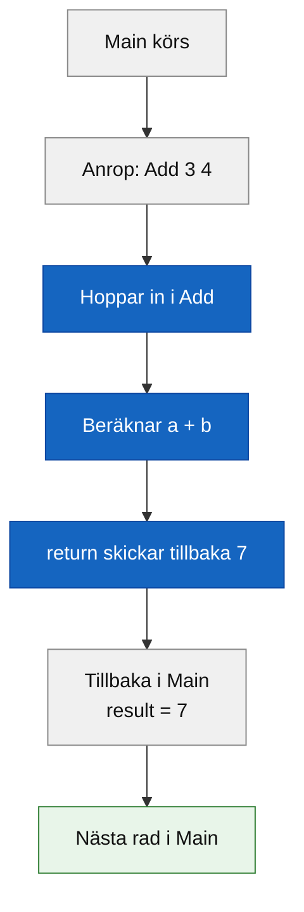
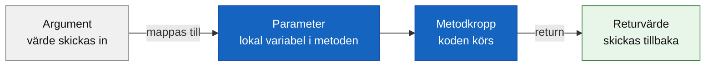

# Programmeringstermer — Metoder

## Metod

En metod är ett namngivet kodblock som utför en avgränsad uppgift. Du skriver koden en gång, och sedan kan du anropa den hur många gånger du vill.

Det är DRY-principen i praktiken — **Don't Repeat Yourself**. Utan metoder ser kod ofta ut såhär:

```csharp
Console.WriteLine("Hej, Anna!");
Console.WriteLine("Välkommen till kursen.");
Console.WriteLine("---");

Console.WriteLine("Hej, Björn!");
Console.WriteLine("Välkommen till kursen.");
Console.WriteLine("---");

Console.WriteLine("Hej, Camilla!");
Console.WriteLine("Välkommen till kursen.");
Console.WriteLine("---");
```

Med en metod skriver du logiken en enda gång och anropar den istället:

```csharp
static void PrintGreeting(string name)
{
    Console.WriteLine("Hej, " + name + "!");
    Console.WriteLine("Välkommen till kursen.");
    Console.WriteLine("---");
}

PrintGreeting("Anna");
PrintGreeting("Björn");
PrintGreeting("Camilla");
```

Koden är kortare, lättare att läsa — och om hälsningsfrasen ska ändras gör du det på ett ställe, inte tre.

**Se även:** [Metodsignatur](#metodsignatur), [Anrop](#anrop), [../notes/](../notes/).

---

## Metodsignatur

Metodsignaturen är metodens "kontrakt" — den beskriver vad metoden heter, vad den tar emot och vad den returnerar. Den består av tre delar:

1. **Returtyp** — vad metoden skickar tillbaka (eller `void` om ingenting)
2. **Namn** — vad metoden kallas
3. **Parameterlista** — vilka värden den tar emot, och av vilken typ

```csharp
//  returtyp  namn      parametrar
    static int Add(int a, int b)
```

Allt innan klammerparenteserna `{ }` är signaturen. Koden inuti är metodens **kropp**.

**Se även:** [Returtyp](#returtyp), [Parameter](#parameter).

---

## Returtyp

Returtypen talar om vad metoden skickar tillbaka till den som anropade den. Om metoden inte returnerar något alls används `void`.

```csharp
// void — returnerar ingenting, gör bara något
static void PrintGreeting(string name)
{
    Console.WriteLine("Hej, " + name + "!");
}

// int — returnerar ett heltal
static int Add(int a, int b)
{
    return a + b;
}

// string — returnerar text
static string GetFullName(string firstName, string lastName)
{
    return firstName + " " + lastName;
}

// bool — returnerar sant eller falskt
static bool IsEven(int number)
{
    return number % 2 == 0;
}
```

Returtypen bestämmer vilken typ variabeln på vänster sida måste ha när du tar emot resultatet:

```csharp
int sum = Add(3, 4);
string fullName = GetFullName("Anna", "Svensson");
bool result = IsEven(6);
```

**Se även:** [return](#return), [Metodsignatur](#metodsignatur).

---

## Parameter

En parameter är en variabel som metoden tar emot som indata. Du deklarerar den i metodsignaturen, precis som en vanlig variabel — typ och namn.

```csharp
static void PrintGreeting(string name)
//                        ^^^^^^^^^^^
//                        parameter: typ 'string', namn 'name'
{
    Console.WriteLine("Hej, " + name + "!");
}
```

En metod kan ha flera parametrar, separerade med komma:

```csharp
static int Add(int a, int b)
//             ^^^^^  ^^^^^
//             param1 param2
{
    return a + b;
}
```

### Parameter vs argument

Det är lätt att blanda ihop de här två orden — de syftar på samma sak men vid olika tidpunkter:

- **Parameter** — variabelnamnet i metoddefinitionen (när du skriver metoden)
- **Argument** — det faktiska värdet du skickar in när du anropar metoden

```csharp
static int Add(int a, int b)   // a och b är PARAMETRAR
{
    return a + b;
}

int result = Add(3, 4);        // 3 och 4 är ARGUMENT
```

**Se även:** [Argument](#argument), [Metodsignatur](#metodsignatur).

---

## Argument

Argumentet är det konkreta värde du skickar in till en metod när du anropar den. Det hamnar i metodens parameter och kan användas i metodens kropp.

```csharp
PrintGreeting("Anna");   // "Anna" är argumentet
Add(10, 5);              // 10 och 5 är argumenten
```

Argumentet kan vara ett literalt värde, en variabel, eller ett uttryck:

```csharp
string playerName = "Björn";
int x = 3;
int y = 7;

PrintGreeting(playerName);   // variabel som argument
Add(x, y);                   // variabler som argument
Add(x + 2, y * 2);           // uttryck som argument
```

**Se även:** [Parameter](#parameter).

---

## return

Nyckelordet `return` gör två saker på en gång: det skickar tillbaka ett värde till den som anropade metoden, och det avslutar metoden omedelbart.

```csharp
static int Add(int a, int b)
{
    return a + b;   // skickar tillbaka summan, metoden är klar
}
```

I en `void`-metod kan du skriva bara `return;` (utan värde) för att avsluta tidigt — till exempel om ett villkor inte stämmer:

```csharp
static void PrintPositive(int number)
{
    if (number <= 0)
    {
        return;   // avsluta tidigt, skriv ingenting
    }
    Console.WriteLine(number);
}
```

Kod efter en `return`-sats i samma block körs aldrig. En metod med en icke-`void` returtyp måste alltid sluta med ett `return` — annars vägrar kompilatorn.

**Se även:** [Returtyp](#returtyp).

---

## static

Nyckelordet `static` betyder att metoden tillhör **klassen** direkt, inte ett specifikt objekt. Just nu i kursen skriver vi alla metoder som `static` för att de ska kunna anropas direkt från `Main` — som också är statisk.

```csharp
class Program
{
    static void Main(string[] args)
    {
        int result = Add(3, 4);
        Console.WriteLine(result);
    }

    static int Add(int a, int b)
    {
        return a + b;
    }
}
```

En statisk metod kan anropa en annan statisk metod direkt, utan att behöva skapa ett objekt. När du börjar jobba med klasser och objekt i vecka 05 kommer du se skillnaden tydligare.

**Se även:** [Klasser och OOP](../../05_klasser_och_oop/programmeringstermer/klasser.md).

---

## Anrop

Att anropa en metod innebär att du kör koden i metodkroppen. Du skriver metodens namn följt av parenteser — med de argument metoden förväntar sig inuti.

```csharp
// Anrop av void-metod
PrintGreeting("Anna");

// Anrop av metod som returnerar ett värde
int sum = Add(3, 4);

// Anrop inuti ett uttryck
Console.WriteLine(Add(10, 5));
```

När programmet når ett anrop hoppar det in i metodkroppen, kör koden där, och hoppar sedan tillbaka till nästa rad efter anropet.



**Se även:** [Parameter](#parameter), [Argument](#argument), [return](#return).

---

## Flödesöversikt — parameter, metodkropp, returvärde



<details><summary>Hela bilden — en metod med returvärde och en utan</summary>

```csharp
// Metod med returvärde
static int Add(int a, int b)
{
    return a + b;
}

// Metod utan returvärde (void)
static void PrintGreeting(string name)
{
    Console.WriteLine("Hej, " + name + "!");
}

static void Main(string[] args)
{
    // Add returnerar ett värde — vi sparar det i en variabel
    int sum = Add(3, 4);
    Console.WriteLine("Summan är: " + sum);

    // PrintGreeting returnerar ingenting — vi anropar den direkt
    PrintGreeting("Anna");
    PrintGreeting("Björn");
}
```

### Output
```plaintext
Summan är: 7
Hej, Anna!
Hej, Björn!
```

</details>
