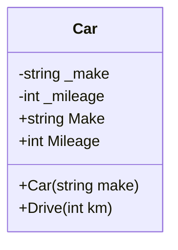

# Programmeringstermer — Klasser och objekt

## Klass

En klass är en mall — en ritning som beskriver hur ett visst slags objekt ska se ut och bete sig. Klassen i sig är inte ett objekt, precis som en husbeskrivning inte är ett hus.

```csharp
class Car
{
    // fält, properties och metoder samlas här
}
```

Du kan ha hur många objekt du vill av samma klass, precis som du kan bygga hur många hus du vill från samma ritning — varje hus är sitt eget, med sin egen adress och färg.

**Se även:** [Objekt](#objekt), [Konstruktor](#konstruktor).

---

## Objekt

Ett objekt är en **instans** av en klass — en konkret sak skapad från mallen. Du skapar ett objekt med nyckelordet `new`.

```csharp
Car myCar = new Car("Volvo");
Car otherCar = new Car("Toyota");
```

`myCar` och `otherCar` är två separata objekt. De delar samma struktur (de är båda `Car`), men de har sina egna fält och sitt eget tillstånd — om du kör med `myCar` påverkar det inte `otherCar`.

**Se även:** [Klass](#klass), [new](#new-nyckelordet), [Instans](#instans).

---

## Fält

Ett fält är en variabel som lagrar data inuti ett objekt. Fält deklareras i klassen och är normalt **privata** — de ska inte kunna ändras utifrån hur som helst.

```csharp
class Car
{
    private string _make;
    private int _mileage;
}
```

Konventionen i C# är att privata fält börjar med understreck: `_make`, `_mileage`. Det gör det tydligt i koden vad som är ett fält och vad som är en lokal variabel.

Fältet är den faktiska lagringsplatsen. Du exponerar det kontrollerat via en property.

**Se även:** [Property](#property), [Inkapsling](oop.md#inkapsling).

---

## Property

En property är ett sätt att exponera ett fälts värde utåt på ett kontrollerat sätt. Den har en `get` (läsa) och ofta en `set` (skriva).

```csharp
class Car
{
    private string _make;

    public string Make
    {
        get { return _make; }
        set { _make = value; }
    }
}
```

Fördelen är kontroll: du kan göra en property skrivskyddad (bara `get`), lägga till validering i `set`, eller beräkna värdet dynamiskt. Utanför klassen ser det ut som en vanlig variabel:

```csharp
Car myCar = new Car("Volvo");
Console.WriteLine(myCar.Make);   // läser via get
myCar.Make = "Saab";             // skriver via set
```

<details><summary>Auto-implementerad property — kortformen</summary>

Om du inte behöver någon logik i `get`/`set` kan du använda kortformen. C# sköter fältet i bakgrunden automatiskt:

```csharp
class Car
{
    public string Make { get; set; }
    public int Mileage { get; private set; }   // bara klassen kan skriva
}
```

Det är ofta den form du ser i kursmaterialet när ingen extra logik behövs.

</details>

**Se även:** [Fält](#fält), [Inkapsling](oop.md#inkapsling).

---

## Konstruktor

Konstruktorn är en speciell metod som körs automatiskt när du skapar ett objekt med `new`. Den initierar objektets fält så att objektet har ett giltigt starttillstånd direkt.

```csharp
class Car
{
    private string _make;
    private int _mileage;

    public Car(string make)
    {
        _make = make;
        _mileage = 0;
    }
}
```

Konstruktorn har **samma namn som klassen** och ingen returtyp — inte ens `void`.

```csharp
Car myCar = new Car("Volvo");
//                  ^^^^^^^
//                  argumentet hamnar i konstruktorns 'make'-parameter
```

<details><summary>Standardkonstruktor</summary>

Om du inte skriver någon konstruktor alls lägger C# till en tom åt dig automatiskt — en så kallad standardkonstruktor. Den tar inga argument och gör ingenting. Så fort du skriver din egen konstruktor försvinner standardkonstruktorn, och du måste skriva den explicit om du fortfarande vill kunna skapa objekt utan argument.

```csharp
class Car
{
    public string Make { get; set; }

    // Tom standardkonstruktor — behövs när en annan konstruktor redan finns
    public Car() { }

    public Car(string make)
    {
        Make = make;
    }
}
```

</details>

**Se även:** [Objekt](#objekt), [new](#new-nyckelordet).

---

## Instans

Instans och objekt betyder samma sak — ett konkret exemplar av en klass. Att "skapa en instans" och att "skapa ett objekt" är samma operation.

```csharp
Car firstCar = new Car("Volvo");    // en instans
Car secondCar = new Car("Toyota");  // en annan instans
```

Varje instans har sin egen kopia av fältens värden. Om du ändrar `firstCar.Mileage` påverkar det inte `secondCar.Mileage`.

**Se även:** [Objekt](#objekt), [Klass](#klass).

---

## new-nyckelordet

`new` skapar en ny instans av en klass. Det allokerar minne för objektet och anropar konstruktorn.

```csharp
Car myCar = new Car("Volvo");
```

Utan `new` existerar objektet inte — variabeln `myCar` är bara en tom referens (i C# kallas det `null`).

**Se även:** [Konstruktor](#konstruktor), [Instans](#instans).

---

## Samlad bild — klass med fält, property och konstruktor

```csharp
class Car
{
    private string _make;
    private int _mileage;

    public string Make
    {
        get { return _make; }
    }

    public int Mileage
    {
        get { return _mileage; }
    }

    public Car(string make)
    {
        _make = make;
        _mileage = 0;
    }

    public void Drive(int km)
    {
        _mileage += km;
    }
}

// Skapa två separata instanser
Car firstCar = new Car("Volvo");
Car secondCar = new Car("Toyota");

firstCar.Drive(100);
secondCar.Drive(250);

Console.WriteLine(firstCar.Make + " har kört " + firstCar.Mileage + " km.");
Console.WriteLine(secondCar.Make + " har kört " + secondCar.Mileage + " km.");
```

### Output
```plaintext
Volvo har kört 100 km.
Toyota har kört 250 km.
```



**Se även:** [OOP och inkapsling](oop.md), [Metoder](../../04_metoder/programmeringstermer/metoder.md).
