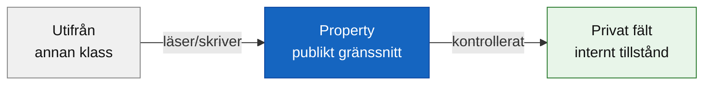

# Programmeringstermer — OOP

OOP — objektorienterad programmering — är ett sätt att organisera kod kring objekt som kombinerar data och beteende. Det bygger på fyra grundpelare. Den här veckan fokuserar vi på de två första; de andra två återkommer i ett senare avsnitt.

---

## Inkapsling

Inkapsling innebär att ett objekts inre data skyddas — den är inte tillgänglig direkt utifrån. Istället kontrollerar objektet själv hur data läses och skrivs, via properties och metoder.

### Utan inkapsling

```csharp
class Car
{
    public int mileage;   // publikt fält — vem som helst kan sätta vilket värde som helst
}

Car myCar = new Car();
myCar.mileage = -999;    // det här borde inte vara möjligt
```

Ingenting hindrar att någon sätter ett ogiltigt värde. Koden kompilerar och kör — men programmet beter sig fel.

### Med inkapsling

```csharp
class Car
{
    private int _mileage;

    public int Mileage
    {
        get { return _mileage; }
        set
        {
            if (value >= 0)
            {
                _mileage = value;
            }
        }
    }
}

Car myCar = new Car();
myCar.Mileage = 500;    // fungerar
myCar.Mileage = -999;   // ignoreras — klassen skyddar sitt eget data
```

Fältet `_mileage` är privat — bara klassen själv kan skriva till det direkt. Utifrån sker allt via propertyn `Mileage`, som kontrollerar att värdet är rimligt.

### Tumregeln

- Fält är **privata** (`private`)
- Properties är **publika** (`public`) och exponerar bara det som behöver exponeras
- Metoder gör saker med objektets data på ett kontrollerat sätt



<details><summary>Varför spelar det roll?</summary>

Tänk på en bil: du kan trycka på gaspedalen, men du kan inte direkt nå in och justera bränsleinsprutningen med handen. Bilen exponerar ett enkelt gränssnitt (pedaler, ratt) och skyddar det komplexa innanverket. Det är inkapsling i verkligheten.

I kod betyder det att klasser kan ändra sin interna implementation utan att bryta kod som använder dem — så länge det publika gränssnittet (properties och metoder) ser likadant ut. Det gör koden mycket lättare att underhålla och förbättra över tid.

</details>

**Se även:** [Fält och properties](klasser.md#fält), [klasser.md](klasser.md).

---

## Abstraktion

Abstraktion innebär att dölja komplexitet bakom ett enkelt gränssnitt. Du behöver inte veta hur något fungerar inuti — du behöver bara veta hur du använder det.

```csharp
class Car
{
    private int _mileage;
    private double _fuelLevel;

    public void Drive(int km)
    {
        // inuti kan det vara hur komplicerat som helst
        _mileage += km;
        _fuelLevel -= km * 0.08;
    }
}

Car myCar = new Car("Volvo");
myCar.Drive(100);   // enkelt att använda — vad som händer inuti spelar ingen roll
```

Du behöver inte bry dig om hur `Drive` beräknar bränsleförbrukning. Det är det stora löftet med objektorienterad kod: väldesignade klasser är enkla att använda utifrån, även om de är komplexa inuti.

Abstraktion och inkapsling hänger tätt ihop — inkapsling skyddar datan, abstraktion döljer komplexiteten.

**Se även:** [Inkapsling](#inkapsling).

---

## Arv

Arv gör det möjligt för en klass att ärva fält, properties och metoder från en annan klass. En `ElectricCar` kan ärva från `Car` och få all bil-funktionalitet gratis, och sedan lägga till det som är unikt för elbilar.

Det här är ett kommande ämne i kursen — du behöver inte kunna det just nu. Men om du är nyfiken:

```csharp
// Förhandstitt — vi återkommer till detta
class ElectricCar : Car
{
    public int BatteryLevel { get; set; }
}
```

`:` efter klassnamnet anger vilken klass som ärvs från. `ElectricCar` får allt `Car` har, plus `BatteryLevel`.

---

## Polymorfism

Polymorfism (av grekiska: "många former") innebär att olika objekt kan svara på samma anrop på olika sätt. En metod kan bete sig olika beroende på vilket objekt den anropas på.

Det är också ett kommande ämne — det hänger ihop med arv och kommer att bli tydligt när vi jobbar med basklasser och ärvda klasser senare i kursen.

---

## Sammanfattning

| Pelare | Kärna | Kursstatus |
|---|---|---|
| Inkapsling | Skydda data, exponera kontrollerat | Vecka 05 — nu |
| Abstraktion | Dölja komplexitet bakom enkelt gränssnitt | Vecka 05 — nu |
| Arv | Återanvänd och utöka klasser | Kommer senare |
| Polymorfism | Samma anrop, olika beteende | Kommer senare |

**Se även:** [klasser.md](klasser.md), [Metoder](../../04_metoder/programmeringstermer/metoder.md).
