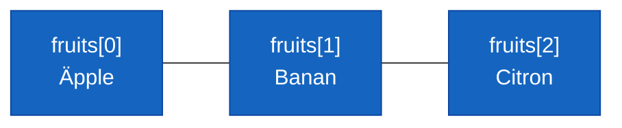

# Programmeringstermer — Arrayer

## Array

En array är en samling av värden av **samma typ** med en **fast storlek**. Du bestämmer hur många element den ska ha när du skapar den — och det går inte att ändra efteråt.

```csharp
string[] fruits = { "Äpple", "Banan", "Citron" };
int[] scores = { 10, 25, 8, 42, 17 };
```

Arrayen håller elementen i en ordnad rad. Varje element har en position — ett index — som du använder för att hämta eller ändra just det elementet.

**Se även:** [Index](#index), [Längd](#längd-arraylength), [List<T>](listor.md).

---

## Index

Index är positionen för ett element i arrayen. Det börjar på **0**, inte 1. Det första elementet är alltså `[0]`, det andra `[1]`, och så vidare.

```csharp
string[] fruits = { "Äpple", "Banan", "Citron" };

Console.WriteLine(fruits[0]);   // Äpple
Console.WriteLine(fruits[1]);   // Banan
Console.WriteLine(fruits[2]);   // Citron
```



Att försöka använda ett index utanför arrayens gränser — till exempel `fruits[3]` på en array med tre element — ger ett körningsfel: `IndexOutOfRangeException`. Det är ett vanligt misstag, och kompilatorn kan inte alltid varna för det i förväg.

**Se även:** [Längd](#längd-arraylength), [for-loop med arrayer](#for-loop-med-arrayer).

---

## Längd — array.Length

`Length` är en property på alla arrayer som talar om hur många element den innehåller.

```csharp
string[] fruits = { "Äpple", "Banan", "Citron" };
Console.WriteLine(fruits.Length);   // 3
```

Det sista giltiga indexet är alltid `array.Length - 1`, inte `array.Length`. Det är en detalj som orsakar många off-by-one-buggar — ha den i bakhuvudet.

**Se även:** [Index](#index), [for-loop med arrayer](#for-loop-med-arrayer).

---

## for-loop med arrayer

Det klassiska mönstret för att gå igenom alla element i en array är en `for`-loop med ett index:

```csharp
string[] fruits = { "Äpple", "Banan", "Citron" };

for (int i = 0; i < fruits.Length; i++)
{
    Console.WriteLine(fruits[i]);
}
```

### Output
```plaintext
Äpple
Banan
Citron
```

Varför `i < fruits.Length` och inte `i <= fruits.Length`? För att det sista giltiga indexet är `fruits.Length - 1`. Om du använder `<=` försöker loopen läsa `fruits[3]` på en array med bara tre element — och kraschar.

`for`-loopen med index är användbar när du behöver veta **vilket** element du är på — till exempel för att skriva ut numret:

```csharp
for (int i = 0; i < fruits.Length; i++)
{
    Console.WriteLine((i + 1) + ". " + fruits[i]);
}
```

### Output
```plaintext
1. Äpple
2. Banan
3. Citron
```

**Se även:** [foreach med arrayer](#foreach-med-arrayer), [Index](#index).

---

## foreach med arrayer

När du bara vill gå igenom alla element utan att behöva hålla koll på index är `foreach` enklare och tydligare:

```csharp
string[] fruits = { "Äpple", "Banan", "Citron" };

foreach (string fruit in fruits)
{
    Console.WriteLine(fruit);
}
```

### Output
```plaintext
Äpple
Banan
Citron
```

`foreach` kan inte ändra elementen i arrayen och ger dig inget index — men när du bara vill läsa varje värde i tur och ordning är det det renaste sättet att skriva det.

**Se även:** [for-loop med arrayer](#for-loop-med-arrayer).

---

## Flerdimensionella arrayer

C# stöder arrayer med mer än en dimension — till exempel en tabell med rader och kolumner. Det är ett mer avancerat ämne, men om du är nyfiken:

```csharp
// 2D-array — 3 rader, 4 kolumner
int[,] grid = new int[3, 4];
grid[0, 0] = 1;
grid[2, 3] = 9;
```

Det här är inte något du behöver nu — det dyker upp naturligt när du jobbar med spelbräden, matriser eller liknande strukturer längre fram.

---

<details><summary>Deklarera och initiera en array på olika sätt</summary>

```csharp
// Initiera med värden direkt
string[] fruits = { "Äpple", "Banan", "Citron" };

// Deklarera storlek, fyll i efteråt
string[] colors = new string[3];
colors[0] = "Röd";
colors[1] = "Grön";
colors[2] = "Blå";

// Kombinerat
int[] numbers = new int[] { 1, 2, 3, 4, 5 };
```

Alla tre sätten skapar en array med fast storlek. Välj det som är tydligast för situationen — om du vet värdena direkt är `{ }` kortast; om du ska fylla i värdena dynamiskt är `new string[n]` rätt väg.

</details>

**Se även:** [List<T>](listor.md) — om du behöver en samling som kan växa.
