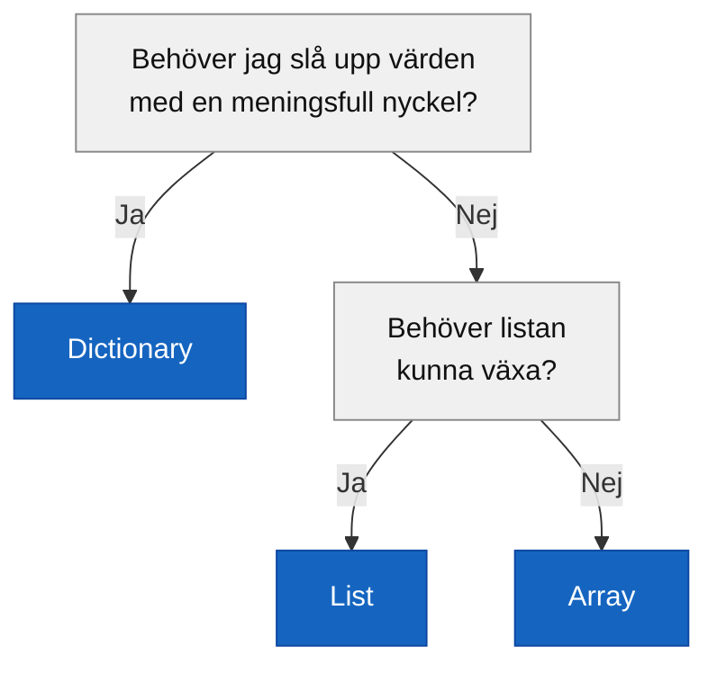

# Programmeringstermer — Dictionary

## Dictionary\<TKey, TValue\>

Ett dictionary lagrar värden i **nyckel-värde-par**. Istället för ett numeriskt index använder du en nyckel — ofta en sträng — för att hämta det tillhörande värdet.

```csharp
Dictionary<string, string> phonebook = new Dictionary<string, string>();
```

Typen anger: `TKey` är nyckelns typ och `TValue` är värdetypen. I telefonboken ovan är båda `string` — ett namn mappar till ett telefonnummer.

```csharp
Dictionary<string, string> phonebook = new Dictionary<string, string>();

phonebook.Add("Anna", "070-123 45 67");
phonebook.Add("Björn", "073-987 65 43");
phonebook.Add("Camilla", "076-555 00 11");

Console.WriteLine(phonebook["Anna"]);    // 070-123 45 67
```

### Output
```plaintext
070-123 45 67
```

Varje nyckel måste vara **unik** i ett dictionary. Försöker du lägga till samma nyckel två gånger kastas ett undantag.

**Se även:** [Nyckel och värde](#nyckel-och-värde), [Add ContainsKey Remove indexer](#add-containskey-remove-indexer).

---

## Nyckel och värde

Varje post i ett dictionary består av ett par:

- **Nyckel** (`TKey`) — det du söker på, måste vara unikt
- **Värde** (`TValue`) — det du hämtar, kan vara vad som helst

```csharp
Dictionary<string, int> ages = new Dictionary<string, int>();

ages.Add("Anna", 28);
ages.Add("Björn", 34);

//          nyckel    värde
//          "Anna" -> 28
//          "Björn"-> 34
```

Nyckeln fungerar som ett ID. Precis som att ett personnummer unikt identifierar en person, identifierar nyckeln unikt ett värde i dictionaryt.

---

## Add, ContainsKey, Remove, indexer

```csharp
Dictionary<string, string> phonebook = new Dictionary<string, string>();

// Lägg till ett par
phonebook.Add("Anna", "070-123 45 67");
phonebook.Add("Björn", "073-987 65 43");

// Hämta ett värde med indexer []
Console.WriteLine(phonebook["Anna"]);         // 070-123 45 67

// Kolla om en nyckel finns
Console.WriteLine(phonebook.ContainsKey("Anna"));    // True
Console.WriteLine(phonebook.ContainsKey("David"));   // False

// Ta bort ett par
phonebook.Remove("Björn");
Console.WriteLine(phonebook.ContainsKey("Björn"));   // False

// Uppdatera ett värde via indexer
phonebook["Anna"] = "070-999 00 00";
Console.WriteLine(phonebook["Anna"]);         // 070-999 00 00
```

### Output
```plaintext
070-123 45 67
True
False
False
070-999 00 00
```

<details><summary>Säker hämtning med TryGetValue</summary>

Att använda `phonebook["nyckel"]` direkt kraschar om nyckeln inte finns. Det säkrare sättet är `TryGetValue`:

```csharp
string number;
if (phonebook.TryGetValue("Anna", out number))
{
    Console.WriteLine("Hittade: " + number);
}
else
{
    Console.WriteLine("Anna finns inte i telefonboken.");
}
```

`TryGetValue` returnerar `true` om nyckeln hittades och lägger värdet i `out`-variabeln — annars returnerar den `false` utan att krascha. Det är det rekommenderade sättet när du inte är säker på om nyckeln finns.

</details>

---

## Iterera med foreach

För att gå igenom alla par i ett dictionary använder du `foreach` med `KeyValuePair<TKey, TValue>`:

```csharp
Dictionary<string, string> phonebook = new Dictionary<string, string>
{
    { "Anna", "070-123 45 67" },
    { "Björn", "073-987 65 43" },
    { "Camilla", "076-555 00 11" }
};

foreach (KeyValuePair<string, string> entry in phonebook)
{
    Console.WriteLine(entry.Key + ": " + entry.Value);
}
```

### Output
```plaintext
Anna: 070-123 45 67
Björn: 073-987 65 43
Camilla: 076-555 00 11
```

`entry.Key` ger nyckeln, `entry.Value` ger värdet. Observera att ordningen i ett dictionary inte är garanterad — om du behöver en specifik ordning behöver du sortera separat.

<details><summary>Kortare syntax med var i foreach</summary>

I verkligheten ser du ofta `var` i foreach-loopen, eftersom typen är lång att skriva ut. I den här kursen använder vi inte `var`, men det är bra att känna igen det:

```csharp
// Så här ser det ut i verklig kod — du behöver inte skriva så
foreach (var entry in phonebook)
{
    Console.WriteLine(entry.Key + ": " + entry.Value);
}
```

Det är exakt samma sak som att skriva ut hela `KeyValuePair<string, string>` — kompilatorn vet typen ändå.

</details>

---

## När ska jag använda Dictionary vs List?

| | List\<T\> | Dictionary\<TKey, TValue\> |
|---|---|---|
| Hämta element | Via index: `list[2]` | Via nyckel: `dict["Anna"]` |
| Bra för | En ordnad rad av värden | Uppslagstabell — nyckel till värde |
| Kolla om något finns | `Contains(värde)` | `ContainsKey(nyckel)` |
| Typisk användning | Shoppinglista, highscore-lista | Telefonbok, konfiguration, räknare |

Välj dictionary när du vill **slå upp** ett värde med ett meningsfullt ID — ett namn, ett personnummer, en produktkod. Välj lista när du vill ha en **sekvens** av värden och ordningen spelar roll.



**Se även:** [List<T>](listor.md), [Array](arrayer.md).
