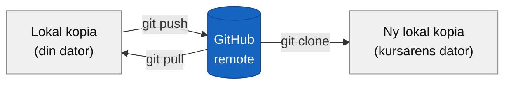
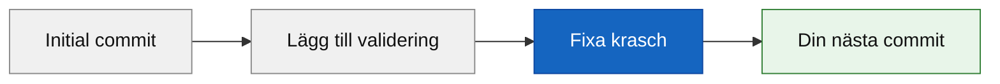
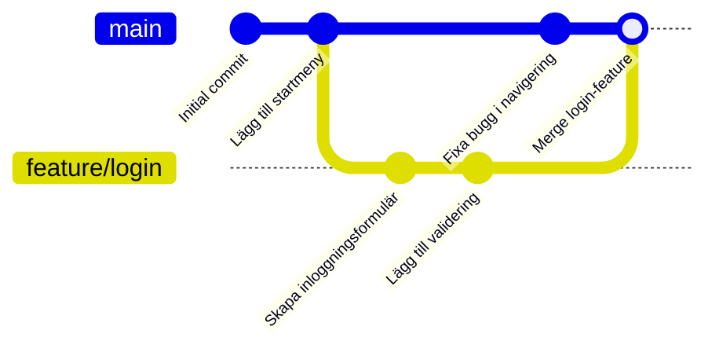
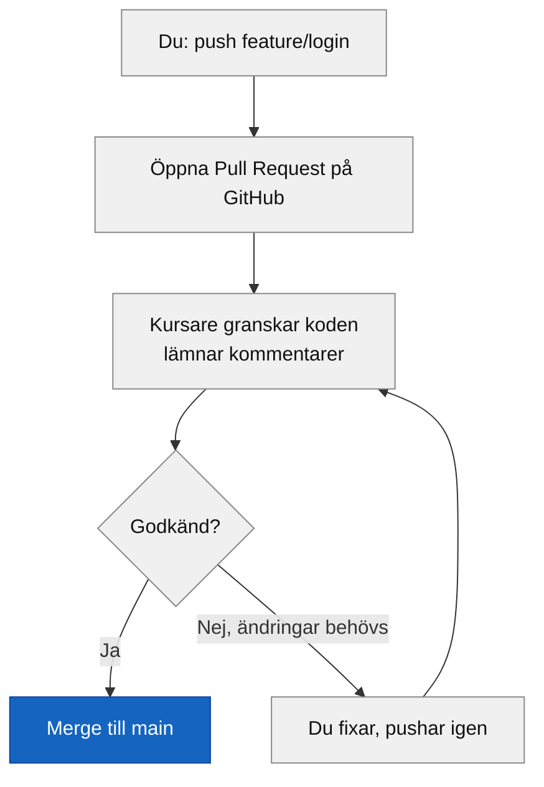
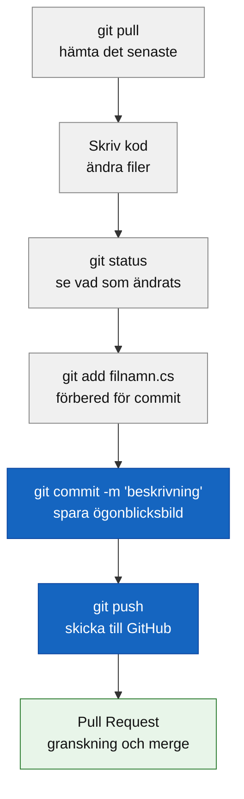

# Programmeringstermer — Git och Markdown

Git och Markdown är varandras naturliga följeslagare i professionell mjukvaruutveckling. Git håller koll på vad du ändrat och när — Markdown gör det du skriver läsbart för både människor och verktyg. Den här veckan sätter vi ihop dem: commit-meddelanden, README-filer och pull request-beskrivningar är alla Markdown i praktiken.

**Se även:** [git.md](../../01_verktyg_och_git/programmeringstermer/git.md) — grundläggande Git-kommandon, [git_konflikter.md](../../01_verktyg_och_git/programmeringstermer/git_konflikter.md) — merge-konflikter.

---

## Git · Versionshantering

Git är ett versionshanteringssystem — en tidsmaskin för din kod. Det håller koll på varje ändring du gör, vem som gjorde den och varför. Utan Git slutar det ofta med mappar döpta till `projekt_final_RIKTIG_v2_ny.zip`.

Tänk på det som ett automatiskt sparande i ett datorspel: varje commit är en checkpoint du alltid kan hoppa tillbaka till.

```bash
git init          # förvandla en mapp till ett Git-repo
git status        # vad har ändrats?
git add README.md # förbered filen
git commit -m "Lägg till README med projekbeskrivning"
git push          # skicka till GitHub
```

> 🖼️ **Bild:** Skärmdump av `git log --oneline` med 5–6 commits, där commit-meddelandena är meningsfulla ("fix: validering av e-post") vs dåliga ("asdf", "fixar grejer")

---

## Repository · Repo

Ett repository (kortform: repo) är Git:s databas för ett projekt — det lagrar alla filer och hela deras ändringshistorik. Det finns alltid i två versioner: din lokala kopia (på datorn) och en remote-kopia (på GitHub).

Tänk på det som ett molndokument: du jobbar lokalt, synkar till molnet med push/pull.

```bash
git clone git@github.com:dittnamn/mitt-projekt.git
# Skapar en lokal kopia med hela historiken
```



---

## Commit · Ögonblicksbild

En commit är en sparad ögonblicksbild av projektet vid en specifik tidpunkt. Varje commit har ett unikt ID (ett hash), ett meddelande, och är kopplad till den föregående commiten — det bildar en kedja.

Tänk på det som ett fotografi av kodbasen: inte en lista med ändringar, utan hela bilden vid det tillfället.

```bash
git add Program.cs
git commit -m "Lägg till validering av e-postadress"

# Visa senaste commits
git log --oneline
```

### Output
```plaintext
a3f7c91 Lägg till validering av e-postadress
d8b2e14 Fixa krasch när lista är tom
4c1a309 Initial commit
```

Vad gör ett bra commit-meddelande? Det förklarar **varför**, inte bara vad. `"fix"` hjälper ingen tre månader senare. `"fix: förhindra krasch när användarlistan är tom"` berättar vad som gick fel och vad som åtgärdades.



> 🖼️ **Bild:** Meme: "git commit -m 'fix'" — en person med en commit-historik full av "fix", "fixar", "försöker igen", "wtf", "äntligen"

---

## Branch · Gren

En branch är en parallell version av koden. Standardbranchen heter `main`. Du skapar en ny branch när du vill jobba på en ny funktion utan att röra fungerande kod.

Tänk på det som ett spårbyte: du kör vidare på ett eget spår utan att störa huvudtåget. När funktionen är klar slår du ihop spåren med en merge.

```bash
git checkout -b feature/login   # skapa och byt till ny branch
git add .
git commit -m "Lägg till inloggningssida"
git push -u origin feature/login
```



**Varför branches?** Du kan experimentera utan risk. Om feature-branchen går åt skogen — bort med den, main är opåverkad.

---

## Merge · Sammanfogning

Merge slår ihop ändringar från en branch till en annan — vanligtvis från en feature-branch till `main`. Om ingen har rört samma rader löser Git det automatiskt. Har båda rört samma rad uppstår en merge-konflikt.

```bash
git checkout main
git merge feature/login
```

Konflikter är inte farliga — Git väntar på att du ska fatta ett beslut. Se [git_konflikter.md](../../01_verktyg_och_git/programmeringstermer/git_konflikter.md) för hela genomgången.

> 🖼️ **Bild:** Skärmdump av VS Code med en merge-konflikt synlig — "Accept Current Change / Accept Incoming Change"-knapparna ovanför konflikten

---

## Pull Request · PR

En pull request är en förfrågan att mergea en branch till en annan — och en möjlighet för teamet att granska koden innan den hamnar i `main`. Det är GitHub:s funktion, inte Git:s.

Tänk på det som att lämna in ett förslag: "Jag har byggt det här — vill du ta en titt innan vi lägger in det?"



En PR innehåller vanligtvis: en titel, en beskrivning av vad som ändrades och varför, och eventuellt skärmdumpar om det är UI-ändringar. Allt detta skrivs i — Markdown.

---

## Push / Pull

`git push` skickar dina lokala commits till GitHub. `git pull` hämtar andras commits från GitHub till din dator. Kör alltid `pull` innan du börjar jobba, inte bara innan du pushar.

```bash
git pull    # hämta det senaste från GitHub
# ... jobba, lägg till commits ...
git push    # skicka dina commits
```

Om GitHub har commits du inte har lokalt nekas `push` med ett felmeddelande. Lösningen är alltid: `git pull` först, lös eventuella konflikter, sedan `git push`.

---

## Clone · Klona

`git clone` hämtar ett befintligt repo från GitHub — hela historiken inkluderad. Det är det du gör en gång när du börjar på ett nytt projekt, eller när du vill bidra till ett öppet källkodsprojekt.

```bash
git clone git@github.com:kursnamn/repo-namn.git
cd repo-namn
# Nu är du redo att jobba
```

---

## Fork · Kopia av annans repo

En fork är din personliga kopia av någon annans repository på GitHub. Du kan göra vad du vill med din fork utan att påverka originalet. Ändringar kan sedan föreslås via en Pull Request tillbaka till originalet.

I kursen används fork när du hämtar en startuppgift — du forkar kursens startrepo och lämnar in via din egna fork.

> 🖼️ **Bild:** Skärmdump av GitHub-sidan med "Fork"-knappen markerad, och en pil som visar att din fork är ett eget repo under ditt användarnamn

---

## .gitignore

En fil i projektets rot som talar om för Git vilka filer och mappar som aldrig ska sparas i historiken. Den skapas en gång och glöms sedan bort — men den är kritisk.

```plaintext
bin/
obj/
.vs/
*.user
.env
secrets.json
```

`bin/` och `obj/` kan vara hundratals megabyte och genereras om automatiskt. `.env` och `secrets.json` kan innehålla lösenord och API-nycklar — om de hamnar på GitHub kan de missbrukas av automatiserade bottar inom minuter.

**Tumregel:** skapa `.gitignore` innan din första commit, inte efteråt. Har du råkat commita känsliga filer är de i historiken för alltid — du måste ta bort hela historiken, inte bara filen.

---

## Markdown · Märkspråk för text

Markdown är ett lättviktigt märkspråk för att formatera text med vanliga tecken. En `#` gör en rubrik. `**text**` gör text fet. `` `kod` `` gör kod-formatering. GitHub renderar Markdown-filer automatiskt — en README.md visas som en snygg sida, inte som råtext.

Tänk på det som en enklare version av Word-formatering, men i ren text som kan versionshanteras med Git.

```markdown
# Projektnamn

En kort beskrivning av vad projektet gör.

## Kom igång

1. Klona repot: `git clone ...`
2. Kör: `dotnet run`

## Teknik

- C# / .NET 10
- Körs i terminalen
```

### Vanliga Markdown-konstruktioner

| Syntax | Resultat |
|--------|----------|
| `# Rubrik` | Stor rubrik (H1) |
| `## Rubrik` | Mellanstor rubrik (H2) |
| `**fetstil**` | **fetstil** |
| `*kursiv*` | *kursiv* |
| `` `kod` `` | `kod` inline |
| ` ```csharp ` | Kodblock med syntaxmarkering |
| `- punkt` | Punktlista |
| `1. punkt` | Numrerad lista |
| `[text](url)` | Länk |
| `` | Bild |

> 🖼️ **Bild:** Sida-vid-sida: råtext i Markdown till vänster, renderad version på GitHub till höger — samma fil, två vyer

---

## README.md

README är projektets välkomstsida — den fil GitHub visar automatiskt när någon besöker ett repo. Varje projekt ska ha en.

En bra README innehåller:
1. **Vad projektet är** — en mening
2. **Hur man kör det** — steg för steg
3. **Vad man behöver** — förutsättningar (t.ex. .NET 10)
4. **Vem som gjort det** — och eventuell licens

```markdown
# Gissningsspel

Ett enkelt terminalspel i C# där du gissar ett hemligt tal.

## Krav

- .NET 10 SDK

## Kör spelet

```bash
git clone git@github.com:dittnamn/gissningsspel.git
cd gissningsspel
dotnet run
```

## Regler

Gissa ett tal mellan 1 och 100. Du får veta om ditt gissning är för högt eller för lågt.
```

README skrivs alltid i Markdown och heter alltid `README.md` — med versaler, för det är konvention.

---

## Sammanfattning: Git-arbetsflödet


