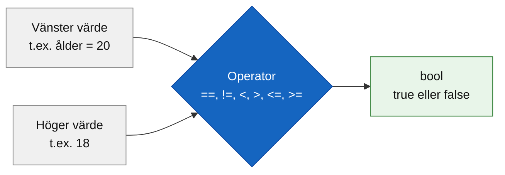
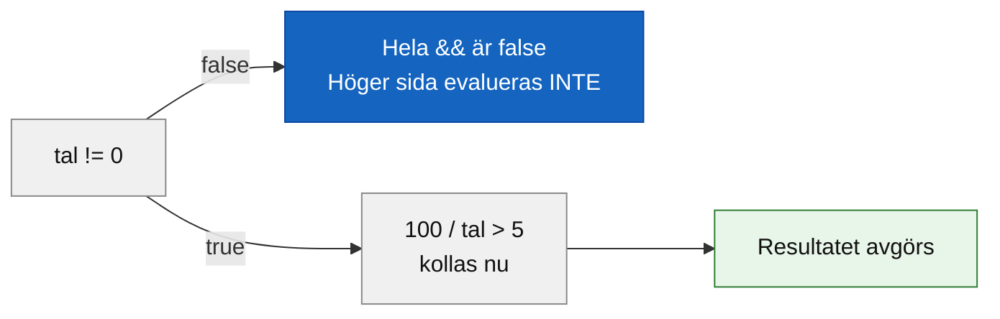

# Programmeringstermer — Operatorer

Operatorer är symboler som utför operationer på värden. I det här avsnittet tittar vi på de operatorer som används för att **jämföra** värden och **kombinera** villkor — det som bildar kärnan i alla if-satser och loopar.

Tänk på en jämförelseoperator som en fråga du ställer till datorn: "Är det här sant?" Svaret är alltid `true` eller `false` — aldrig "troligtvis" eller "lite grand".

**Se även:** [bool i datatyper.md](../../02_syntax_och_variabler/programmeringstermer/bool.md) — för vad `true` och `false` är och hur de lagras.

---

## Jämförelseoperatorer

Jämförelseoperatorer jämför två värden och returnerar alltid ett booleskt värde — antingen `true` eller `false`.



---

### == (lika med)

`==` kontrollerar om två värden är exakt lika.

```csharp
int poäng = 100;

if (poäng == 100)
{
    Console.WriteLine("Perfekt poäng!");
}
```

### Output
```plaintext
Perfekt poäng!
```

Vanlig fallgrop: `=` är tilldelning, `==` är jämförelse. `if (poäng = 100)` är ett kompileringsfel i C# — kompilatorn fångar det, men var vaksam.

---

### != (inte lika med)

`!=` är sant när värdena är **olika**.

```csharp
string lösenord = "abc";

if (lösenord != "rätt_lösenord")
{
    Console.WriteLine("Fel lösenord.");
}
```

### Output
```plaintext
Fel lösenord.
```

---

### < och > (mindre än / större än)

```csharp
int ålder = 16;

if (ålder < 18)
{
    Console.WriteLine("Du är minderårig.");
}

if (ålder > 10)
{
    Console.WriteLine("Du är äldre än 10.");
}
```

### Output
```plaintext
Du är minderårig.
Du är äldre än 10.
```

`<` och `>` är strikta — värdet på gränsen räknas inte. `16 < 18` är sant, men `18 < 18` är falskt.

---

### <= och >= (mindre än eller lika med / större än eller lika med)

```csharp
int poäng = 50;

if (poäng >= 50)
{
    Console.WriteLine("Godkänd");
}

if (poäng <= 100)
{
    Console.WriteLine("Poängen är inom rimliga gränser.");
}
```

### Output
```plaintext
Godkänd
Poängen är inom rimliga gränser.
```

`>=` och `<=` inkluderar gränsvärdet. `poäng >= 50` är sant när `poäng` är exakt 50 — det vore falskt med bara `>`.

---

## Sammanfattning: alla jämförelseoperatorer

| Operator | Betydelse | Sant när... |
|----------|-----------|-------------|
| `==` | lika med | värdena är exakt lika |
| `!=` | inte lika med | värdena skiljer sig |
| `<` | mindre än | vänster är strikt mindre |
| `>` | större än | vänster är strikt större |
| `<=` | mindre än eller lika med | vänster är mindre eller lika |
| `>=` | större än eller lika med | vänster är större eller lika |

> 🖼️ **Bild:** Meme: "== vs =" — en person som försöker tilldela ett värde i en if-sats och undrar varför kompilatorn skriker

---

## Logiska operatorer

Logiska operatorer kombinerar flera booleska uttryck till ett. Tänk på dem som kopplingen i ett kontrakt: "du måste ha **både** biljett **och** ID" (`&&`) kontra "biljett **eller** studentkort duger" (`||`).

---

### && (och)

`&&` är sant bara om **båda** sidor är sanna. Är en sida `false` är hela uttrycket `false`.

```csharp
int temperatur = 22;
bool solsken = true;

if (temperatur > 20 && solsken)
{
    Console.WriteLine("Perfekt utomhusdag!");
}
```

### Output
```plaintext
Perfekt utomhusdag!
```

Om `temperatur` hade varit 18 — eller `solsken` hade varit `false` — hade villkoret som helhet blivit falskt och inget skrivits ut.

---

### || (eller)

`||` är sant om **minst en** av sidorna är sann.

```csharp
bool harBiljett = false;
bool harStudentkort = true;

if (harBiljett || harStudentkort)
{
    Console.WriteLine("Välkommen ombord!");
}
```

### Output
```plaintext
Välkommen ombord!
```

`harBiljett` är `false`, men `harStudentkort` är `true` — och `false || true` är `true`.

---

### ! (inte / negation)

`!` vänder ett booleskt värde. `true` blir `false`, `false` blir `true`.

```csharp
bool inloggad = false;

if (!inloggad)
{
    Console.WriteLine("Du måste logga in.");
}
```

### Output
```plaintext
Du måste logga in.
```

`!inloggad` är `!false` vilket är `true` — if-blocket körs. Det läser nästan som svenska: "om inte inloggad".

---

## Short-circuit · Kortslutning

C# utvärderar logiska uttryck med kortslutning. Det betyder att C# slutar utvärdera ett uttryck så fort resultatet är avgjort — precis som du slutar läsa ett kontrakt när du ser ett villkor som omöjligen kan vara uppfyllt.

```csharp
int tal = 0;

if (tal != 0 && 100 / tal > 5)
{
    Console.WriteLine("Stora tal");
}
else
{
    Console.WriteLine("tal är noll");
}
```

### Output
```plaintext
tal är noll
```

`tal != 0` är `false`. Eftersom `&&` kräver att båda sidor är sanna behöver C# inte ens titta på `100 / tal > 5` — det kan inte förändra resultatet. Det är tur: `100 / 0` skulle ha orsakat ett `DivideByZeroException` om det hade körts.



<details><summary>Fungerar short-circuit med || också?</summary>

Ja. Med `||` gäller motsatsen: om den vänstra sidan är `true` vet C# redan att hela uttrycket är `true` — den högra sidan körs aldrig.

```csharp
bool harAccess = true;

if (harAccess || AnropaDatabasen())   // AnropaDatabasen() körs aldrig
{
    Console.WriteLine("Åtkomst beviljad");
}
```

Användbart när höger sida är dyr (t.ex. ett databasanrop) eller kan orsaka fel.

</details>

> 🖼️ **Bild:** Diagram på en whiteboard: "&&" med två rutor märkta "Vänster" och "Höger", med en stor röd X om vänster är false och texten "Höger kollas aldrig"

---

## Nästa steg

Operatorer sätts ihop till villkor som styr if-satser och loopar. Se [if_else.md](if_else.md) för hur villkor används i praktiken, och [loopar.md](loopar.md) för hur de styr repetition.
