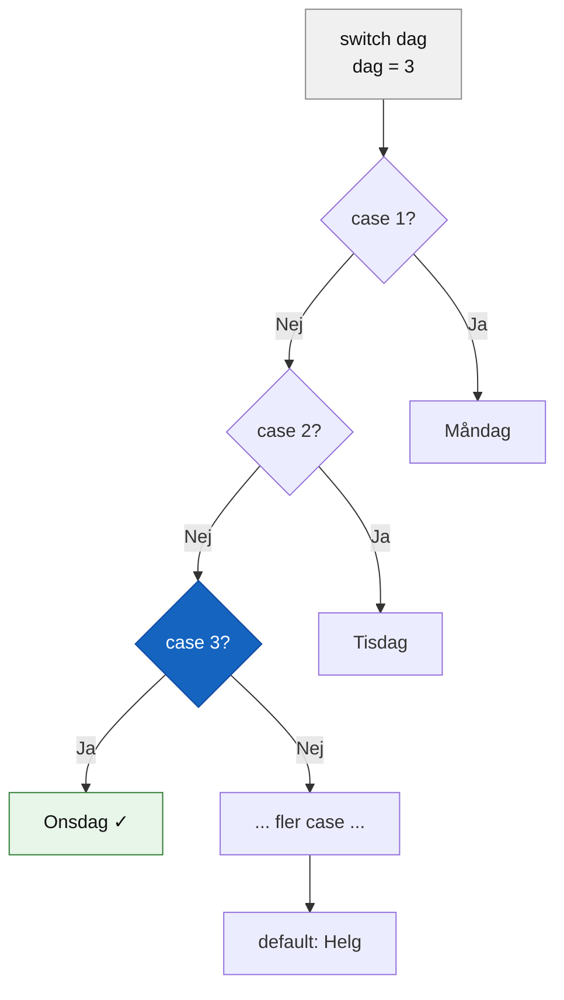
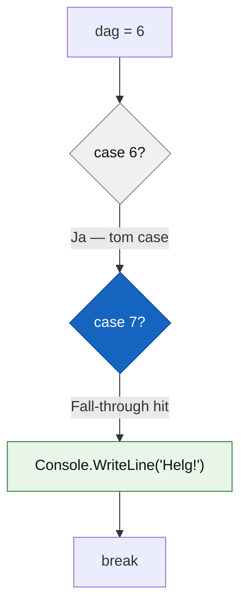

# Programmeringstermer — Switch

En `switch`-sats är ett alternativ till en lång rad `else if` när du jämför en variabel mot ett antal **kända, fasta värden**. Koden blir ofta lättare att läsa när det är många grenar.

Tänk på det som ett spårbyte på en järnväg: tåget (värdet) kommer in, och beroende på vilket spårnummer det matchar skickas det ut på rätt spår. Matchar inget — tar `default`-spåret.

**Se även:** [if_else.md](if_else.md) — grunderna i villkorssatser.

---

## switch

Nyckelordet `switch` tar ett uttryck — ofta en variabel — och jämför det mot en lista av `case`-etiketter. Den första `case` som matchar körs.

```csharp
int dag = 3;

switch (dag)
{
    case 1:
        Console.WriteLine("Måndag");
        break;
    case 2:
        Console.WriteLine("Tisdag");
        break;
    case 3:
        Console.WriteLine("Onsdag");
        break;
    case 4:
        Console.WriteLine("Torsdag");
        break;
    case 5:
        Console.WriteLine("Fredag");
        break;
    default:
        Console.WriteLine("Helg");
        break;
}
```

### Output
```plaintext
Onsdag
```

`dag` är 3, så `case 3:` matchar och "Onsdag" skrivs ut. Ingen av de andra grenarna testas.



> 🖼️ **Bild:** En järnvägsväxel sedd ovanifrån: ett spår in, flera spår ut märkta "case 1", "case 2", "case 3", "default" — tåget tar rätt spår

---

## case

Varje `case` är en etikett som anger ett möjligt värde. Om `switch`-uttryckets värde matchar etiketten körs koden under den.

```csharp
int betyg = 4;

switch (betyg)
{
    case 5:
        Console.WriteLine("Utmärkt — VG");
        break;
    case 4:
        Console.WriteLine("Bra jobbat — G");
        break;
    case 3:
        Console.WriteLine("Godkänt — G");
        break;
    default:
        Console.WriteLine("Underkänt");
        break;
}
```

### Output
```plaintext
Bra jobbat — G
```

`case`-värdet måste vara ett konstant värde — en heltalslit­eral, en teckenliteral eller en sträng. Du kan inte skriva `case x > 5:` i klassisk switch-syntax (för det finns [pattern matching](#pattern-matching-c-9)).

---

## break

`break` avslutar switch-blocket och hoppar till koden efter `}`. Utan `break` fortsätter exekveringen rakt ned i nästa `case` — det kallas fall-through (se nedan).

```csharp
int val = 2;

switch (val)
{
    case 1:
        Console.WriteLine("Ett");
        break;   // <-- hoppar ut efter detta
    case 2:
        Console.WriteLine("Två");
        break;   // <-- hoppar ut efter detta
    case 3:
        Console.WriteLine("Tre");
        break;
}
```

### Output
```plaintext
Två
```

`break` är obligatoriskt i C# — till skillnad från C och JavaScript kan du inte utelämna det av misstag utan att kompilatorn protesterar (med ett undantag: se fall-through nedan).

---

## default

`default` är switch-satsens motsvarighet till `else` — koden här körs om inget `case` matchade. `default` är valfritt, men bra praxis att alltid ha med.

```csharp
int dag = 9;

switch (dag)
{
    case 1:
        Console.WriteLine("Måndag");
        break;
    case 2:
        Console.WriteLine("Tisdag");
        break;
    default:
        Console.WriteLine("Okänd dag");
        break;
}
```

### Output
```plaintext
Okänd dag
```

`default` brukar placeras sist, men det är inte ett krav i C#. Det är en konvention för läsbarhet.

---

## Fall-through

Fall-through innebär att exekveringen "faller igenom" från en `case` till nästa utan att stanna. I C# är fall-through med kod förbjudet — kompilatorn kräver `break` (eller `return`/`goto`) om en `case` innehåller satser.

Däremot är fall-through **tillåtet** när en `case` är helt tom — det är ett medvetet mönster för att låta flera värden köra samma kod:

```csharp
int dag = 6;

switch (dag)
{
    case 6:
    case 7:
        Console.WriteLine("Helg!");
        break;
    default:
        Console.WriteLine("Vardag");
        break;
}
```

### Output
```plaintext
Helg!
```

`case 6:` har ingen egen kod — exekveringen faller direkt igenom till `case 7:` som har koden och `break`. Båda dagarna delar alltså samma gren.



---

## Pattern matching (C# 9+)

Från C# 9 kan du använda switch expressions med relationsoperatorer direkt — ett kompaktare sätt att skriva switch när du vill matcha **intervall** snarare än exakta värden.

```csharp
int temperatur = 15;

string beskrivning = temperatur switch
{
    < 0  => "Minusgrader",
    < 10 => "Kallt",
    < 20 => "Lagom",
    _    => "Varmt"
};

Console.WriteLine(beskrivning);
```

### Output
```plaintext
Lagom
```

`_` är ett wildcard — det matchar allt som inte fångats av de tidigare grenarna, precis som `default`. Switch expressions returnerar ett värde direkt och behöver inte `break`.

<details><summary>Klassisk switch eller switch expression?</summary>

Klassisk `switch` med `case`/`break` är tydligare för nybörjare och fungerar alltid. Switch expressions är kortare och idiomatisk modern C# — men kräver att du förstår `=>` och att switch kan returnera ett värde. Båda stilarna förekommer i professionell kod.

</details>

> 🖼️ **Bild:** Sida-vid-sida: klassisk switch med 4 case-block till vänster, samma logik som switch expression (6 rader) till höger — visuellt jämfört

---

## Nästa steg

Switch hanterar ett värde mot kända fall. När du behöver upprepa kod ett visst antal gånger eller tills ett villkor uppfylls — se [loopar.md](loopar.md).
