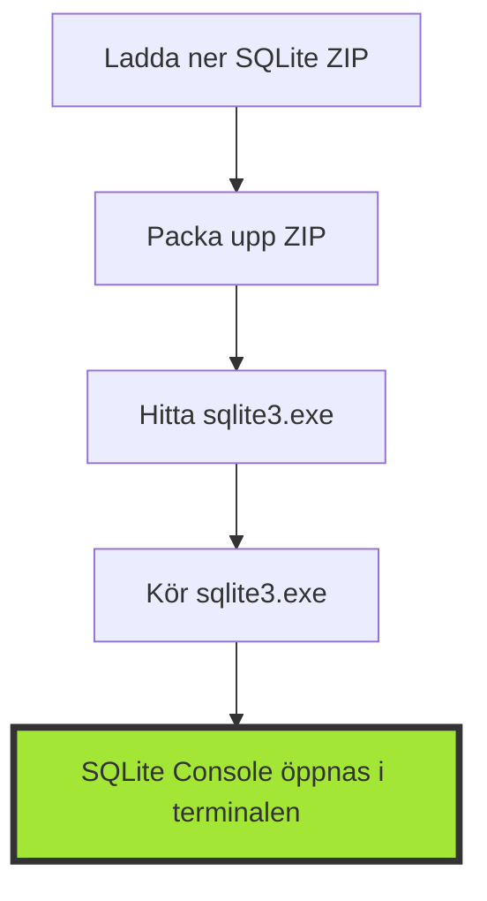
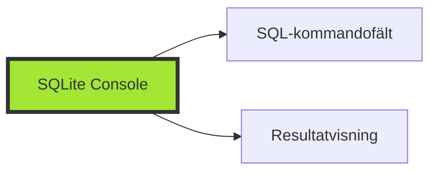

---

title: 2. Installation och konfiguration av LocalDB och SQLite Console (45 min)
author: Marcus Ackre Medina
type: lecture
topic: databaser
difficulty: 1
language: mixed
status: adapted
marcus_voice: true
source: "Old_courses/2025/csharp/2_db/lectures/03_db_h2/2_h2_installation.md"
description: "Hur kan vi effektivt installera, konfigurera och använda LocalDB och SQLite i .NET-utvecklingsmiljöer för att skapa och hantera databaser?"
tags: ["console", "databaser", "installation", "konfiguration", "localdb", "min)", "sql", "sqlite", "ssh", "visual-studio"]
week_fit: []
---

# 2. Installation och konfiguration av LocalDB och SQLite Console (45 min)

🟢


## Övergripande frågeställning

Hur kan vi effektivt installera, konfigurera och använda LocalDB och SQLite i .NET-utvecklingsmiljöer för att skapa och hantera databaser?

## 1. Nedladdning av LocalDB eller SQLite

### För LocalDB:

LocalDB är en del av SQL Server Express och kommer ofta förinstallerad med Visual Studio. Om du inte har det installerat, kan du ladda ner det via:

- Gå till Microsoft SQL Server Download-sidan.
- Välj att ladda ner SQL Server Express.
- Följ installationsanvisningarna för att installera LocalDB.

### För SQLite:

SQLite kan laddas ner separat om det inte redan är tillgängligt i ditt projekt:

- Gå till den officiella SQLite-sidan: <https://www.sqlite.org/download.html>
- Välj att ladda ner den senaste versionen av SQLite för ditt operativsystem (Windows, Mac eller Linux).
- Ladda ner zip-filen och packa upp den till en lämplig plats på din dator.

## 2. Installation av LocalDB och SQLite

### För LocalDB:

- LocalDB kräver ingen ytterligare installation om du använder Visual Studio. Det startas automatiskt när en anslutning görs.
- För att kontrollera om LocalDB är installerat, kan du öppna kommandotolken och köra:

  ```bash
  sqllocaldb info
  ```

- Detta visar en lista över instanser. Om LocalDB är installerat kommer en lista över tillgängliga instanser visas.

### För SQLite:

- Packa upp den nedladdade ZIP-filen till en lämplig plats på din dator.
- Ingen formell installation krävs – SQLite kan köras direkt från den uppackade mappen.

<div class="mermaid" style="zoom: 1.4;">



</div>

## 3. Starta SQLite Console

- Navigera till den mapp där du packade upp SQLite.
- Kör `sqlite3.exe` i terminalen för att starta SQLite Console.

För LocalDB:

- Om du arbetar med Visual Studio öppnar du din applikation och konfigurerar en anslutning till LocalDB via **Server Explorer** eller **SQL Server Object Explorer**.

## 4. Konfiguration av LocalDB och SQLite

### För LocalDB:

När du har startat Visual Studio eller SQL Server Management Studio (SSMS), gör följande:

- Välj **Add Connection** i SQL Server Object Explorer.
- Använd **(localdb)\MSSQLLocalDB** som servernamn.
- Om det är första gången kan du skapa en ny databas från denna vy eller ansluta till en befintlig.

### För SQLite:

När SQLite Console är öppen kan du skapa en ny databas eller ansluta till en befintlig. För att skapa en ny databas skriver du:

```bash
sqlite3 minNyaDatabas.db
```

- Detta skapar en ny fil i den aktuella katalogen för databasen, och SQLite Console öppnas där du kan börja köra SQL-kommandon.

<div class="mermaid" style="zoom: 1.4;">



</div>

## 5. Skapa en ny databas och tabell

### För LocalDB:

- Skapa en ny databas genom att högerklicka på anslutningen i **SQL Server Object Explorer** och välja **New Query**:

```sql
CREATE DATABASE MinNyaDatabas;
```

### För SQLite:

- När SQLite Console är igång, skapa en tabell genom att köra följande SQL-kommandon:

```sql
CREATE TABLE Studenter (
    ID INT PRIMARY KEY,
    Namn VARCHAR(50),
    Alder INT
);
```

- Du kan lägga till data genom att köra:

```sql
INSERT INTO Studenter VALUES (1, 'Anna Andersson', 25);
INSERT INTO Studenter VALUES (2, 'Bengt Bengtsson', 30);
```

## 6. Utforska LocalDB och SQLite Console

### LocalDB:

- I SQL Server Object Explorer kan du utforska databasstrukturen, köra frågor och administrera databasen visuellt.

### SQLite:

- I SQLite Console använder du SQL-kommandon för att interagera med databasen. För att se alla tabeller skriver du:

```sql
.tables
```

- För att se all data i en tabell:

```sql
SELECT * FROM Studenter;
```

## 7. Grundläggande säkerhetsinställningar för LocalDB

### LocalDB:

- Byt standardlösenordet för databasanvändaren om du använder SQL-autentisering.
- Förbättra säkerheten genom att ställa in rättighetsbegränsningar för användare och roller.

### SQLite:

- Använd kryptering om känsliga data hanteras, till exempel med SQLite Encryption Extension (SEE), som dock kräver en kommersiell licens.

## 8. Backup och återställning

### För LocalDB:

- Skapa en säkerhetskopia av din databas med följande SQL-kommandon i SQL Server Object Explorer:

```sql
BACKUP DATABASE MinNyaDatabas TO DISK = 'C:\backup\MinNyaDatabas.bak';
```

### För SQLite:

- Använd följande SQL-kommando för att skapa en backup:

```sql
.backup 'backup.db'
```

- För att återställa från backupen, använd:

```sql
.restore 'backup.db'
```

---

# Övningsuppgifter

## Övning 1: Installation och första anslutning (10 minuter)

- Låt studenterna ladda ner och installera LocalDB eller SQLite på sina datorer.
- Be dem skapa en ny databas (använd Visual Studio för LocalDB eller kommandotolken för SQLite) och ansluta till den.

## Övning 2: Skapa och utforska tabeller (15 minuter)

- Be studenterna skapa en enkel tabell i sin nya databas:

```sql

**15-minutersregeln:** Fastnar du i mer än 15 minuter — fråga klassen, sen AI, sen mig. I den ordningen.
CREATE TABLE Studenter (
    ID INT PRIMARY KEY,
    Namn VARCHAR(50),
    Alder INT
);
```

- Låt dem utforska tabellen genom att använda SELECT-satser och undersöka databasstrukturen.

## Övning 3: Säkerhetsinställningar och backup (10 minuter)

- Be studenterna experimentera med grundläggande säkerhetsinställningar (byt lösenord i LocalDB).
- Låt dem skapa en backup av sin databas och återställa den med backup-kommandon.

## Övning 4: Diskussion (5 minuter)

Be studenterna reflektera över följande frågor och diskutera i små grupper:

1. Vilka fördelar ser du med att använda LocalDB eller SQLite för utveckling?
2. Vilka utmaningar stötte du på under installationen och konfigurationen, och hur löste du dem?

---
Nu har du verktygen. Använd dem, missbruka dem, lär dig av misstagen. Det är vägen.
