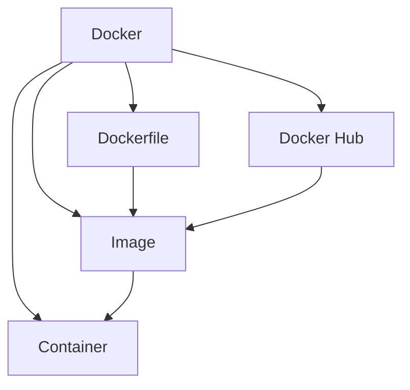

# 2. Installation och konfiguration av MySQL med Docker

🟢


Övergripande frågeställning: Hur kan vi använda Docker för att effektivt installera, konfigurera och hantera MySQL-databaser?

## Introduktion till Docker

### Vad är Docker?

Docker är en plattform för att utveckla, leverera och köra applikationer i containrar. Containrar är lätta, portabla och konsistenta miljöer som gör det möjligt att köra applikationer på ett enhetligt sätt oavsett underliggande infrastruktur.

### Grundläggande Docker-koncept

<div class="mermaid" style="zoom: 1.4;">



</div>

1. Image: En mall för att skapa containrar
2. Container: En körande instans av en image
3. Dockerfile: Instruktioner för att bygga en image
4. Docker Hub: Centralt repositorium för Docker-images

### Fördelar med att använda Docker för databashantering

1. Isolering: Varje databas körs i sin egen container, vilket minimerar konflikter och säkerhetsproblem.
2. Portabilitet: Samma miljö kan användas oavsett värdplattform, vilket förenklar utveckling och driftsättning.
3. Versionskontroll: Det är enkelt att hantera olika versioner av databaser och applikationer.
4. Snabb uppstart och nedstängning: Containrar startar och stängs av mycket snabbare än traditionella virtuella maskiner.
5. Resurseffektivitet: Containrar delar värdmaskinens OS-kärna, vilket gör dem mer resurseffektiva än fullständiga virtuella maskiner.

## Starta MySQL i Docker

### Docker-kommando för att starta MySQL

Syntax:
```
docker run [OPTIONS] IMAGE [COMMAND] [ARG...]
```

Exempel:
```bash
docker run --name mysql-container -e MYSQL_ROOT_PASSWORD=password -p 3306:3306 -d mysql:latest
```

### Förklaring av parametrarna

- `--name mysql-container`: Ger containern ett namn för enkel referens.
- `-e MYSQL_ROOT_PASSWORD=password`: Sätter root-lösenordet för MySQL-instansen.
- `-p 3306:3306`: Mappar containerns port 3306 till värdmaskinens port 3306.
- `-d`: Kör containern i bakgrunden (detached mode).
- `mysql:latest`: Använder den senaste MySQL-imagen från Docker Hub.

### Kontrollera att containern körs

Syntax:
```
docker ps [OPTIONS]
```

Exempel:
```bash
docker ps
```

### Stoppa och ta bort containern

Syntax:
```
docker stop CONTAINER
docker rm CONTAINER
```

Exempel:
```bash
docker stop mysql-container
docker rm mysql-container
```

## Ansluta till MySQL i Docker

### Ansluta via kommandoraden

Syntax:
```
docker exec [OPTIONS] CONTAINER COMMAND [ARG...]
```

Exempel:
```bash
docker exec -it mysql-container mysql -uroot -p
```

### Ansluta med en MySQL-klient (t.ex. DataGrip)

- Host: localhost
- Port: 3306
- User: root
- Password: password (eller det du angav)

## Docker-compose för mer komplexa uppsättningar

Docker Compose används för att definiera och köra multi-container Docker-applikationer. Det är särskilt användbart när man behöver hantera flera tjänster samtidigt.

Exempel på en enkel docker-compose.yml för MySQL:

```yaml
version: '3'
services:
  db:
    image: mysql:latest
    environment:
      MYSQL_ROOT_PASSWORD: password
    ports:
      - "3306:3306"
```

## Säkerhetsaspekter

- Använd aldrig standard root-lösenord i produktion för att förhindra obehörig åtkomst.
- Begränsa nätverksåtkomst till containern för att minska risken för externa attacker.
- Använd Docker secrets för känslig information för att förbättra säkerheten.

## Interaktiv demonstration

[Plats för en interaktiv demonstration där studenterna kan se hur man startar en MySQL-container, ansluter till den och utför grundläggande databasoperationer]

## Kort quiz

1. Vad är huvudsyftet med Docker?
   a) Att ersätta virtuella maskiner
   b) Att skapa isolerade miljöer för applikationer
   c) Att optimera databashantering
   d) Att ersätta traditionella operativsystem

2. Vilken parameter används för att sätta root-lösenordet när man startar en MySQL-container?
   a) -p
   b) --password
   c) -e MYSQL_ROOT_PASSWORD
   d) --set-password

3. Hur kan man kontrollera om en Docker-container körs?
   a) docker list
   b) docker check
   c) docker ps
   d) docker status

4. Vad är syftet med Docker Compose?
   a) Att kompilera Docker-images
   b) Att definiera och köra multi-container applikationer
   c) Att optimera Docker-prestanda
   d) Att skapa backup av Docker-containrar

5. Varför är det viktigt att inte använda standardlösenord i produktion?
   a) Det är svårt att komma ihåg
   b) Det kan leda till prestandaproblem
   c) Det ökar risken för säkerhetsbrister
   d) Det är inte kompatibelt med vissa applikationer

Svar:
1. b
2. c
3. c
4. b
5. c

---

# Övningsuppgifter

## Uppgift 1: Starta en MySQL-container

1. Öppna en terminal eller kommandotolk
2. Kör följande kommando:

   ```bash

**15-minutersregeln:** Fastnar du i mer än 15 minuter — fråga klassen, sen AI, sen mig. I den ordningen.
   docker run --name my-mysql -e MYSQL_ROOT_PASSWORD=mysecretpassword -p 3306:3306 -d mysql:latest
   ```

3. Verifiera att containern körs med `docker ps`

Använd Docker Desktop eller Docker CLI för att utföra och övervaka denna uppgift.

## Uppgift 2: Anslut till MySQL och skapa en databas

1. Anslut till MySQL-containern med följande kommando:

   ```bash
   docker exec -it my-mysql mysql -uroot -p
   ```

2. Ange lösenordet när du uppmanas till det
3. Skapa en ny databas och en tabell:

   ```sql
   CREATE DATABASE myapp;
   USE myapp;
   CREATE TABLE users (id INT AUTO_INCREMENT PRIMARY KEY, name VARCHAR(100), email VARCHAR(100));
   INSERT INTO users (name, email) VALUES ('Alice', 'alice@example.com');
   SELECT * FROM users;
   ```

4. Avsluta MySQL-klienten med `exit`

Använd en terminal eller kommandotolk för denna uppgift.

## Uppgift 3: Anslut med DataGrip

1. Öppna DataGrip
2. Skapa en ny MySQL-anslutning med följande detaljer:
   - Host: localhost
   - Port: 3306
   - User: root
   - Password: mysecretpassword
3. Testa anslutningen
4. Anslut och verifiera att du kan se databasen och tabellen du skapade

Använd DataGrip eller en annan MySQL-klient för denna uppgift.

## Uppgift 4: Skapa en docker-compose.yml

1. Skapa en ny mapp för ditt projekt
2. I mappen, skapa en fil som heter `docker-compose.yml`
3. Lägg till följande innehåll:

   ```yaml
   version: '3'
   services:
     db:
       image: mysql:latest
       environment:
         MYSQL_ROOT_PASSWORD: composesecret
         MYSQL_DATABASE: composeapp
       ports:
         - "3307:3306"
   ```

4. Kör `docker-compose up -d` i terminalen från projektmappen
5. Verifiera att den nya containern körs med `docker ps`

Använd en textredigerare som Visual Studio Code eller Sublime Text för att skapa och redigera docker-compose.yml-filen.

## Reflektionsövning

Skriv en kort reflektion (150-200 ord) om dina erfarenheter av att använda Docker för MySQL-installation och -konfiguration. Överväg följande frågor:

1. Vilka fördelar ser du med att använda Docker för databashantering jämfört med traditionell installation?
2. Vilka utmaningar stötte du på under övningarna och hur löste du dem?
3. Hur tror du att Docker kan påverka ditt framtida arbete med databasadministration och -utveckling?

Använd ett reflektionsverktyg som Obsidian (Markdown), Journey eller Day One för att skriva din reflektion.

---
Det här är grunden. Öva på den, lek med koden, gör misstag. Det är så du lär dig.
