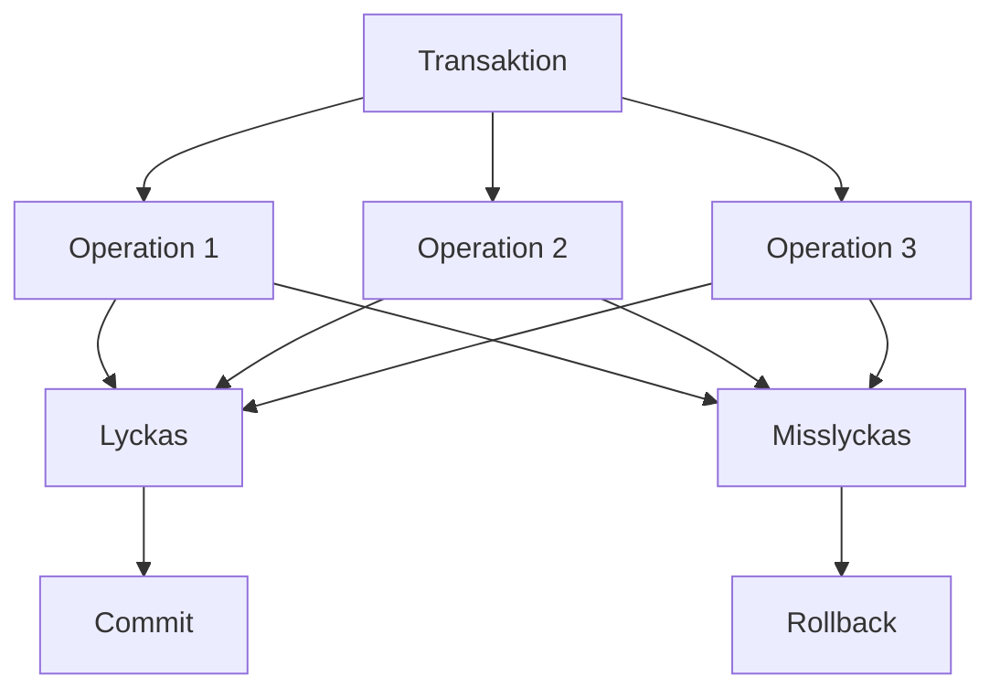
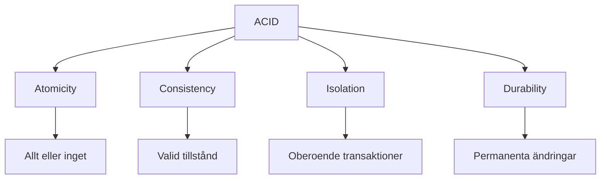
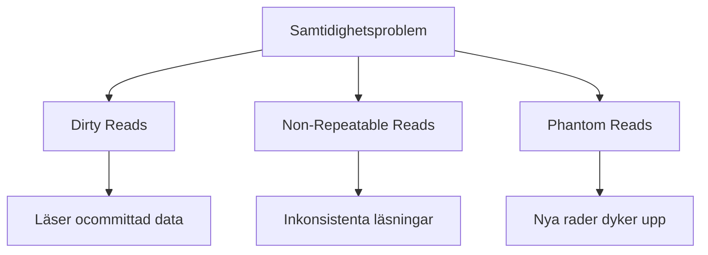

Här är den omvandlade versionen för **C# och MySQL** i Visual Studio:

---

# 2. Transaktioner och ACID-egenskaper (45 min)

🟢


## Föreläsningsmaterial: Transaktioner och ACID-egenskaper i MySQL med C#

Övergripande frågeställning: Hur säkerställer transaktioner och ACID-egenskaper dataintegritet och konsistens i MySQL-databaser?

## 1. Introduktion till transaktioner

### Vad är en transaktion?

- En sekvens av databasoperationer som behandlas som en enda enhet.
- Antingen utförs alla operationer i en transaktion, eller ingen av dem.
- Säkerställer databasintegritet vid komplexa operationer.

### Varför behövs transaktioner?

- Hanterar samtidiga databasåtkomster.
- Skyddar mot systemfel och strömavbrott.
- Upprätthåller databasens konsistens.

<div class="mermaid" style="zoom: 1.4;">



</div>

## 2. ACID-egenskaper

### Atomicity (Atomäritet)

- Allt eller inget: antingen utförs alla operationer eller inga.
- Säkerställer att databasen förblir konsistent även vid fel.

### Consistency (Konsistens)

- Databasen förblir i ett giltigt tillstånd före och efter transaktionen.
- Alla regler och begränsningar i databasen upprätthålls.

### Isolation (Isolering)

- Transaktioner utförs oberoende av varandra.
- Förhindrar att ofullständiga ändringar är synliga för andra transaktioner.

### Durability (Hållbarhet)

- När en transaktion är slutförd (committad), är ändringarna permanenta.
- Ändringar överlever systemkrascher och strömavbrott.

<div class="mermaid" style="zoom: 1.4;">



</div>

## 3. Hantering av transaktioner i MySQL med C#

### BEGIN, COMMIT, och ROLLBACK i C#

- Använd `MySqlTransaction` för att hantera transaktioner i MySQL med C#.
- `Commit`: Slutför transaktionen och gör ändringarna permanenta.
- `Rollback`: Ångrar alla ändringar gjorda i transaktionen.

### Exempel på en transaktion i C#

```csharp
using (var connection = new MySqlConnection(connectionString))
{
    connection.Open();
    var transaction = connection.BeginTransaction();

    try
    {
        var command1 = new MySqlCommand("UPDATE accounts SET balance = balance - 100 WHERE id = 1", connection, transaction);
        command1.ExecuteNonQuery();

        var command2 = new MySqlCommand("UPDATE accounts SET balance = balance + 100 WHERE id = 2", connection, transaction);
        command2.ExecuteNonQuery();

        // Commit transaction
        transaction.Commit();
    }
    catch (Exception)
    {
        // Rollback transaction on error
        transaction.Rollback();
    }
}
```

### Automatisk commit

- MySQL använder som standard autocommit.
- Varje enskild SQL-sats behandlas som en transaktion.
- Stäng av autocommit om du vill hantera transaktioner manuellt.

```sql
SET autocommit = 0;
```

## 4. Isolationsnivåer

### Vad är isolationsnivåer?

- Definierar hur transaktioner påverkar varandra.
- Balanserar mellan datakonsistens och prestanda.

### Olika isolationsnivåer i MySQL

1. READ UNCOMMITTED
2. READ COMMITTED
3. REPEATABLE READ (standard i MySQL)
4. SERIALIZABLE

### Exempel på att sätta isolationsnivå

```sql
SET TRANSACTION ISOLATION LEVEL READ COMMITTED;
```

## 5. Vanliga problem med samtidighet

### Dirty Reads

- En transaktion läser data som en annan transaktion har ändrat men inte committad.

### Non-Repeatable Reads

- En transaktion läser samma rad två gånger och får olika resultat.

### Phantom Reads

- En transaktion läser en uppsättning rader som uppfyller ett sökvillkor, men en annan transaktion infogar nya rader som uppfyller villkoret.

<div class="mermaid" style="zoom: 1.4;">



</div>

---

# Övningsuppgifter

## Uppgift 1: Skapa och använda en transaktion i MySQL med C#

1. Skapa en tabell `bank_accounts` med följande struktur:

```sql

**15-minutersregeln:** Fastnar du i mer än 15 minuter — fråga klassen, sen AI, sen mig. I den ordningen.
CREATE TABLE bank_accounts (
    id INT AUTO_INCREMENT PRIMARY KEY,
    account_number VARCHAR(20) UNIQUE,
    balance DECIMAL(10, 2)
);
```

2. Infoga några exempel-konton:

```sql
INSERT INTO bank_accounts (account_number, balance) VALUES
('1001', 1000),
('1002', 500);
```

3. Skriv en transaktion i C# som överför 200 från konto '1001' till konto '1002':

```csharp
using (var connection = new MySqlConnection(connectionString))
{
    connection.Open();
    var transaction = connection.BeginTransaction();

    try
    {
        var command1 = new MySqlCommand("UPDATE bank_accounts SET balance = balance - 200 WHERE account_number = '1001'", connection, transaction);
        command1.ExecuteNonQuery();

        var command2 = new MySqlCommand("UPDATE bank_accounts SET balance = balance + 200 WHERE account_number = '1002'", connection, transaction);
        command2.ExecuteNonQuery();

        transaction.Commit();
    }
    catch (Exception)
    {
        transaction.Rollback();
    }
}
```

4. Verifiera att överföringen har skett korrekt genom att kontrollera båda kontona.

5. Skriv en ny transaktion som försöker överföra mer pengar än vad som finns på kontot. Använd `ROLLBACK` om saldot blir negativt.

## Uppgift 2: Undersöka isolationsnivåer

1. Öppna två separata databasanslutningar (sessioner) i MySQL.

2. I session 1, sätt isolationsnivån till `READ UNCOMMITTED`:

```sql
SET SESSION TRANSACTION ISOLATION LEVEL READ UNCOMMITTED;
```

3. I session 1, starta en transaktion och uppdatera ett konto:

```sql
START TRANSACTION;
UPDATE bank_accounts SET balance = balance + 1000 WHERE account_number = '1001';
```

4. I session 2, läs saldot för konto '1001' utan att starta en transaktion.

5. I session 1, gör `ROLLBACK`.

6. Diskutera vad som hände och varför. Hur skulle resultatet skilja sig om isolationsnivån var `READ COMMITTED`?

## Uppgift 3: Hantera samtidighetsproblem

1. Sätt isolationsnivån till `REPEATABLE READ` i båda sessionerna:

```sql
SET SESSION TRANSACTION ISOLATION LEVEL REPEATABLE READ;
```

2. I session 1, starta en transaktion och läs saldot för konto '1001'.

3. I session 2, starta en transaktion, uppdatera saldot för konto '1001' och commit.

4. I session 1, läs saldot för konto '1001' igen och försök sedan uppdatera det.

5. Vad händer? Diskutera konceptet "optimistisk låsning" och hur MySQL hanterar samtidiga uppdateringar.

---

## Reflektionsövning

Reflektera över följande frågor:

1. Hur säkerställer transaktioner dataintegritet i en databas?
2. Vilka utmaningar kan uppstå när flera användare arbetar samtidigt i en databas?
3. Hur påverkar valet av isolationsnivå prestanda och datakonsistens?
4. I vilka situationer i verkliga applikationer är transaktioner särskilt viktiga?

---
Sådärja. Nu har du koll på det här. Nästa steg — testa själv. Det är då det fastnar.
