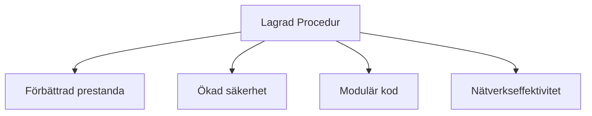
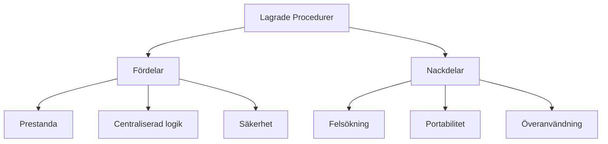

---

title: Lagrade procedurer i MySQL för .NET-utvecklare (45 min)
author: Marcus Ackre Medina
type: lecture
topic: databaser
difficulty: 1
language: mixed
status: adapted
marcus_voice: true
source: "Old_courses/2025/csharp/2_db/lectures/05_db_mysql_advanced/3_stored_procedures.md"
description: "Övergripande frågeställning: Hur kan vi använda lagrade procedurer för att förbättra databashantering, prestanda och säkerhet i MySQL när vi arbetar med .NET-applikationer?"
tags: [".net-utvecklare", "databaser", "lagrade", "min)", "mysql", "procedurer", "procedures", "sql", "stored"]
week_fit: []
---

# Lagrade procedurer i MySQL för .NET-utvecklare (45 min)

🟢


## Föreläsningsmaterial: Lagrade Procedurer i MySQL för .NET

Övergripande frågeställning: Hur kan vi använda lagrade procedurer för att förbättra databashantering, prestanda och säkerhet i MySQL när vi arbetar med .NET-applikationer?

## 1. Introduktion till Lagrade Procedurer

### Vad är en Lagrad Procedur?

- En fördefinierad och namngiven samling SQL-satser som lagras i databasen
- Kan anropas och exekveras senare
- Liknar funktioner i programmeringsspråk

### Varför använda Lagrade Procedurer?

- Förbättrad prestanda: Kompileras och optimeras i förväg
- Säkerhet: Kan begränsa direktåtkomst till tabeller
- Moduläritet: Förenklar komplex logik och underlättar underhåll
- Nätverkseffektivitet: Minskar mängden data som skickas över nätverket

<div class="mermaid" style="zoom: 1.4;">



</div>

## 2. Skapa en Lagrad Procedur

### Grundläggande syntax

```sql
DELIMITER //

CREATE PROCEDURE procedure_name(parameter_list)
BEGIN
    -- SQL-satser
END //

DELIMITER ;
```

### Exempel på en enkel Lagrad Procedur

```sql
DELIMITER //

CREATE PROCEDURE GetAllCustomers()
BEGIN
    SELECT * FROM customers;
END //

DELIMITER ;
```

### Anropa en Lagrad Procedur från .NET

```csharp
using (var connection = new MySqlConnection(connectionString))
{
    connection.Open();
    using (var command = new MySqlCommand("GetAllCustomers", connection))
    {
        command.CommandType = CommandType.StoredProcedure;
        using (var reader = command.ExecuteReader())
        {
            while (reader.Read())
            {
                // Bearbeta resultatet
            }
        }
    }
}
```

## 3. Parametrar i Lagrade Procedurer

### Typer av parametrar

- IN: Inparameter (standard)
- OUT: Utparameter
- INOUT: Både in- och utparameter

### Exempel med parametrar

```sql
DELIMITER //

CREATE PROCEDURE GetCustomersByCity(IN cityName VARCHAR(50))
BEGIN
    SELECT * FROM customers WHERE city = cityName;
END //

DELIMITER ;
```

### Anropa med parameter från .NET

```csharp
using (var connection = new MySqlConnection(connectionString))
{
    connection.Open();
    using (var command = new MySqlCommand("GetCustomersByCity", connection))
    {
        command.CommandType = CommandType.StoredProcedure;
        command.Parameters.AddWithValue("@cityName", "New York");
        using (var reader = command.ExecuteReader())
        {
            while (reader.Read())
            {
                // Bearbeta resultatet
            }
        }
    }
}
```

## 4. Kontrollstrukturer i Lagrade Procedurer

### IF-ELSE

```sql
IF condition THEN
    -- satser
ELSEIF condition THEN
    -- satser
ELSE
    -- satser
END IF;
```

### CASE

```sql
CASE
    WHEN condition THEN statement
    WHEN condition THEN statement
    ELSE statement
END CASE;
```

### Loops

```sql
WHILE condition DO
    -- satser
END WHILE;
```

## 5. Felhantering i Lagrade Procedurer

### Använd DECLARE ... HANDLER

```sql
DECLARE CONTINUE HANDLER FOR SQLEXCEPTION
BEGIN
    -- Felhanteringskod
END;
```

### Exempel på felhantering

```sql
DELIMITER //

CREATE PROCEDURE SafeInsert(IN name VARCHAR(50), IN age INT)
BEGIN
    DECLARE CONTINUE HANDLER FOR SQLEXCEPTION
    BEGIN
        SELECT 'Ett fel inträffade' AS message;
    END;

    INSERT INTO users (name, age) VALUES (name, age);
    SELECT 'Infogningen lyckades' AS message;
END //

DELIMITER ;
```

### Anropa procedur med felhantering från SQL

```sql
CALL SafeInsert('Marcus Lön', 150000); -- Ack... om det bara vore sant!
```

### Anropa procedur med felhantering från .NET

```csharp
using (var connection = new MySqlConnection(connectionString))
{
    connection.Open();
    using (var command = new MySqlCommand("SafeInsert", connection))
    {
        command.CommandType = CommandType.StoredProcedure;
        command.Parameters.AddWithValue("@name", "John Doe");
        command.Parameters.AddWithValue("@age", 30);

        using (var reader = command.ExecuteReader())
        {
            if (reader.Read())
            {
                Console.WriteLine(reader["message"]);
            }
        }
    }
}
```

Mycket kod för lite handling, så... ifall du glömt det, det är därför vi gömmer all hemsk kod i metoder :)

## 6. Fördelar och nackdelar med Lagrade Procedurer

### Fördelar

- Förbättrad prestanda för komplexa operationer
- Centraliserad affärslogik
- Förbättrad säkerhet genom begränsad åtkomst

### Nackdelar

- Kan vara svårare att felsöka
- Mindre portabla mellan olika databasmotorer
- Kan leda till överanvändning för enkel logik

<div class="mermaid" style="zoom: 1.4;">



</div>

## Övningsuppgifter

### Uppgift 1: Skapa en enkel Lagrad Procedur

1. Skapa en Lagrad Procedur som heter `GetTotalProducts` och som returnerar det totala antalet produkter i `products`-tabellen.

2. Anropa den skapade proceduren från C# och visa resultatet.

### Uppgift 2: Lagrad Procedur med parametrar

1. Skapa en Lagrad Procedur som heter `GetProductsByCategory` som tar en kategori som inparameter och returnerar alla produkter i den kategorin.

2. Anropa proceduren från C# med olika kategorier och visa resultaten.

### Uppgift 3: Lagrad Procedur med kontrollstrukturer

1. Skapa en Lagrad Procedur som heter `ClassifyProduct` som tar ett produktpris som inparameter och returnerar en klassificering baserad på priset:

   - Under 50: "Budget"
   - 50-100: "Mellanpris"
   - Över 100: "Premium"

2. Anropa proceduren från C# med olika priser och visa klassificeringen.

### Uppgift 4: Lagrad Procedur med felhantering

1. Skapa en Lagrad Procedur som heter `SafeUpdatePrice` som uppdaterar priset på en produkt. Proceduren ska hantera fel om produkten inte finns eller om det nya priset är negativt.

2. Implementera anrop till proceduren i C# och hantera eventuella felmeddelanden.

## Reflektionsövning

Reflektera över följande frågor:

1. Hur kan lagrade procedurer förbättra prestandan i en .NET-applikation som använder MySQL?
2. I vilka situationer skulle du välja att använda en lagrad procedur istället för att skriva SQL direkt i din C#-kod?
3. Vilka potentiella nackdelar finns det med att förlita sig för mycket på lagrade procedurer i en .NET-applikation?
4. Hur kan användningen av lagrade procedurer påverka säkerheten i en databasdriven .NET-applikation?

---
Och kom ihåg: allt vi gått igenom här är grunden. Resten bygger på det. Så var inte rädd att experimentera.
