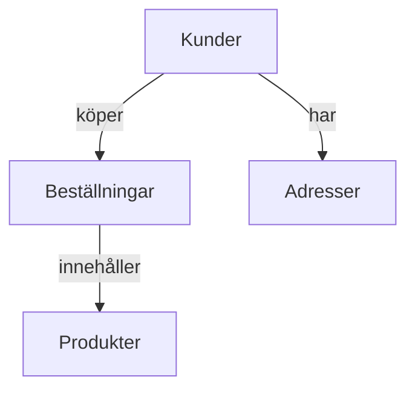

---

title: 
author: Marcus Ackre Medina
type: lecture
topic: databaser
difficulty: 1
language: sql
status: adapted
marcus_voice: true
source: "Old_courses/2025/2_databases/lectures/crud/databaser_crud_marp.md"
description: "Tänk er ett bibliotek med perfekt ordning:"
tags: ["", "marp", "rider", "sql", "ssh", "verktyg"]
week_fit: []
---

# 

🟢


# **SQL & Relationsdatabaser**

### Dagens lära: CRUD och databasteori
---

## **Vad är en relationsdatabas?**

Tänk er ett bibliotek med perfekt ordning:

- **Tabeller** = Hyllor med olika ämnen
- **Rader** = Böcker på hyllan
- **Kolumner** = Information om varje bok (titel, författare, år)
- **Relationer** = Kopplingar mellan hyllorna

<div class="mermaid">



</div>

---

## **Varför relationsdatabaser?**

Som en välorganiserad verktygslåda:

- **Struktur**: Allt på sin plats
- **Integritet**: Data håller ihop
- **Prestanda**: Snabba sökningar
- **Säkerhet**: Kontrollerad åtkomst
- **ACID**: Atomicity, Consistency, Isolation, Durability

**Kort sagt**: Ingen data försvinner, inget blir fel!

---

## **Verktyg för er databas-resa**

### **Rekommenderat för alla:**
- **DB Browser for SQLite** - Perfekt för att börja!

### **För JetBrains Rider-användare:**
- Inbyggd databas-explorer
- Datagrip-integration

### **För Visual Studio-användare:**
- SQL Server Object Explorer
- Server Explorer

**Tipset**: Börja med DB Browser - enkelt och kraftfullt!

---

## **CRUD - Era fyra grundverktyg**

Som en schweizisk armékniv för data:

- **C**reate (INSERT) - Lägg till ny data
- **R**ead (SELECT) - Hämta data
- **U**pdate (UPDATE) - Ändra befintlig data
- **D**elete (DELETE) - Ta bort data
- (**L**ist (SELECT)) - Listar visst antal poster
Allt ni behöver för att hantera data!

---

## **CREATE - Skapa tabeller**

Först bygger vi vårt "bibliotek":

```sql
-- Skapa en kund-tabell
CREATE TABLE Customers (
    Id INTEGER PRIMARY KEY,
    Name TEXT NOT NULL,
    Email TEXT UNIQUE,
    CreatedDate DATE DEFAULT CURRENT_DATE
);

-- Skapa en produkt-tabell
CREATE TABLE Products (
    Id INTEGER PRIMARY KEY,
    Name TEXT NOT NULL,
    Price DECIMAL(10,2),
    Stock INTEGER DEFAULT 0
);
```

Som att bygga hyllor innan vi lägger dit böckerna!

---

## **INSERT - Lägg till data**

Nu fyller vi vårt "bibliotek":

```sql
-- Lägg till kunder
INSERT INTO Customers (Name, Email)
VALUES
    ('Anna Andersson', 'anna@email.com'),
    ('Bengt Bengtsson', 'bengt@email.com'),
    ('Cecilia Carlsson', 'cecilia@email.com');

-- Lägg till produkter
INSERT INTO Products (Name, Price, Stock)
VALUES
    ('Laptop', 15000.00, 10),
    ('Mus', 299.00, 50),
    ('Tangentbord', 899.00, 25);
```

---

## **SELECT - Hämta data**

Nu kan vi börja "läsa våra böcker":

```sql
-- Hämta alla kunder
SELECT * FROM Customers;

-- Hämta specifika kolumner
SELECT Name, Email FROM Customers;

-- Filtrera med WHERE
SELECT * FROM Products WHERE Price < 1000;

-- Sortera resultat
SELECT * FROM Products ORDER BY Price DESC;

-- Begränsa antal resultat
SELECT * FROM Products LIMIT 2;
```

---

## **UPDATE - Ändra data**

Ibland behöver vi "redigera böckerna":

```sql
-- Uppdatera pris för en produkt
UPDATE Products
SET Price = 799.00
WHERE Name = 'Tangentbord';

-- Uppdatera flera kolumner
UPDATE Products
SET Price = 12999.00, Stock = 15
WHERE Name = 'Laptop';

-- Uppdatera baserat på villkor
UPDATE Products
SET Stock = Stock - 1
WHERE Id = 1;
```

**Varning**: Glöm aldrig WHERE-klausulen! Annars ändras alla rader.

---

## **DELETE - Ta bort data**

Städa upp på "biblioteket":

```sql
-- Ta bort en specifik kund
DELETE FROM Customers
WHERE Id = 3;

-- Ta bort baserat på villkor
DELETE FROM Products
WHERE Stock = 0;

-- Ta bort alla rader (VARNING!)
DELETE FROM Products;

-- Ta bort hela tabellen
DROP TABLE Products;
```

**Viktigt**: DELETE tar bort rader, DROP tar bort hela tabellen!

---

## **Praktiska WHERE-exempel**

Filtrera som en detektiv:

```sql
-- Numeriska jämförelser
SELECT * FROM Products WHERE Price >= 500;
SELECT * FROM Products WHERE Stock BETWEEN 10 AND 50;

-- Textjämförelser
SELECT * FROM Customers WHERE Name LIKE 'A%'; -- Börjar med A
SELECT * FROM Customers WHERE Email LIKE '%@gmail.com'; -- Gmail

-- Kombinera villkor
SELECT * FROM Products
WHERE Price < 1000 AND Stock > 0;

SELECT * FROM Products
WHERE Name = 'Laptop' OR Name = 'Mus';
```

---

## **Grundläggande funktioner**

SQL har inbyggda "superhjältekrafter":

```sql
-- Räkna rader
SELECT COUNT(*) FROM Customers;

-- Hitta max/min värden
SELECT MAX(Price), MIN(Price) FROM Products;

-- Beräkna medelvärden
SELECT AVG(Price) FROM Products;

-- Summera värden
SELECT SUM(Price * Stock) AS TotalValue FROM Products;

-- Dagens datum
SELECT DATE('now') AS Today;
```

---

## **Datatyper i SQL**

Viktiga datatyper att känna till:

| Datatyp | Beskrivning | Exempel |
|---------|-------------|---------|
| `INTEGER` / `INT` | Heltal | `Age INTEGER` |
| `TEXT` / `VARCHAR` | Textsträngär | `Name TEXT NOT NULL` |
| `DECIMAL(p,s)` | Decimaltal | `Price DECIMAL(10,2)` |
| `DATE` | Datum | `CreatedDate DATE` |
| `BOOLEAN` | Sant/falskt | `IsActive BOOLEAN` |
| `BLOB` | Binärdata | `ProfileImage BLOB` |

---

## **Constraints - Regler för data**

Håll ordning på datan:

```sql
CREATE TABLE Users (
    Id INTEGER PRIMARY KEY,           -- Unikt ID
    Username TEXT NOT NULL UNIQUE,   -- Måste finnas, unikt
    Email TEXT UNIQUE,               -- Unikt om det finns
    Age INTEGER CHECK (Age >= 0),    -- Måste vara positiv
    Status TEXT DEFAULT 'active',    -- Standardvärde
    CreatedDate DATE DEFAULT CURRENT_DATE
);
```

**Constraints** = Regler som databasan följer automatiskt!

---

## **Primary Keys & Foreign Keys**

Kopplingar mellan tabeller:

```sql
-- Parent tabell
CREATE TABLE Categories (
    Id INTEGER PRIMARY KEY,
    Name TEXT NOT NULL
);

-- Child tabell med foreign key
CREATE TABLE Products (
    Id INTEGER PRIMARY KEY,
    Name TEXT NOT NULL,
    CategoryId INTEGER,
    FOREIGN KEY (CategoryId) REFERENCES Categories(Id)
);
```

**Foreign Key** = "Denna kolumn pekar på en rad i en annan tabell"

---

## **Säkerhet och bästa praxis**

Som att ha lås på biblioteket:

### **DO:**
- Använd parameterized queries
- Validera input
- Använd transactions för kritiska operationer
- Backup regelbundet

### **DON'T:**
- Klistra in användarinput direkt i SQL
- Dela databas-lösenord
- Köra som admin om det inte behövs
- Glömma WHERE i UPDATE/DELETE

---

## **Praktisk övning - Skolsystem**

Dags att testa era nya kunskaper!

```sql

**15-minutersregeln:** Fastnar du i mer än 15 minuter — fråga klassen, sen AI, sen mig. I den ordningen.
-- Skapa tabeller för ett enkelt skolsystem
CREATE TABLE Students (
    Id INTEGER PRIMARY KEY,
    Name TEXT NOT NULL,
    Email TEXT UNIQUE,
    Grade INTEGER CHECK (Grade BETWEEN 1 AND 12)
);

CREATE TABLE Courses (
    Id INTEGER PRIMARY KEY,
    Name TEXT NOT NULL,
    Credits INTEGER DEFAULT 1,
    Teacher TEXT
);
```

**Er uppgift**: Lägg till data och experimentera med CRUD!

---

## **Övning - Steg för steg**

### **Steg 1**: Skapa tabellerna (CREATE)
### **Steg 2**: Lägg till några studenter och kurser (INSERT)
### **Steg 3**: Hämta all data (SELECT)
### **Steg 4**: Filtrera studenter i årskurs 3 (WHERE)
### **Steg 5**: Uppdatera en students betyg (UPDATE)
### **Steg 6**: Ta bort en kurs (DELETE)

**Experimentera och ha kul! 🎯**

---

## **Vanliga misstag att undvika**

### **SQL Injection 💀**
```sql
-- FARLIGT! Användarinput direkt i SQL
"SELECT * FROM Users WHERE name = '" + userInput + "'";

-- SÄKERT! Använd parametrar
"SELECT * FROM Users WHERE name = ?";
```

### **Glömd WHERE-klausul 💀**
```sql
-- FARLIGT! Uppdaterar ALLA rader
UPDATE Products SET Price = 0;

-- SÄKERT! Specifik uppdatering
UPDATE Products SET Price = 0 WHERE Id = 5;
```

---

## **Sammanfattning - Dagens lärande**

Idag har ni lärt er:

- ✅ **Relationsdatabaser** - Struktur och fördelar
- ✅ **CRUD-operationer** - CREATE, READ, UPDATE, DELETE
- ✅ **SQL-syntax** - Grundläggande kommandon
- ✅ **Datatyper** - INTEGER, TEXT, DATE, BOOLEAN
- ✅ **Constraints** - PRIMARY KEY, FOREIGN KEY, NOT NULL
- ✅ **Säkerhet** - Bästa praxis och vanliga misstag

**Ni har grunden för ert SQL-äventyr! 🚀**

---

## **Nästa steg i er resa**

**Imorgon (Tisdag)**:
🕵️‍♂️ **SQL Murder Mystery** - Använd era nya kunskaper för att lösa ett mord!

**I veckan**:
- Aggregering och gruppering
- JOINs mellan tabeller
- C# + SQL integration

**Förberedelser**:
- Installera DB Browser for SQLite
- Träna på CRUD-operationer
- W3Schools SQL som referens

---

## **Källor & Resurser**

**Verktyg:**
- DB Browser for SQLite
- W3Schools SQL Tutorial
- SQLZoo Interactive SQL Tutorial

**Dokumentation:**
- SQLite Documentation
- SQL Standards Reference

**Imorgon:**
- SQL Murder Mystery
- Detektiv-utmaningar väntar! 🔍

**Lycka till och ha kul med SQL! 🌟**

---
Nu har du verktygen. Använd dem, missbruka dem, lär dig av misstagen. Det är vägen.
