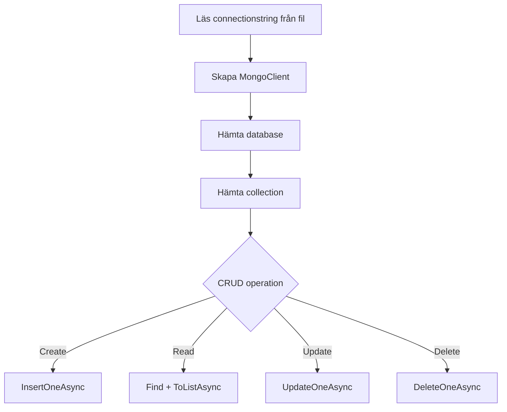

---

title: MongoDB CRUD i C#
author: Marcus Ackre Medina
type: lecture
topic: databaser
difficulty: 1
language: mixed
status: adapted
marcus_voice: true
source: "Old_courses/2025/2_databases/lectures/MongoDB/mongodb_crud_marp.md"
description: "- Läsa connectionstring från fil"
tags: ["crud", "csharp", "databaser", "marp", "mongodb", "ssh", "visual-studio"]
week_fit: []
---

# MongoDB CRUD i C#

🟢

### En steg-för-steg guide
---

## Vad ska vi göra?

- Läsa connectionstring från fil
- Ansluta till MongoDB
- Hämta en collection
- **C**reate - Skapa nya dokument
- **R**ead - Läsa data
- **U**pdate - Uppdatera dokument
- **D**elete - Ta bort dokument

---

## Steg 1: NuGet-paket

```bash
dotnet add package MongoDB.Driver
```

Vi behöver MongoDB's officiella driver för C#.

---

## Steg 2: Person-klassen

```csharp
using MongoDB.Bson;
using MongoDB.Bson.Serialization.Attributes;

public class Person
{
    [BsonId]
    [BsonRepresentation(BsonType.ObjectId)]
    public string MongoId { get; set; }

    [BsonElement("id")]
    public string Id { get; set; }

    public string first_name { get; set; }
    public string last_name { get; set; }
    public string email { get; set; }
    public string gender { get; set; }
    public string ip_address { get; set; }
    public string car { get; set; }
    public string car_model { get; set; }
    public int car_year { get; set; }
    public string app { get; set; }
}
```

---

## Varför den konstiga Id-lösningen? 🤔

**Problemet:**
- MongoDB har automatiskt fält `_id` (ObjectId)
- Vår data har redan ett fält `id` (string GUID)
- MongoDB-drivern tror `Id` eller `id` är `_id`!

**Lösningen:**
```csharp
[BsonId]                              // Detta är MongoDB's _id
[BsonRepresentation(BsonType.ObjectId)]
public string MongoId { get; set; }

[BsonElement("id")]                   // Detta är vårt egna id-fält
public string Id { get; set; }
```

---

## Attribut-förklaring

**`[BsonId]`**
- Säger "detta är MongoDB's `_id`-fält"
- Varje dokument MÅSTE ha en `_id`

**`[BsonRepresentation(BsonType.ObjectId)]`**
- Konverterar MongoDB's ObjectId till string
- Lättare att jobba med i C#

**`[BsonElement("id")]`**
- Mappar C#-property `Id` till MongoDB-fält `id`
- Nu kan vi ha BÅDE `_id` OCH `id`!

---

## Steg 3: Using-statements

```csharp
using MongoDB.Driver;
using MongoDB.Bson;
using MongoDB.Bson.Serialization.Attributes;
```

Importera MongoDB-namespace.

---

## Varför async/await? 🤔

**MongoDB.Driver är 100% asynkron**

- Alla metoder heter `*Async`
- Inga synkrona alternativ finns
- Nätverksanrop ska inte blockera trådar

**Exempel:**
```csharp
// ❌ Finns inte
var result = collection.Find(_ => true).ToList();

// ✅ Måste använda
var result = await collection.Find(_ => true).ToListAsync();
```

---

## Async är bra! 🚀

**Varför?**
- Programmet kan göra annat medan vi väntar på databasen
- Bättre prestanda (inte blockerad tråd)
- Modern C# standard

**Tänk dig:**
- Du ringer ett samtal (synkront) - du kan inte göra annat medan du pratar
- Du skickar SMS (asynkront) - du kan göra annat medan du väntar på svar

MongoDB-anrop är som SMS!

---

## Steg 4: Läs connectionstring

```csharp
string myDocsPath = Environment
    .GetFolderPath(Environment.SpecialFolder.MyDocuments);

string dbFolderPath = Path.Combine(myDocsPath, "databaser");
string connectionFilePath = Path.Combine(dbFolderPath, "MongoDB.txt");

string connectionString = File.ReadAllText(connectionFilePath).Trim();
```

Bygger sökväg plattformsoberoende.

---

## Steg 5: Skapa MongoDB-klient

```csharp
var client = new MongoClient(connectionString);
```

Skapar anslutning till MongoDB (Atlas eller lokal).

---

## Steg 6: Hämta databas

```csharp
var database = client.GetDatabase("Person");
```

Ansluter till databasen "Person".

---

## Steg 7: Hämta collection

```csharp
var collection = database.GetCollection<Person>("Person");
```

Nu har vi tillgång till alla personer i collection "Person".

---

## CREATE - Lägg till en person

```csharp
var newPerson = new Person
{
    Id = Guid.NewGuid().ToString(),
    first_name = "Luke",
    last_name = "Skywalker",
    email = "luke@rebellion.com",
    gender = "Male",
    ip_address = "192.168.1.1",
    car = "Landspeeder",
    car_model = "X-34",
    car_year = 1977,
    app = "ForceChat"
};

await collection.InsertOneAsync(newPerson);
```

---

## READ - Hämta alla personer

```csharp
var allPersons = await collection.Find(_ => true).ToListAsync();

foreach (var person in allPersons)
{
    Console.WriteLine($"{person.first_name} {person.last_name} - {person.email}");
}
```

`_ => true` betyder "alla dokument".

---

## READ - Filtrera efter namn

```csharp
var filter = Builders<Person>.Filter.Eq(p => p.first_name, "Luke");
var luke = await collection.Find(filter).FirstOrDefaultAsync();

if (luke != null)
{
    Console.WriteLine($"Hittade: {luke.first_name} {luke.last_name}");
}
```

---

## READ - Flera filter (AND)

```csharp
var filter = Builders<Person>.Filter.And(
    Builders<Person>.Filter.Eq(p => p.gender, "Female"),
    Builders<Person>.Filter.Eq(p => p.car, "Ford")
);

var fordWomen = await collection.Find(filter).ToListAsync();
```

---

## UPDATE - Uppdatera email

```csharp
var filter = Builders<Person>.Filter.Eq(p => p.first_name, "Luke");
var update = Builders<Person>.Update.Set(p => p.email, "luke@jedi.com");

var result = await collection.UpdateOneAsync(filter, update);

Console.WriteLine($"Uppdaterade {result.ModifiedCount} dokument");
```

---

## UPDATE - Uppdatera flera fält

```csharp
var update = Builders<Person>.Update
    .Set(p => p.email, "luke@jedi.com")
    .Set(p => p.car, "X-Wing")
    .Set(p => p.car_model, "T-65");

await collection.UpdateOneAsync(filter, update);
```

---

## DELETE - Ta bort en person

```csharp
var filter = Builders<Person>.Filter.Eq(p => p.email, "luke@jedi.com");
var result = await collection.DeleteOneAsync(filter);

Console.WriteLine($"Tog bort {result.DeletedCount} dokument");
```

---

## DELETE - Ta bort flera

```csharp
var filter = Builders<Person>.Filter.Eq(p => p.gender, "Male");
var result = await collection.DeleteManyAsync(filter);

Console.WriteLine($"Tog bort {result.DeletedCount} dokument");
```

⚠️ Var försiktig med DeleteMany!

---

## Felhantering

```csharp
try
{
    await collection.InsertOneAsync(newPerson);
}
catch (MongoException ex)
{
    Console.WriteLine($"MongoDB-fel: {ex.Message}");
}
catch (FileNotFoundException)
{
    Console.WriteLine("Hittade inte connectionstring-filen!");
}
```

---

## Complete example flow

<div class="mermaid">



</div>

---

## Filter Builder - Cheat Sheet

```csharp
// Exakt match
Builders<Person>.Filter.Eq(p => p.first_name, "Luke")

// Större än
Builders<Person>.Filter.Gt(p => p.car_year, 2000)

// Mindre än
Builders<Person>.Filter.Lt(p => p.car_year, 2010)

// Innehåller (Regex)
Builders<Person>.Filter.Regex(p => p.email, "gmail")

// In (någon av flera värden)
Builders<Person>.Filter.In(p => p.car, new[] { "Ford", "Toyota" })
```

---

## Update Builder - Cheat Sheet

```csharp
// Sätt värde
Builders<Person>.Update.Set(p => p.email, "new@email.com")

// Öka värde
Builders<Person>.Update.Inc(p => p.car_year, 1)

// Ta bort fält
Builders<Person>.Update.Unset(p => p.app)

// Byt namn på fält
Builders<Person>.Update.Rename("old_field", "new_field")
```

---

## Async/Await - Sammanfattning

**Alla MongoDB-metoder:**
- InsertOneAsync
- FindAsync / ToListAsync
- UpdateOneAsync
- DeleteOneAsync

**Glöm inte:**
- `await` framför anrop
- `async` i metodsignatur
- Program.cs måste ha async main eller top-level statements

```csharp
// ✅ Modern C# (top-level statements)
var facade = new PersonFacade(connectionString);
var persons = await facade.GetAllAsync();
```

---

## Sammanfattning

1. Läs connectionstring från fil
2. Skapa `MongoClient`
3. Hämta database och collection
4. **Create**: `InsertOneAsync`
5. **Read**: `Find` + `ToListAsync`
6. **Update**: `UpdateOneAsync` + Update Builder
7. **Delete**: `DeleteOneAsync` / `DeleteManyAsync`

---

## 🎯 Övningsuppgift

1. Skapa en ny Person
2. Hämta alla personer med en Ford
3. Uppdatera alla Ford-ägare till bilår 2025
4. Ta bort personer med email från "elpais.com"

---

## 💡 Pro-tips

- Använd `BsonIgnoreIfNull` för att inte spara null-värden
- Indexera fält du söker ofta på
- Använd `FindOneAndUpdateAsync` för atomiska operationer
- Testa alltid filter med `Find` innan `Delete`!

---

## Frågor?

MongoDB dokumentation:
https://www.mongodb.com/docs/drivers/csharp/

Nu kör vi! 🚀

---
Nu har du verktygen. Använd dem, missbruka dem, lär dig av misstagen. Det är vägen.
