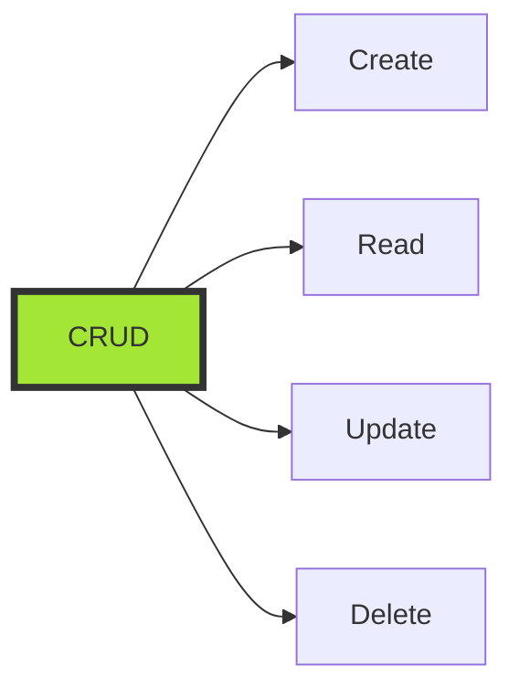

# 3. Grundläggande CRUD-operationer i LocalDB och SQLite (45 min)

🔴


## Övergripande frågeställning

Hur kan vi effektivt utföra och optimera grundläggande databasoperationer (CRUD) i LocalDB och SQLite, och vilka unika funktioner erbjuder dessa databaser för att förbättra dessa operationer i .NET-miljö?

# Föreläsningsmaterial: Grundläggande CRUD-operationer i LocalDB och SQLite

## 1. Introduktion till CRUD

CRUD står för Create, Read, Update, Delete - de fyra grundläggande operationerna för persistens i databaser.

<div class="mermaid" style="zoom: 1.4;">



</div>

## 2. CREATE - Skapa tabeller och lägga till data

### Skapa en tabell i LocalDB

```sql
CREATE TABLE Books (
    ID INT PRIMARY KEY IDENTITY(1,1),
    Title NVARCHAR(100) NOT NULL,
    Author NVARCHAR(100),
    PublicationYear INT,
    ISBN NVARCHAR(13) UNIQUE
);
```

### Skapa en tabell i SQLite

SQLite använder inte `IDENTITY` utan har en inbyggd funktionalitet för att skapa auto-increment-fält:

```sql
CREATE TABLE Books (
    ID INTEGER PRIMARY KEY AUTOINCREMENT,
    Title TEXT NOT NULL,
    Author TEXT,
    PublicationYear INTEGER,
    ISBN TEXT UNIQUE
);
```

### Lägga till data (INSERT)

Samma INSERT-syntax fungerar i både LocalDB och SQLite:

```sql
INSERT INTO Books (Title, Author, PublicationYear, ISBN)
VALUES ('1984', 'George Orwell', 1949, '9780451524935');
```

## 3. READ - Hämta data

### Enkel SELECT

```sql
SELECT * FROM Books;
```

### SELECT med villkor

```sql
SELECT Title, Author FROM Books WHERE PublicationYear > 2000;
```

## 4. UPDATE - Uppdatera data

```sql
UPDATE Books
SET PublicationYear = 1948
WHERE Title = '1984';
```

## 5. DELETE - Ta bort data

```sql
DELETE FROM Books WHERE ISBN = '9780451524935';
```

## 6. Unika funktioner i LocalDB och SQLite

### Auto-increment/IDENTITY

I LocalDB används `IDENTITY` för att skapa unika ID:n automatiskt, medan SQLite använder `AUTOINCREMENT`. Denna funktion förenklar hanteringen av primärnycklar.

#### LocalDB

```sql
CREATE TABLE Employees (
    ID INT PRIMARY KEY IDENTITY(1,1),
    FirstName NVARCHAR(50),
    LastName NVARCHAR(50),
    Department NVARCHAR(50),
    Salary DECIMAL(10, 2)
);
```

#### SQLite

```sql
CREATE TABLE Employees (
    ID INTEGER PRIMARY KEY AUTOINCREMENT,
    FirstName TEXT,
    LastName TEXT,
    Department TEXT,
    Salary DECIMAL(10, 2)
);
```

### UPSERT (Merge) i SQLite

SQLite har stöd för en funktion som liknar H2:s `MERGE INTO`, kallad `INSERT OR REPLACE`, för att uppdatera eller infoga rader baserat på en unik nyckel:

```sql
INSERT OR REPLACE INTO Books (ID, Title, Author, PublicationYear, ISBN)
VALUES (1, '1984', 'George Orwell', 1949, '9780451524935');
```

I LocalDB använder man en annan teknik för upsert, vanligtvis genom att kombinera `MERGE` med `WHEN MATCHED` och `WHEN NOT MATCHED`:

#### LocalDB (SQL Server)

```sql
MERGE INTO Books AS Target
USING (SELECT '1984' AS Title, 'George Orwell' AS Author, 1949 AS PublicationYear, '9780451524935' AS ISBN) AS Source
ON Target.ISBN = Source.ISBN
WHEN MATCHED THEN 
    UPDATE SET Title = Source.Title, Author = Source.Author, PublicationYear = Source.PublicationYear
WHEN NOT MATCHED THEN 
    INSERT (Title, Author, PublicationYear, ISBN) 
    VALUES (Source.Title, Source.Author, Source.PublicationYear, Source.ISBN);
```

## 7. Indexering i LocalDB och SQLite

Vad: Indexering förbättrar prestandan för sökfrågor genom att skapa en datastruktur som snabbt kan lokalisera rader baserat på indexerade kolumner.

### LocalDB:

```sql
CREATE INDEX idx_author ON Books(Author);
```

### SQLite:

```sql
CREATE INDEX idx_author ON Books(Author);
```

Båda använder samma syntax, men prestandaskillnader kan förekomma beroende på databasstorlek och mängden data.

## 8. Transaktioner i LocalDB och SQLite

Vad: Transaktioner säkerställer dataintegritet genom att garantera att alla operationer i en grupp antingen lyckas eller misslyckas tillsammans.

### LocalDB:

```sql
BEGIN TRANSACTION;
INSERT INTO Books (Title, Author) VALUES ('Bok 1', 'Författare 1');
INSERT INTO Books (Title, Author) VALUES ('Bok 2', 'Författare 2');
COMMIT;
```

### SQLite:

```sql
BEGIN;
INSERT INTO Books (Title, Author) VALUES ('Bok 1', 'Författare 1');
INSERT INTO Books (Title, Author) VALUES ('Bok 2', 'Författare 2');
COMMIT;
```

I båda fallen använder man transaktioner för att hantera flera databasoperationer som en enda enhet.

## 9. Felsökning och felhantering

Vad: Felsökning och felhantering är viktigt för att upprätthålla databasens integritet och för att snabbt identifiera och lösa problem.

### LocalDB:
Använd `TRY...CATCH` i SQL Server för att fånga och hantera fel:

```sql
BEGIN TRY
    INSERT INTO Books (Title, Author) VALUES ('Bok 1', 'Författare 1');
END TRY
BEGIN CATCH
    SELECT ERROR_MESSAGE() AS ErrorMessage;
END CATCH;
```

### SQLite:
SQLite saknar inbyggt felhanteringsstöd som SQL Server, men du kan hantera fel via applikationslogik eller SQL-kommandon som `PRAGMA` för att visa databasens tillstånd.

---

# Övningsuppgifter

## Övning 1: Skapa och populera en tabell (10 minuter)

Be studenterna skapa en tabell `Employees` med följande kolumner:

- ID (AUTO_INCREMENT eller IDENTITY)
- FirstName
- LastName
- Department
- Salary

Låt dem lägga till minst 5 anställda i tabellen.

## Övning 2: Utföra SELECT-frågor (10 minuter)

Be studenterna skriva och köra följande SELECT-frågor:

1. Hämta alla anställda.
2. Hämta namn och avdelning för anställda med en lön över 30000.
3. Räkna antalet anställda per avdelning.

## Övning 3: Uppdatera och ta bort data (10 minuter)

1. Uppdatera lönen för en specifik anställd.
2. Ta bort alla anställda från en viss avdelning.
3. Använd en transaktion för att flytta en anställd till en ny avdelning och justera deras lön.

## Övning 4: Avancerade operationer (15 minuter)

1. Skapa ett index på Department-kolumnen och förklara varför det kan vara användbart.
2. Använd UPSERT (MERGE för LocalDB, INSERT OR REPLACE för SQLite) för att uppdatera eller lägga till en ny anställd baserat på deras ID.
3. Skriv en SELECT-fråga som använder en subquery för att hitta anställda med lön över genomsnittet.

## Övning 5: Reflektion och diskussion (5 minuter)

Be studenterna reflektera över och diskutera i små grupper:

1. Vilka fördelar ser du med LocalDB:s och SQLite:s unika funktioner?
2. Hur skiljer sig syntax eller funktionalitet mellan LocalDB och SQLite?
3. I vilka situationer tror du att CRUD-operationer i dessa databaser skulle vara särskilt användbara i ett verkligt projekt?

---
Nu har du verktygen. Använd dem, missbruka dem, lär dig av misstagen. Det är vägen.
