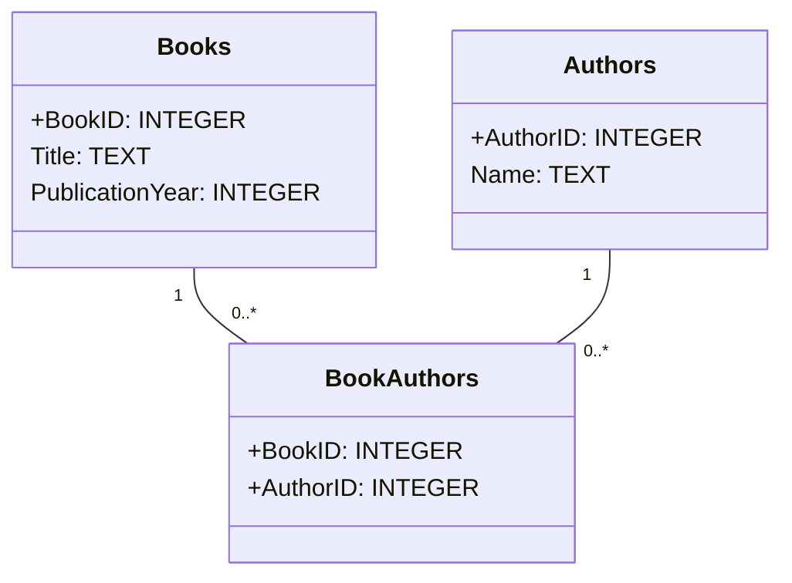
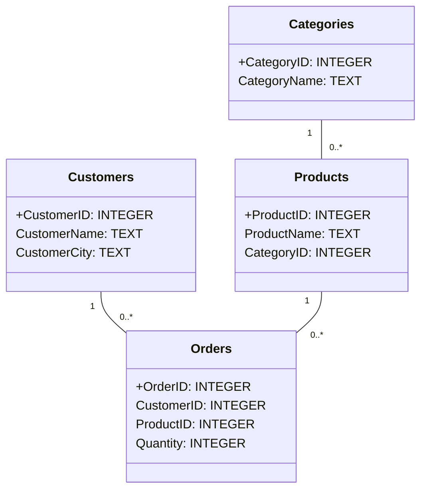

# 4. Normalisering och UML-diagram (45 min)

🟢


## Föreläsningsmaterial

### Koncept av normalisering och dess fördelar

#### 1. Vad är normalisering?

- Normalisering är processen att organisera data i en databas för att minska redundans och förbättra dataintegritet.
- Det innebär att strukturera en relationsdatabas i enlighet med en serie så kallade normalformer.

#### 2. Fördelar med normalisering

- Minskar dataduplicering
- Förbättrar dataintegritet
- Förenklar dataunderhåll
- Ökar flexibiliteten i databasen

#### 3. Första normalform (1NF)

- Varje kolumn innehåller atomära (odelbart) värden
- Inga upprepande grupper av kolumner
- Exempel:

  Icke-normaliserad:
  | OrderID | Products |
  | ------- | ------------------ |
  | 1 | Bok, Penna, Linjal |

** 1NF:**  
 | OrderID | Product |
| ------- | ------- |
| 1 | Bok |
| 1 | Penna |
| 1 | Linjal |

#### 4. Andra normalform (2NF)

- Uppfyller 1NF
- Alla icke-nyckelfält är fullt funktionellt beroende av primärnyckeln
- Eliminerar partiella beroenden

**1NF (inte 2NF):**
| OrderID | Product | Category | CategoryDescription |
| ------- | ------- | ---------- | ------------------- |
| 1 | Bok | Litteratur | Skrivna verk |
| 2 | Penna | Kontor | Skrivtillbehör |
| 3 | Sudde | Kontor | Skrivtillbehör |

**2NF:**
Table: Orders
| OrderID | Product | CategoryID |
| ------- | ------- | ---------- |
| 1 | Bok | 1 |
| 2 | Penna | 2 |
| 3 | Sudde | 2 |

Table: Categories
| CategoryID | Category | Description |
| ---------- | ---------- | ------------ |
| 1 | Litteratur | Skrivna verk |
| 2 | Kontor | Skrivtillbehör |

#### 5. Tredje normalform (3NF)

- Uppfyller 2NF
- Inga transitiva beroenden mellan icke-nyckelfält
- Exempel:

  **2NF (inte 3NF):**
  | OrderID | Product | Category | CategoryDescription |
  | ------- | ------- | ---------- | ------------------- |
  | 1 | Bok | Litteratur | Skrivna verk |
  | 2 | Penna | Kontor | Skrivtillbehör |
  | 3 | Sudde | Kontor | Skrivtillbehör |

  **3NF:**
  **Table: Orders**
  | OrderID | Product | CategoryID |
  | ------- | ------- | ---------- |
  | 1 | Bok | 1 |
  | 2 | Penna | 2 |
  | 3 | Sudde | 2 |

  **Table: Categories**
  | CategoryID | Category | Description |
  | ---------- | ---------- | ------------ |
  | 1 | Litteratur | Skrivna verk |
  | 2 | Kontor | Skrivtillbehör |


### Introduktion till UML-diagram för databasdesign

#### 1. Vad är UML?

- UML står för Unified Modeling Language
- Det är ett standardiserat modelleringsspråk inom mjukvaruutveckling

#### 2. UML-klassdiagram för databaser

- Representerar tabeller som klasser
- Visar relationer mellan tabeller
- Inkluderar attribut (kolumner) och deras datatyper

#### 3. Komponenter i ett UML-klassdiagram

- Klasser (tabeller)
- Attribut (kolumner)
- Relationer (förhållanden mellan tabeller)

#### 4. Exempel på UML-diagram för en enkel databas

<div class="mermaid" style="zoom: 1.4;">



</div>

---

## Övningsuppgifter

### Uppgift 1: Identifiera normalformer

Granska följande tabell och identifiera vilken normalform den uppfyller. Förklara ditt resonemang.

| StudentID | Name  | Course1 | Course2 | Course3 |
| --------- | ----- | ------- | ------- | ------- |
| 1         | Anna  | Math    | Physics | NULL    |
| 2         | Bengt | English | History | Biology |

<details>
  <summary>Lösningsförslag</summary>

Denna tabell uppfyller inte ens första normalform (1NF) eftersom:

- Den har upprepande grupper av kolumner (Course1, Course2, Course3)
- Kolumnerna innehåller NULL-värden som indikerar frånvaro av data

För att uppnå 1NF bör tabellen omstruktureras till:

```sql
CREATE TABLE StudentCourses (
    StudentID INTEGER,
    Name TEXT,
    Course TEXT,
    PRIMARY KEY (StudentID, Course)
);

INSERT INTO StudentCourses (StudentID, Name, Course) VALUES
(1, 'Anna', 'Math'),
(1, 'Anna', 'Physics'),
(2, 'Bengt', 'English'),
(2, 'Bengt', 'History'),
(2, 'Bengt', 'Biology');
```

</details>

### Uppgift 2: Normalisera till 3NF

Normalisera följande tabell till tredje normalform (3NF):

| OrderID | ProductName | Quantity | CustomerName | CustomerCity |
| ------- | ----------- | -------- | ------------ | ------------ |
| 1       | Laptop      | 2        | Alice        | Stockholm    |
| 2       | Mouse       | 3        | Bob          | Göteborg     |
| 3       | Keyboard    | 1        | Alice        | Stockholm    |

<details>
  <summary>Lösningsförslag</summary>

3NF-lösning:

```sql
-- Customers table
CREATE TABLE Customers (
    CustomerID INTEGER PRIMARY KEY,
    CustomerName TEXT,
    CustomerCity TEXT
);

-- Products table
CREATE TABLE Products (
    ProductID INTEGER PRIMARY KEY,
    ProductName TEXT
);

-- Orders table
CREATE TABLE Orders (
    OrderID INTEGER PRIMARY KEY,
    CustomerID INTEGER,
    ProductID INTEGER,
    Quantity INTEGER,
    FOREIGN KEY (CustomerID) REFERENCES Customers(CustomerID),
    FOREIGN KEY (ProductID) REFERENCES Products(ProductID)
);

-- Insert data
INSERT INTO Customers (CustomerID, CustomerName, CustomerCity) VALUES
(1, 'Alice', 'Stockholm'),
(2, 'Bob', 'Göteborg');

INSERT INTO Products (ProductID, ProductName) VALUES
(1, 'Laptop'),
(2, 'Mouse'),
(3, 'Keyboard');

INSERT INTO Orders (OrderID, CustomerID, ProductID, Quantity) VALUES
(1, 1, 1, 2),
(2, 2, 2, 3),
(3, 1, 3, 1);
```

</details>

### Uppgift 3: Skapa ett UML-diagram

Skapa ett UML-klassdiagram för den normaliserade databasen från Uppgift 2.

<details>
  <summary>Lösningsförslag</summary>

<div class="mermaid" style="zoom: 1.4;">

```mermaid

**15-minutersregeln:** Fastnar du i mer än 15 minuter — fråga klassen, sen AI, sen mig. I den ordningen.
classDiagram
    class Customers {
        +CustomerID: INTEGER
        CustomerName: TEXT
        CustomerCity: TEXT
    }
    class Products {
        +ProductID: INTEGER
        ProductName: TEXT
    }
    class Orders {
        +OrderID: INTEGER
        CustomerID: INTEGER
        ProductID: INTEGER
        Quantity: INTEGER
    }
    Customers "1" -- "0..*" Orders
    Products "1" -- "0..*" Orders
```

</div>

</details>

### Uppgift 4: Identifiera och åtgärda normaliseringsbrister

Granska följande tabell och identifiera eventuella brister i normaliseringen. Föreslå förbättringar för att uppnå 3NF.

| EmployeeID | Name  | Department | DepartmentHead | Salary |
| ---------- | ----- | ---------- | -------------- | ------ |
| 1          | Anna  | IT         | John Doe       | 50000  |
| 2          | Bengt | HR         | Jane Smith     | 45000  |
| 3          | Clara | IT         | John Doe       | 52000  |

<details>
  <summary>Lösningsförslag</summary>

Brister:

- DepartmentHead är beroende av Department, inte av EmployeeID (transitiv beroende)
- Department och DepartmentHead upprepas

3NF-lösning:

```sql
-- Employees table
CREATE TABLE Employees (
    EmployeeID INTEGER PRIMARY KEY,
    Name TEXT,
    DepartmentID INTEGER,
    Salary INTEGER,
    FOREIGN KEY (DepartmentID) REFERENCES Departments(DepartmentID)
);

-- Departments table
CREATE TABLE Departments (
    DepartmentID INTEGER PRIMARY KEY,
    DepartmentName TEXT,
    DepartmentHead TEXT
);

-- Insert data
INSERT INTO Departments (DepartmentID, DepartmentName, DepartmentHead) VALUES
(1, 'IT', 'John Doe'),
(2, 'HR', 'Jane Smith');

INSERT INTO Employees (EmployeeID, Name, DepartmentID, Salary) VALUES
(1, 'Anna', 1, 50000),
(2, 'Bengt', 2, 45000),
(3, 'Clara', 1, 52000);
```

</details>

### Uppgift 5: Utöka UML-diagrammet

Utöka UML-diagrammet från Uppgift 3 genom att lägga till en ny entitet "Category" som är relaterad till "Products". Varje produkt tillhör en kategori, och en kategori kan ha många produkter.

<details>
  <summary>Lösningsförslag</summary>

<div class="mermaid" style="zoom: 1.4;">



</div>

</details>

### Uppgift 6: Normalisera följande data

Här kommer du att få se några brev som kommit in till djursjukhuset, detta data behöver bearbetas och matas in i databasen. Det går inte att automatisera processen, så du behöver göra det manuellt (djursjukhuset har inte råd med ett AI för att identifiera data, så du får göra det manuellt 🤪).

**Här är ett exempel på en email till djursjukhuset:**

---

**Hej!**

Jag vill boka en tid för min lilla vovve Bella. Hon är en chihuahua och har haft lite problem med sitt ben den senaste veckan. Jag tror att hon kan ha brutit det när hon hoppade ner från soffan, men jag är inte säker. Vi är verkligen oroliga. Jag heter Anna Karlsson och ni kan nå mig på 070-1234567 eller via email på anna.karlsson@mail.com. Snälla hjälp oss så snart som möjligt!

---

**Hej djursjukhuset,**

Jag behöver verkligen få min katt Felix undersökt. Han är en perser, och jag märkte att han hela tiden kliar sig runt nacken. Jag tror att det kan vara en allergi, men jag vet inte riktigt vad han kan vara allergisk mot. Felix är ganska gammal nu, så jag är lite extra orolig. Ni kan nå mig, Johan Svensson, på 072-9876543 eller på johan.svensson@example.com. Jag hoppas ni kan hjälpa oss!

---

**Hej!**

Jag vill boka tid för min golden retriever Max. Han har varit överdrivet glad den senaste veckan och viftat så mycket på svansen att den nu verkar ha blivit överansträngd. Han ser ledsen ut och slutar inte gnälla. Jag heter Maria Lund och ni kan nå mig på 076-5432109 eller på maria.lund@dogmail.com.

---

**Hallå!**

Jag har en sköldpadda, och hans namn är Sheldon. Sheldon har varit snorig och verkar lite hängig de senaste dagarna. Kan sköldpaddor bli förkylda? Jag visste inte det! Jag heter Erik, och mitt nummer är 070-6667778, eller så kan ni maila mig på erik@turtlesrock.com. Tack!

---

**Hej djursjukhuset,**

Min lilla kanin, Fluff, verkar ha blivit stucken av ett bi. Han är en dvärgkanin och verkar ha en svullnad på nosen. Det ser inte bra ut, och jag är orolig för att det kanske är något allvarligt. Jag heter Emma Berg och ni kan nå mig på 073-8889990 eller på emma.berg@bunnylove.com.

---

För att kunna normalisera datan från breven ovan, plocka fram viktig information från mailen som går att spara på ett strukturerat sätt i en databas.

<details>
  <summary>Lösningsförslag</summary>

| Djur        | Ras               | Namn    | Ägare          | Telefonnummer  | E-mail                   | Anledning                                       |
|-------------|-------------------|---------|----------------|----------------|--------------------------|-------------------------------------------------|
| Hund        | Chihuahua          | Bella   | Anna Karlsson  | 070-1234567    | anna.karlsson@mail.com    | Möjligt brutet ben                              |
| Katt        | Perser             | Felix   | Johan Svensson | 072-9876543    | johan.svensson@example.com | Möjlig allergi                                  |
| Hund        | Golden Retriever   | Max     | Maria Lund     | 076-5432109    | maria.lund@dogmail.com    | Överansträngd svans efter att ha varit för glad |
| Sköldpadda  | -                  | Sheldon | Erik           | 070-6667778    | erik@turtlesrock.com      | Förkylning                                      |
| Kanin       | Dvärgkanin         | Fluff   | Emma Berg      | 073-8889990    | emma.berg@bunnylove.com   | Stucken av ett bi                               |

</details>

<br>När du fått fram informationen ska du skapa tabeller för den datan du har, tänk på att normalisera datan så att den är i åtminstone 3NF. Spara anledningen till besök i en besöks-tabell.

<details>
  <summary>Lösningsförslag</summary>

### Tabeller:

#### Tabell 1: **Owners** (ägare)
Ägarinformation.

| OwnerID | Name           | Phone       | Email                    |
|---------|----------------|-------------|--------------------------|
| 1       | Anna Karlsson   | 070-1234567 | anna.karlsson@mail.com    |
| 2       | Johan Svensson  | 072-9876543 | johan.svensson@example.com|
| 3       | Maria Lund      | 076-5432109 | maria.lund@dogmail.com    |
| 4       | Erik            | 070-6667778 | erik@turtlesrock.com      |
| 5       | Emma Berg       | 073-8889990 | emma.berg@bunnylove.com   |

#### Tabell 2: **Species** (arter)
Här lagrar vi unika arter (t.ex. hund, katt, sköldpadda).

| SpeciesID | Name        |
|-----------|-------------|
| 1         | Hund        |
| 2         | Katt        |
| 3         | Sköldpadda  |
| 4         | Kanin       |

#### Tabell 3: **Breeds** (raser)
Här lagrar vi raser och associerar dem med en art via en främmande nyckel.

| BreedID | Name            | SpeciesID |
|---------|-----------------|-----------|
| 1       | Chihuahua       | 1         |
| 2       | Perser          | 2         |
| 3       | Golden Retriever| 1         |
| 4       | Dvärgkanin      | 4         |

#### Tabell 4: **Animals** (djur)
Här refererar vi till både art och ras med främmande nycklar.

| AnimalID | Name    | SpeciesID | BreedID | OwnerID |
|----------|---------|-----------|---------|---------|
| 1        | Bella   | 1         | 1       | 1       |
| 2        | Felix   | 2         | 2       | 2       |
| 3        | Max     | 1         | 3       | 3       |
| 4        | Sheldon | 3         | null    | 4       |
| 5        | Fluff   | 4         | 4       | 5       |

#### Tabell 5: **Visits** (besök)
Besökstabellen, varje besök är kopplat till ett specifikt djur.

| VisitID | AnimalID | Reason                                            |
|---------|----------|---------------------------------------------------|
| 1       | 1        | Möjligt brutet ben                                |
| 2       | 2        | Möjlig allergi                                    |
| 3       | 3        | Överansträngd svans efter att ha varit för glad    |
| 4       | 4        | Förkylning                                        |
| 5       | 5        | Stucken av ett bi                                 |

### Förklaring:
- **Species** innehåller varje art (hund, katt, etc.).
- **Breeds** är associerade med en art, vilket gör att vi kan referera till både art och ras via främmande nycklar i **Animals**.
- **Animals** refererar till både **Species** och **Breeds**, så varje djur är kopplat till sin specifika art och ras.
- **Visits** förblir kopplat till djuret (som nu har sin art och ras normaliserad).

</details>

<br>Slutligen ska du skapa tabeller för den datan du har, tänk igenom ifall du normaliserat på ett bra sätt innan du börjar koda SQL.

<details>
  <summary>Lösningsförslag</summary>

### Tabeller:

#### Tabell 1: **Owners** (ägare)
Ägarinformationen.

```sql
CREATE TABLE Owners (
    OwnerID INTEGER PRIMARY KEY,
    Name TEXT NOT NULL,
    Phone TEXT NOT NULL,
    Email TEXT NOT NULL
);

INSERT INTO Owners (OwnerID, Name, Phone, Email)
VALUES
    (1, 'Anna Karlsson', '070-1234567', 'anna.karlsson@mail.com'),
    (2, 'Johan Svensson', '072-9876543', 'johan.svensson@example.com'),
    (3, 'Maria Lund', '076-5432109', 'maria.lund@dogmail.com'),
    (4, 'Erik', '070-6667778', 'erik@turtlesrock.com'),
    (5, 'Emma Berg', '073-8889990', 'emma.berg@bunnylove.com');

```

| OwnerID | Name           | Phone       | Email                    |
|---------|----------------|-------------|--------------------------|
| 1       | Anna Karlsson   | 070-1234567 | anna.karlsson@mail.com    |
| 2       | Johan Svensson  | 072-9876543 | johan.svensson@example.com|
| 3       | Maria Lund      | 076-5432109 | maria.lund@dogmail.com    |
| 4       | Erik            | 070-6667778 | erik@turtlesrock.com      |
| 5       | Emma Berg       | 073-8889990 | emma.berg@bunnylove.com   |

#### Tabell 2: **Species** (arter)
Här lagrar vi unika arter (t.ex. hund, katt, sköldpadda).

```sql
CREATE TABLE Species (
    SpeciesID INTEGER PRIMARY KEY,
    Name TEXT NOT NULL
);

INSERT INTO Species (SpeciesID, Name)
VALUES
    (1, 'Hund'),
    (2, 'Katt'),
    (3, 'Sköldpadda'),
    (4, 'Kanin');

```

| SpeciesID | Name        |
|-----------|-------------|
| 1         | Hund        |
| 2         | Katt        |
| 3         | Sköldpadda  |
| 4         | Kanin       |

#### Tabell 3: **Breeds** (raser)
Här lagrar vi raser och associerar dem med en art via en främmande nyckel.

```sql
CREATE TABLE Breeds (
    BreedID INTEGER PRIMARY KEY,
    Name TEXT NOT NULL,
    SpeciesID INTEGER,
    FOREIGN KEY (SpeciesID) REFERENCES Species(SpeciesID)
);

INSERT INTO Breeds (BreedID, Name, SpeciesID)
VALUES
    (1, 'Chihuahua', 1),
    (2, 'Perser', 2),
    (3, 'Golden Retriever', 1),
    (4, 'Dvärgkanin', 4);

```

| BreedID | Name            | SpeciesID |
|---------|-----------------|-----------|
| 1       | Chihuahua       | 1         |
| 2       | Perser          | 2         |
| 3       | Golden Retriever| 1         |
| 4       | Dvärgkanin      | 4         |

#### Tabell 4: **Animals** (djur)
Här refererar vi till både art och ras med främmande nycklar.

```sql
CREATE TABLE Animals (
    AnimalID INTEGER PRIMARY KEY,
    Name TEXT NOT NULL,
    SpeciesID INTEGER,
    BreedID INTEGER,
    OwnerID INTEGER,
    FOREIGN KEY (SpeciesID) REFERENCES Species(SpeciesID),
    FOREIGN KEY (BreedID) REFERENCES Breeds(BreedID),
    FOREIGN KEY (OwnerID) REFERENCES Owners(OwnerID)
);

INSERT INTO Animals (AnimalID, Name, SpeciesID, BreedID, OwnerID)
VALUES
    (1, 'Bella', 1, 1, 1),
    (2, 'Felix', 2, 2, 2),
    (3, 'Max', 1, 3, 3),
    (4, 'Sheldon', 3, NULL, 4),
    (5, 'Fluff', 4, 4, 5);

```

| AnimalID | Name    | SpeciesID | BreedID | OwnerID |
|----------|---------|-----------|---------|---------|
| 1        | Bella   | 1         | 1       | 1       |
| 2        | Felix   | 2         | 2       | 2       |
| 3        | Max     | 1         | 3       | 3       |
| 4        | Sheldon | 3         | 5       | 4       |
| 5        | Fluff   | 4         | 4       | 5       |

#### Tabell 5: **Visits** (besök)
Besökstabellen förblir densamma som tidigare, där varje besök är kopplat till ett specifikt djur.

```sql
CREATE TABLE Visits (
    VisitID INTEGER PRIMARY KEY,
    AnimalID INTEGER,
    Reason TEXT NOT NULL,
    FOREIGN KEY (AnimalID) REFERENCES Animals(AnimalID)
);

INSERT INTO Visits (VisitID, AnimalID, Reason)
VALUES
    (1, 1, 'Möjligt brutet ben'),
    (2, 2, 'Möjlig allergi'),
    (3, 3, 'Överansträngd svans efter att ha varit för glad'),
    (4, 4, 'Förkylning'),
    (5, 5, 'Stucken av ett bi');
```

| VisitID | AnimalID | Reason                                            |
|---------|----------|---------------------------------------------------|
| 1       | 1        | Möjligt brutet ben                                |
| 2       | 2        | Möjlig allergi                                    |
| 3       | 3        | Överansträngd svans efter att ha varit för glad    |
| 4       | 4        | Förkylning                                        |
| 5       | 5        | Stucken av ett bi                                 |

### Förklaring:
- **Species** innehåller varje art (hund, katt, etc.).
- **Breeds** är associerade med en art, vilket gör att vi kan referera till både art och ras via främmande nycklar i **Animals**.
- **Animals** refererar till både **Species** och **Breeds**, så varje djur är kopplat till sin specifika art och ras.
- **Visits** förblir kopplat till djuret (som nu har sin art och ras normaliserad).

</details>

<br>Mjau! 🐱

---
Nu har du verktygen. Använd dem, missbruka dem, lär dig av misstagen. Det är vägen.
