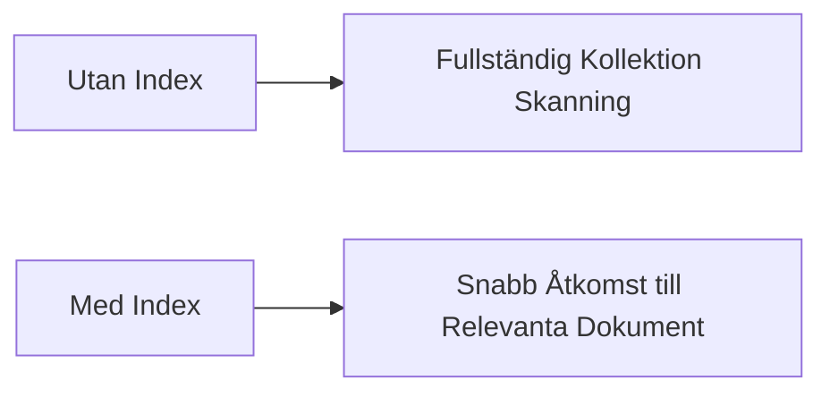
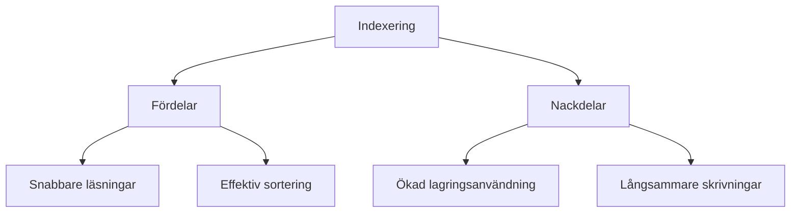

# 1. Indexering i MongoDB (45 min)

🟢


Övergripande frågeställning: Hur kan vi optimera databasförfrågningar i MongoDB genom effektiv indexering?

## 1. Introduktion till indexering

Indexering i MongoDB är en teknik för att optimera databasförfrågningar genom att skapa en datastruktur som snabbt kan lokalisera specifika dokument baserat på indexerade fält.

### Varför använda index?

- Förbättrar sökprestanda dramatiskt
- Minskar antalet dokument som MongoDB måste skanna
- Möjliggör effektiv sortering på indexerade fält

<div class="mermaid" style="zoom: 1.4;">



</div>

## 2. Typer av index i MongoDB

### Single Field Index

- Indexerar ett enda fält i dokumenten
- Syntax: `db.collection.createIndex( { field: 1 } )`
- Används för att optimera sökningar på ett specifikt fält

### Compound Index

- Indexerar flera fält tillsammans
- Ordningen på fälten är viktig
- Syntax: `db.collection.createIndex( { field1: 1, field2: -1 } )`
- Effektiv för frågor som involverar flera fält samtidigt

### Multikey Index

- För indexering av array-fält
- Skapas automatiskt när ett indexerat fält innehåller en array
- Möjliggör effektiv sökning i array-element

### Text Index

- För textsökningar
- Syntax: `db.collection.createIndex( { field: "text" } )`
- Möjliggör fulltext-sökningar i textfält

### Geospatial Index

- För geografiska data
- Typer: 2dsphere och 2d
- Optimerar sökningar baserade på geografisk närhet

## 3. Skapa och hantera index

### Skapa index

```javascript
db.users.createIndex( { username: 1 } )
```

### Visa existerande index

```javascript
db.users.getIndexes()
```

### Ta bort index

```javascript
db.users.dropIndex( { username: 1 } )
```

## 4. Indexeringsstrategier

- Indexera fält som ofta används i frågor
- Undvik att överindexera (påverkar skrivprestanda)
- Använd compound index för frågor med flera fält
- Överväg bakgrundsindexering för stora datamängder

## 5. Analysera frågor med explain()

```javascript
db.users.find({ age: { $gt: 25 } }).explain("executionStats")
```

Detta kommando visar detaljerad information om hur MongoDB exekverar frågan, inklusive om och hur index används.

## 6. Prestandaöverväganden

- Index tar upp lagringsutrymme
- Uppdatering av index påverkar skrivprestanda
- Balansera mellan läs- och skrivprestanda

<div class="mermaid" style="zoom: 1.4;">



</div>

Plats för interaktiv demonstration:
[Här kan en interaktiv demonstration av indexering i MongoDB implementeras, till exempel genom att visa realtidseffekter av att lägga till och ta bort index på en testdatabas.]

---

## Övningsuppgifter: Indexering i MongoDB

## Övning: Skapa en testkollektion

1. Skapa en ny kollektion kallad `employees` i din MongoDB-databas.
2. Infoga följande dokument:

```javascript

**15-minutersregeln:** Fastnar du i mer än 15 minuter — fråga klassen, sen AI, sen mig. I den ordningen.
db.employees.insertMany([
  { name: "Alice", age: 30, department: "IT", salary: 60000 },
  { name: "Bob", age: 35, department: "HR", salary: 55000 },
  { name: "Charlie", age: 28, department: "IT", salary: 62000 },
  { name: "David", age: 40, department: "Finance", salary: 70000 },
  { name: "Eve", age: 32, department: "HR", salary: 58000 }
])
```

## Övning: Skapa och testa single field index

1. Skapa ett index på `age`-fältet:

```javascript
db.employees.createIndex({ age: 1 })
```

2. Kör följande fråga och använd `explain()` för att se hur indexet används:

```javascript
db.employees.find({ age: { $gt: 30 } }).explain("executionStats")
```

3. Jämför resultatet med en fråga som inte använder indexet:

```javascript
db.employees.find({ salary: { $gt: 60000 } }).explain("executionStats")
```

## Övning: Skapa och testa compound index

1. Skapa ett sammansatt index på `department` och `salary`:

```javascript
db.employees.createIndex({ department: 1, salary: -1 })
```

2. Kör följande fråga och använd `explain()` för att se hur det sammansatta indexet används:

```javascript
db.employees.find({ department: "IT", salary: { $gt: 60000 } }).explain("executionStats")
```

3. Testa en fråga som bara använder den första delen av indexet:

```javascript
db.employees.find({ department: "HR" }).explain("executionStats")
```

## Övning: Skapa och testa text index

1. Skapa ett textindex på `name`-fältet:

```javascript
db.employees.createIndex({ name: "text" })
```

2. Utför en textsökning:

```javascript
db.employees.find({ $text: { $search: "Alice" } }).explain("executionStats")
```

3. Prova en mer komplex textsökning:

```javascript
db.employees.find({ $text: { $search: "Alice David" } }).explain("executionStats")
```

## Övning: Analysera och optimera en fråga

1. Kör följande fråga och analysera dess prestanda:

```javascript
db.employees.find({ department: "IT", age: { $lt: 35 } }).sort({ salary: -1 }).explain("executionStats")
```

2. Baserat på resultatet, skapa ett lämpligt index för att optimera denna fråga.

3. Kör frågan igen och jämför prestandan före och efter indexeringen.

## Reflektionsövning

Tänk igenom följande frågor:

1. Vilka typer av index visade sig vara mest effektiva för dina frågor?
2. Hur påverkade olika index prestandan för olika typer av frågor?
3. Vilka överväganden bör göras när man beslutar om att lägga till eller ta bort index i en produktionsdatabas?
4. Hur kan du använda kunskapen om indexering för att optimera databasdesignen i dina framtida projekt?

---
Nu har du verktygen. Använd dem, missbruka dem, lär dig av misstagen. Det är vägen.
