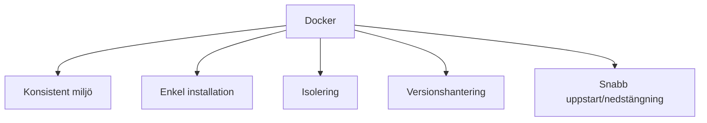

# 2. Installation av MongoDB med Docker (45 min)

🟢


Övergripande frågeställning: Hur kan vi enkelt och effektivt installera och köra MongoDB med hjälp av Docker?

## 1. Introduktion till MongoDB

MongoDB är en populär dokumentdatabas som erbjuder:

- Flexibel datamodell med JSON-liknande dokument
- Kraftfullt frågespråk och aggregeringsramverk
- Horisontell skalbarhet
- Hög prestanda för både läs- och skrivoperationer

## 2. Varför Docker för MongoDB?

Fördelar med att använda Docker:

- Konsistent miljö över olika plattformar
- Enkel installation och konfiguration
- Isolering från andra applikationer
- Enkel hantering av olika versioner
- Snabb uppstart och nedstängning

<div class="mermaid" style="zoom: 1.4;">



</div>

## 3. Steg-för-steg guide för installation av MongoDB med Docker

### Steg 1: Kontrollera Docker-installation

Säkerställ att Docker är installerat och kör:

```bash
docker --version
```

### Steg 2: Hämta MongoDB-imagen

Hämta den officiella MongoDB-imagen från Docker Hub:

```bash
docker pull mongo
```

### Steg 3: Skapa och starta en MongoDB-container

Kör följande kommando för att starta en MongoDB-container:

```bash
docker run -d --name mongodb -p 27017:27017 -v mongodb_data:/data/db mongo
```

Förklaring av parametrarna:

- `-d`: Kör containern i bakgrunden (detached mode)
- `--name mongodb`: Ger containern namnet "mongodb"
- `-p 27017:27017`: Mappar port 27017 på host till port 27017 i containern
- `-v mongodb_data:/data/db`: Skapar en volym för persistent datalagring

### Steg 4: Verifiera att containern körs

Kontrollera att MongoDB-containern körs:

```bash
docker ps
```

### Steg 5: Anslut till MongoDB

Anslut till MongoDB-shell inuti containern:

```bash
docker exec -it mongodb mongosh
```

## 4. Grundläggande MongoDB-kommandon

När du är ansluten till MongoDB-shell, kan du testa följande kommandon:

```javascript
// Visa alla databaser
show dbs

// Skapa/använd en databas
use mydb

// Infoga ett dokument
db.users.insertOne({name: "Alice", age: 30})

// Visa alla dokument i en kollektion
db.users.find()
```

## 5. Hantera MongoDB-containern

Stoppa containern:

```bash
docker stop mongodb
```

Starta containern igen:

```bash
docker start mongodb
```

Ta bort containern (OBS: Detta tar även bort data om ingen volym används):

```bash
docker rm mongodb
```

Plats för interaktiv demonstration:
[Här kan en live-demonstration av Docker-kommandon och MongoDB-anslutning genomföras]

---

# Övningsuppgifter

## Övning 1: Installera och starta MongoDB

1. Öppna en terminal på din dator.
2. Kör Docker-kommandot för att hämta MongoDB-imagen:

   ```bash

**15-minutersregeln:** Fastnar du i mer än 15 minuter — fråga klassen, sen AI, sen mig. I den ordningen.
   docker pull mongo
   ```

3. Starta en MongoDB-container med namnet "mydb" och exponera den på port 27017:

   ```bash
   docker run -d --name mydb -p 27017:27017 mongo
   ```

4. Verifiera att containern körs genom att lista alla aktiva containrar:

   ```bash
   docker ps
   ```

## Övning 2: Anslut till MongoDB och utför grundläggande operationer

1. Anslut till MongoDB-shell i containern:

   ```bash
   docker exec -it mydb mongosh
   ```

2. Inuti MongoDB-shell, skapa en ny databas kallad "bookstore":

   ```javascript
   use bookstore
   ```

3. Infoga ett dokument i en kollektion kallad "books":

   ```javascript
   db.books.insertOne({title: "The Great Gatsby", author: "F. Scott Fitzgerald", year: 1925})
   ```

4. Visa alla dokument i "books"-kollektionen:

   ```javascript
   db.books.find()
   ```

5. Avsluta MongoDB-shell med kommandot `exit`.

## Övning 3: Hantera MongoDB-containern

1. Stoppa MongoDB-containern:

   ```bash
   docker stop mydb
   ```

2. Starta containern igen:

   ```bash
   docker start mydb
   ```

3. Anslut till MongoDB-shell igen och verifiera att datan du infogade tidigare fortfarande finns kvar.

## Reflektionsövning

Reflektera över följande frågor:

1. Vilka fördelar ser du med att använda Docker för att köra MongoDB jämfört med en traditionell installation?
2. Vilka potentiella utmaningar kan du förutse med att använda Docker för databashantering?
3. Hur skulle du gå tillväga för att säkerhetskopiera data från din MongoDB-container?

Skriv ner dina tankar och diskutera dem med en klasskamrat.

Quiz:

1. Vilket kommando används för att hämta MongoDB-imagen från Docker Hub?
   A) docker get mongo
   B) docker install mongo
   C) docker pull mongo
   D) docker download mongo

<details>
<summary>Svar:</summary>
Rätt svar: C
</details>

2. Vilken parameter används för att mappa en port från host till container?
   A) --port
   B) -p
   C) --expose
   D) -m

<details>
<summary>Svar:</summary>
Rätt svar: B
</details>

3. Hur ansluter man till MongoDB-shell i en körande container?
   A) docker run mongodb
   B) docker connect mongodb
   C) docker exec -it mongodb bash
   D) docker exec -it mongodb mongosh

<details>
<summary>Svar:</summary>
Rätt svar: D
</details>

4. Vilket kommando används i MongoDB-shell för att visa alla databaser?
   A) list dbs
   B) show databases
   C) show dbs
   D) list databases

<details>
<summary>Svar:</summary>
Rätt svar: C
</details>

5. Hur stoppar man en körande Docker-container?
   A) docker kill [container-name]
   B) docker end [container-name]
   C) docker stop [container-name]
   D) docker exit [container-name]

<details>
<summary>Svar:</summary>
Rätt svar: C
</details>

---
Sådärja. Nu har du koll på det här. Nästa steg — testa själv. Det är då det fastnar.
