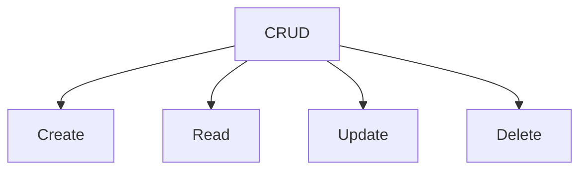

# 3. Grundläggande CRUD-operationer i MongoDB (45 min)

🟢


Övergripande frågeställning: Hur utför vi grundläggande Create, Read, Update och Delete (CRUD) operationer i MongoDB?

## 1. Introduktion till CRUD i MongoDB

CRUD står för Create, Read, Update och Delete, vilket representerar de fyra grundläggande operationerna för datahantering i databaser.

<div class="mermaid" style="zoom: 1.4;">



</div>

## 2. Create (Insättning av dokument)

### insertOne()

Används för att infoga ett enskilt dokument i en kollektion.

Syntax:

```javascript
db.collection.insertOne(document)
```

Exempel:

```javascript
db.users.insertOne({
    name: "Alice",
    age: 30,
    email: "alice@example.com"
})
```

### insertMany()

Används för att infoga flera dokument samtidigt.

Syntax:

```javascript
db.collection.insertMany([document1, document2, ...])
```

Exempel:

```javascript
db.users.insertMany([
    { name: "Bob", age: 25, email: "bob@example.com" },
    { name: "Charlie", age: 35, email: "charlie@example.com" }
])
```

## 3. Read (Hämtning av dokument)

### find()

Används för att hämta dokument från en kollektion.

Syntax:

```javascript
db.collection.find(query, projection)
```

Exempel:

```javascript
// Hämta alla användare
db.users.find()

// Hämta användare som är äldre än 30
db.users.find({ age: { $gt: 30 } })

// Hämta endast namn och email för användare
db.users.find({}, { name: 1, email: 1, _id: 0 })
```

### findOne()

Hämtar det första dokumentet som matchar frågan.

Syntax:

```javascript
db.collection.findOne(query, projection)
```

Exempel:

```javascript
db.users.findOne({ name: "Alice" })
```

## 4. Update (Uppdatering av dokument)

### updateOne()

Uppdaterar ett enskilt dokument som matchar frågan.

Syntax:

```javascript
db.collection.updateOne(filter, update, options)
```

Exempel:

```javascript
db.users.updateOne(
    { name: "Alice" },
    { $set: { age: 31 } }
)
```

### updateMany()

Uppdaterar alla dokument som matchar frågan.

Syntax:

```javascript
db.collection.updateMany(filter, update, options)
```

Exempel:

```javascript
db.users.updateMany(
    { age: { $lt: 30 } },
    { $inc: { age: 1 } }
)
```

## 5. Delete (Borttagning av dokument)

### deleteOne()

Tar bort ett enskilt dokument som matchar frågan.

Syntax:

```javascript
db.collection.deleteOne(filter)
```

Exempel:

```javascript
db.users.deleteOne({ name: "Alice" })
```

### deleteMany()

Tar bort alla dokument som matchar frågan.

Syntax:

```javascript
db.collection.deleteMany(filter)
```

Exempel:

```javascript
db.users.deleteMany({ age: { $gt: 50 } })
```

## 6. Aggregation Pipeline

Aggregation pipeline är ett kraftfullt verktyg för att bearbeta och analysera data i MongoDB.

Syntax:

```javascript
db.collection.aggregate([stage1, stage2, ...])
```

Exempel:

```javascript
db.users.aggregate([
    { $match: { age: { $gt: 25 } } },
    { $group: { _id: null, averageAge: { $avg: "$age" } } }
])
```

Plats för interaktiv demonstration:
[Här kan en live-demonstration av CRUD-operationer i MongoDB genomföras]

---

# Övningsuppgifter

## Övning: Create - Infoga dokument

1. Använd `insertOne()` för att lägga till en ny bok i en kollektion kallad "books":

   ```javascript

**15-minutersregeln:** Fastnar du i mer än 15 minuter — fråga klassen, sen AI, sen mig. I den ordningen.
   db.books.insertOne({
       title: "The Great Gatsby",
       author: "F. Scott Fitzgerald",
       year: 1925,
       genres: ["novel", "fiction"]
   })
   ```

2. Använd `insertMany()` för att lägga till flera böcker samtidigt:

   ```javascript
   db.books.insertMany([
       {
           title: "To Kill a Mockingbird",
           author: "Harper Lee",
           year: 1960,
           genres: ["novel", "fiction"]
       },
       {
           title: "1984",
           author: "George Orwell",
           year: 1949,
           genres: ["science fiction", "dystopian"]
       }
   ])
   ```

## Övning: Read - Hämta dokument

1. Använd `find()` för att hämta alla böcker:

   ```javascript
   db.books.find()
   ```

2. Använd `find()` med ett villkor för att hämta böcker publicerade efter 1950:

   ```javascript
   db.books.find({ year: { $gt: 1950 } })
   ```

3. Använd `findOne()` för att hämta en specifik bok:

   ```javascript
   db.books.findOne({ title: "1984" })
   ```

## Övning: Update - Uppdatera dokument

1. Använd `updateOne()` för att lägga till ett nytt fält "rating" till en bok:

   ```javascript
   db.books.updateOne(
       { title: "The Great Gatsby" },
       { $set: { rating: 4.5 } }
   )
   ```

2. Använd `updateMany()` för att lägga till ett "lastUpdated" fält till alla böcker:

   ```javascript
   db.books.updateMany(
       {},
       { $set: { lastUpdated: new Date() } }
   )
   ```

## Övning: Delete - Ta bort dokument

1. Använd `deleteOne()` för att ta bort en specifik bok:

   ```javascript
   db.books.deleteOne({ title: "1984" })
   ```

2. Använd `deleteMany()` för att ta bort alla böcker publicerade före 1950:

   ```javascript
   db.books.deleteMany({ year: { $lt: 1950 } })
   ```

## Övning: Aggregation Pipeline

Använd aggregation pipeline för att beräkna genomsnittligt publiceringsår för böckerna:

```javascript
db.books.aggregate([
    { $group: { _id: null, averageYear: { $avg: "$year" } } }
])
```

## Reflektionsövning

Reflektera över följande frågor:

1. Hur skiljer sig CRUD-operationer i MongoDB från de i relationsdatabaser som MySQL?
2. Vilka fördelar och nackdelar ser du med MongoDB:s flexibla dokumentstruktur jämfört med tabellstrukturen i relationsdatabaser?
3. Hur kan aggregation pipeline vara användbar i realistiska scenarion?

Skriv ner dina tankar och diskutera dem med en klasskamrat.

---
Sådärja. Nu har du koll på det här. Nästa steg — testa själv. Det är då det fastnar.
