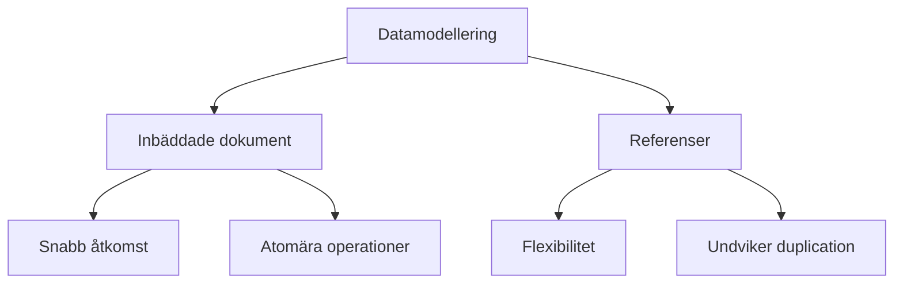

# 4. Datamodellering i MongoDB (45 min)

🟢


Övergripande frågeställning: Hur kan vi effektivt modellera data i MongoDB för att optimera prestanda och flexibilitet i vår applikation?

## 1. Introduktion till datamodellering i MongoDB

Datamodellering i MongoDB skiljer sig från traditionell relationsdatabasmodellering på grund av dess dokumentbaserade natur.

Huvudprinciper:

- Flexibel schemadesign
- Inbäddade dokument vs. referenser
- Denormalisering för prestandaoptimering

## 2. Inbäddade dokument vs. Referenser

### Inbäddade dokument

- Lagrar relaterad data i ett enda dokument
- Fördelar: Snabb åtkomst, atomära operationer
- Nackdelar: Potential för stora dokument

Exempel på inbäddat dokument:

```javascript
{
   _id: 1,
   name: "John Doe",
   address: {
      street: "123 Main St",
      city: "Anytown",
      country: "USA"
   }
}
```

### Referenser

- Lagrar relaterad data i separata dokument med referenser
- Fördelar: Flexibilitet, undviker duplication
- Nackdelar: Kräver flera queries för att hämta relaterad data

Exempel på referens:

```javascript
// Users collection
{
   _id: 1,
   name: "John Doe"
}

// Addresses collection
{
   _id: 100,
   user_id: 1,
   street: "123 Main St",
   city: "Anytown",
   country: "USA"
}
```

## 3. När ska man använda inbäddning vs. referenser?

Använd inbäddning när:

- Data har en "tillhör till" relation
- Relaterad data är alltid använd tillsammans
- Prestandaoptimering för läsoperationer är kritisk

Använd referenser när:

- Data har en "har många" relation med potentiellt stort antal relaterade dokument
- Relaterad data används sällan tillsammans
- Data uppdateras ofta oberoende av varandra

<div class="mermaid" style="zoom: 1.4;">



</div>

## 4. Denormalisering i MongoDB

Denormalisering innebär att duplicera data för att förbättra läsprestanda.

Fördelar:

- Snabbare läsoperationer
- Minskar behovet av komplexa joins

Nackdelar:

- Ökad datalagring
- Potentiell inkonsistens vid uppdateringar

Exempel på denormalisering:

```javascript
{
   _id: 1,
   title: "MongoDB Basics",
   author: {
      name: "John Smith",
      email: "john@example.com"
   },
   comments: [
      {
         user: "Alice",
         text: "Great article!",
         date: ISODate("2023-05-01")
      },
      {
         user: "Bob",
         text: "Very helpful",
         date: ISODate("2023-05-02")
      }
   ]
}
```

## 5. Hantering av många-till-många relationer

Många-till-många relationer kan hanteras på flera sätt i MongoDB:

1. Array av referenser
2. Inbäddade arrays
3. Separat kopplingsdokument

Exempel på array av referenser:

```javascript
// Books collection
{
   _id: 1,
   title: "MongoDB Design Patterns",
   author_ids: [10, 11]
}

// Authors collection
{
   _id: 10,
   name: "John Doe"
}
{
   _id: 11,
   name: "Jane Smith"
}
```

## 6. Schemadesign och validering

Trots MongoDB:s flexibla schema, är det ofta bra att definiera en struktur:

- Använd JSON Schema för att validera dokument
- Balansera mellan flexibilitet och konsistens

Exempel på schema validering:

```javascript
db.createCollection("users", {
   validator: {
      $jsonSchema: {
         bsonType: "object",
         required: [ "name", "email" ],
         properties: {
            name: {
               bsonType: "string",
               description: "must be a string and is required"
            },
            email: {
               bsonType: "string",
               pattern: "^.+@.+$",
               description: "must be a valid email address"
            }
         }
      }
   }
})
```

Plats för interaktiv demonstration:
[Här kan en interaktiv demonstration av olika datamodelleringsstrategier implementeras, till exempel genom att visa hur olika modelleringar påverkar prestanda och flexibilitet.]

---

## Övningsuppgifter: Datamodellering i MongoDB

## Övning 1: Inbäddade dokument vs. Referenser

Scenario: Du ska designa en databas för en bloggplattform. Varje bloggpost har en författare och flera kommentarer.

1. Skapa en datamodell med inbäddade dokument för både författare och kommentarer.
2. Skapa en alternativ datamodell med referenser för både författare och kommentarer.
3. Diskutera för- och nackdelar med båda approacherna.

## Övning 2: Modellering av många-till-många relation

Scenario: Du ska modellera en databas för ett bibliotekssystem där böcker kan ha flera författare och författare kan ha skrivit flera böcker.

1. Skapa en datamodell som representerar denna många-till-många relation.
2. Skriv exempel på hur du skulle lägga till en ny bok med flera författare.
3. Beskriv hur du skulle hämta alla böcker av en specifik författare.

## Övning 3: Schemadesign och validering

Skapa ett JSON Schema för en "product" kollektion med följande krav:

- Produkten måste ha ett namn (string) och ett pris (number).
- Produkten kan ha en beskrivning (string) och en array av kategorier (strings).
- Priset måste vara positivt.
- Namn och beskrivning får inte vara tomma strängar.

## Reflektionsövning

Tänk igenom följande frågor:

1. Hur skiljer sig datamodellering i MongoDB från traditionell relationsmodellering?
2. Vilka faktorer bör man överväga när man väljer mellan inbäddade dokument och referenser?
3. Hur kan denormalisering påverka databasens prestanda och underhåll?
4. Vilka utmaningar kan uppstå vid modellering av komplexa relationer i MongoDB, och hur kan dessa hanteras?

---
Det här är grunden. Öva på den, lek med koden, gör misstag. Det är så du lär dig.
