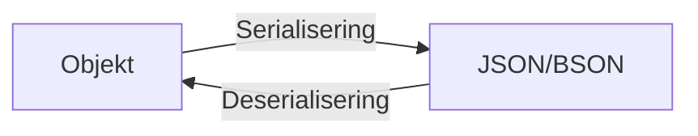
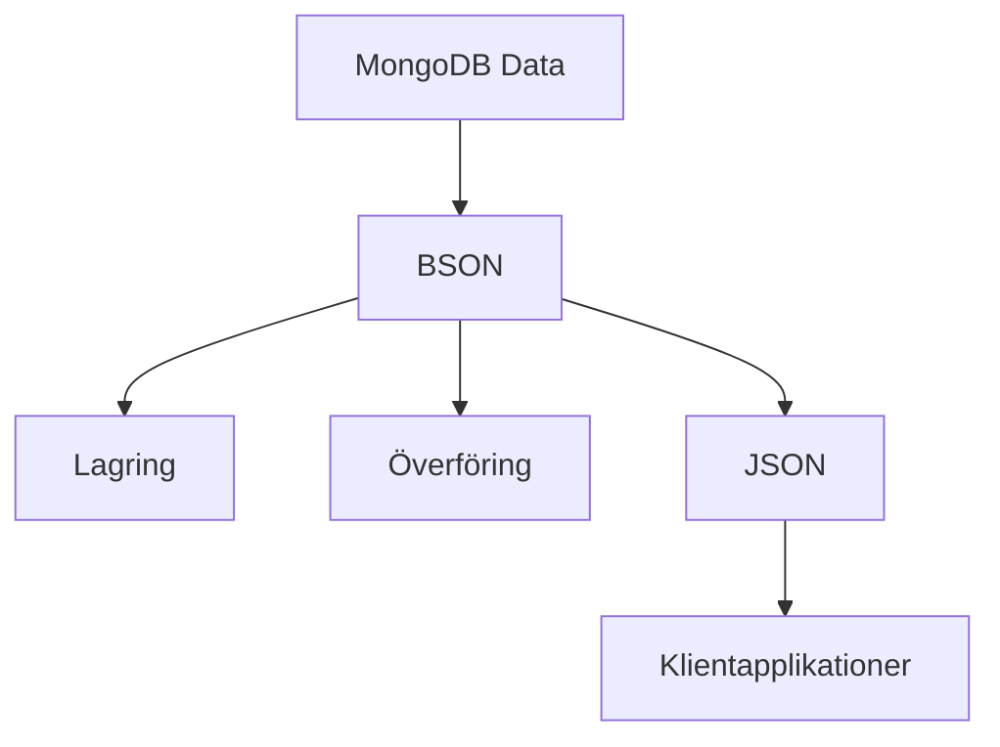

---

title: 5. Serialisering och deserialisering av objekt i MongoDB (45 min)
author: Marcus Ackre Medina
type: lecture
topic: databaser
difficulty: 1
language: mixed
status: adapted
marcus_voice: true
source: "Old_courses/2025/csharp/2_db/lectures/06_db_nosql_mongodb/5_serializing.md"
description: "Övergripande frågeställning: Hur hanterar MongoDB serialisering och deserialisering av objekt, och hur påverkar detta datalagring och -hämtning?"
tags: ["databaser", "deserialisering", "javascript", "min)", "mongodb", "objekt", "serialisering", "serializing", "visual-studio"]
week_fit: []
---

# 5. Serialisering och deserialisering av objekt i MongoDB (45 min)

🟢


Övergripande frågeställning: Hur hanterar MongoDB serialisering och deserialisering av objekt, och hur påverkar detta datalagring och -hämtning?

## 1. Introduktion till serialisering och deserialisering

Serialisering är processen att konvertera ett objekt till ett format som kan lagras eller överföras.
Deserialisering är den omvända processen, att återskapa objektet från det serialiserade formatet.

<div class="mermaid" style="zoom: 1.4;">



</div>

## 2. JSON och BSON i MongoDB

### JSON (JavaScript Object Notation)

- Lättläsligt, textbaserat dataformat
- Används för att representera strukturerad data
- Stödjer grundläggande datatyper: objekt, arrayer, strängar, nummer, booleaner, null

### BSON (Binary JSON)

- Binärt format som används internt i MongoDB
- Utökar JSON med ytterligare datatyper
- Mer effektiv lagring och bearbetning än JSON

<div class="mermaid" style="zoom: 1.4;">



</div>

## 3. Datatyper i MongoDB

MongoDB stödjer flera datatyper, inklusive:

- String
- Number (Integer, Float, Double)
- Boolean
- Date
- Array
- Object (Embedded/Nested document)
- ObjectId
- Null

Exempel på ett dokument med olika datatyper:

```javascript
{
  _id: ObjectId("5f8a7b2b9d3b2c1b1c9b4567"),
  name: "John Doe",
  age: 30,
  isStudent: false,
  birthDate: ISODate("1993-05-15T00:00:00Z"),
  grades: [85, 90, 78],
  address: {
    street: "123 Main St",
    city: "Anytown"
  }
}
```

## 4. Serialisering i MongoDB

När data skickas till MongoDB:

1. Klienten konverterar data till JSON
2. MongoDB driver serialiserar JSON till BSON
3. BSON-data lagras i databasen

## 5. Deserialisering i MongoDB

När data hämtas från MongoDB:

1. BSON-data hämtas från databasen
2. MongoDB driver deserialiserar BSON till JSON
3. Klienten konverterar JSON till lämpligt format (t.ex. objekt i programmeringsspråket)

## 6. Hantering av särskilda datatyper

### ObjectId

- Unik identifierare för dokument i MongoDB
- Genereras automatiskt om inte specificerad
- 12 byte: tidsstämpel (4), maskin-id (3), process-id (2), räknare (3)

### Date

- Lagras som millisekunder sedan Unix epoch
- Konverteras automatiskt mellan klient och server

### Inbäddade dokument och arrayer

- Kan nästlas i flera nivåer
- Möjliggör komplexa datastrukturer

## 7. Utmaningar och överväganden

- Datatypskonvertering mellan olika system
- Hantering av stora dokument (16MB gräns per dokument)
- Prestandaoptimering vid serialisering/deserialisering av komplexa objekt

Plats för interaktiv demonstration:
[Här kan en live-demonstration av serialisering och deserialisering i MongoDB genomföras]

---

# Övningsuppgifter

## Övning 1: Skapa och hämta komplexa dokument

1. Skapa ett dokument som representerar en produkt med olika datatyper:

```javascript

**15-minutersregeln:** Fastnar du i mer än 15 minuter — fråga klassen, sen AI, sen mig. I den ordningen.
db.products.insertOne({
  name: "Smart TV",
  price: 599.99,
  inStock: true,
  specs: {
    screenSize: 55,
    resolution: "4K",
    connectivity: ["WiFi", "Bluetooth", "HDMI"]
  },
  releaseDate: new Date("2023-03-15"),
  reviews: [
    { user: "Alice", rating: 4.5, comment: "Great picture quality!" },
    { user: "Bob", rating: 4.0, comment: "Easy to set up." }
  ]
})
```

2. Hämta och visa dokumentet:

```javascript
var product = db.products.findOne({ name: "Smart TV" });
printjson(product);
```

3. Observera hur olika datatyper representeras i utskriften.

## Övning 2: Arbeta med ObjectId

1. Skapa ett nytt dokument och låt MongoDB generera ett ObjectId:

```javascript
var result = db.users.insertOne({
  username: "johndoe",
  email: "john@example.com"
});

print("Inserted document ID: " + result.insertedId);
```

2. Hämta dokumentet med det genererade ObjectId:

```javascript
var user = db.users.findOne({ _id: result.insertedId });
printjson(user);
```

3. Jämför det ursprungliga ObjectId med det hämtade dokumentets _id.

## Övning 3: Hantera datum

1. Infoga ett dokument med flera datumfält:

```javascript
db.events.insertOne({
  name: "Tech Conference",
  startDate: new Date("2023-09-15T09:00:00Z"),
  endDate: new Date("2023-09-17T18:00:00Z"),
  registrationDeadline: new Date("2023-08-31")
})
```

2. Hämta och visa dokumentet:

```javascript
var event = db.events.findOne({ name: "Tech Conference" });
printjson(event);
```

3. Utför en sökning baserad på datum:

```javascript
var upcomingEvents = db.events.find({
  startDate: { $gte: new Date() }
}).toArray();

print("Upcoming events: " + upcomingEvents.length);
```

## Övning 4: Nästlade dokument och arrayer

1. Skapa ett dokument med djupt nästlade strukturer:

```javascript
db.companies.insertOne({
  name: "Tech Innovations Inc.",
  founded: 2010,
  locations: [
    {
      city: "San Francisco",
      employees: 100,
      departments: ["R&D", "Marketing", "Sales"]
    },
    {
      city: "New York",
      employees: 50,
      departments: ["Finance", "HR"]
    }
  ],
  products: {
    software: ["App A", "App B"],
    hardware: ["Device X", "Device Y"]
  }
})
```

2. Hämta specifik information från den nästlade strukturen:

```javascript
var sfOffice = db.companies.findOne(
  { name: "Tech Innovations Inc.", "locations.city": "San Francisco" },
  { "locations.$": 1 }
);
printjson(sfOffice);
```

## Reflektionsövning

Reflektera över följande frågor:

1. Hur skiljer sig hanteringen av datatyper i MongoDB jämfört med relationsdatabaser du har erfarenhet av?
2. Vilka fördelar och utmaningar ser du med MongoDB:s flexibla dokumentstruktur när det gäller serialisering och deserialisering?
3. Hur kan kunskap om serialisering och deserialisering hjälpa dig att designa mer effektiva datamodeller i MongoDB?

Skriv ner dina tankar och diskutera dem med en klasskamrat.

Quiz:

1. Vad är huvudsyftet med serialisering i databaskontext?
   A) Att kryptera data
   B) Att komprimera data
   C) Att konvertera objekt till ett format som kan lagras eller överföras
   D) Att indexera data för snabbare sökningar

<details>
<summary>Svar:</summary>
Rätt svar: C
</details>

2. Vilket format används internt i MongoDB för att lagra data?
   A) XML
   B) JSON
   C) BSON
   D) CSV

<details>
<summary>Svar:</summary>
Rätt svar: C
</details>

3. Vilken datatyp används vanligtvis för att representera unika identifierare i MongoDB?
   A) Integer
   B) String
   C) ObjectId
   D) UUID

<details>
<summary>Svar:</summary>
Rätt svar: C
</details>

4. Hur hanterar MongoDB datum?
   A) Som textsträngar
   B) Som Unix tidsstämplar
   C) Som millisekunder sedan Unix epoch
   D) Som ISO 8601 strängar

<details>
<summary>Svar:</summary>
Rätt svar: C
</details>

5. Vilken av följande är INTE en utmaning vid serialisering och deserialisering i MongoDB?
   A) Datatypskonvertering mellan olika system
   B) Hantering av stora dokument
   C) Prestandaoptimering för komplexa objekt
   D) Begränsning av antalet nästlade nivåer

<details>
<summary>Svar:</summary>
Rätt svar: D
</details>

---
Sådärja. Nu har du koll på det här. Nästa steg — testa själv. Det är då det fastnar.
