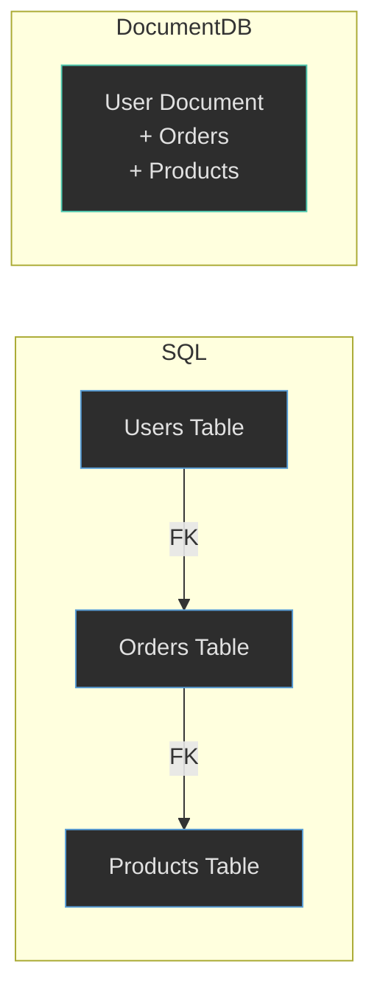

---

title: Dokumentdatabaser
author: Marcus Ackre Medina
type: lecture
topic: databaser
difficulty: 1
language: mixed
status: adapted
marcus_voice: true
source: "Old_courses/2025/2_databases/lectures/MongoDB/document_databases_marp.md"
description: ""
tags: ["csharp", "databaser", "databases", "document", "dokumentdatabaser", "installation", "marp", "ssh", "verktyg", "visual-studio"]
week_fit: []
---


# **Dokumentdatabaser**

### När Entity Framework Blir Krångligt
---

## **Ni Har Kämpat Med EF**

Låt mig gissa vad ni har stött på:

- Migrations som kraschar
- Foreign key constraints från helvetet
- Komplexa joins som tar evigheter
- Datamodeller som ändras hela tiden

Hängde jag med?

---

## **Entity Framework: Styrka & Svaghet**

EF är fantastiskt när:

- Du har en **stabil** datamodell
- Du behöver **strikta** relationer
- Du vill ha **ACID**-garantier
- Du bygger affärskritiska system

Men det blir jobbigt när data är **flexibel** och **föränderlig**.

---

## **Scenariot: E-handelssystem**

Tänk dig att ni bygger en webshop.

Produkter har olika attribut beroende på kategori:

- **T-shirt**: Storlek, färg, material
- **Laptop**: RAM, processor, skärmstorlek
- **Bok**: Författare, sidantal, ISBN

Hur modellerar man det i SQL?

---

## **Lösning 1: EAV-Modellen (Evil)**

**E**ntity-**A**ttribute-**V**alue pattern.

Varje attribut blir en rad i en separat tabell.

```csharp
public class ProductAttribute {
    public int Id { get; set; }
    public int ProductId { get; set; }
    public string AttributeName { get; set; }
    public string AttributeValue { get; set; }
}
```

Det funkar. Men det är **smärtsamt**.

---

## **Varför Är EAV Jobbigt?**

För att hämta **en** produkt måste du:

1. Joina `Products` med `ProductAttributes`
2. Filtrera på AttributeName
3. Pivota resultatet

Det blir typ 15 rader SQL för något som borde vara enkelt.

Och EF blir **långsam** som tusan.

---

## **Lösning 2: JSON-Kolumner I SQL**

Modern SQL stöder JSON:

```csharp
public class Product {
    public int Id { get; set; }
    public string Name { get; set; }
    public string AttributesJson { get; set; }
}
```

Bättre!

Men nu tappar du:
- Schema-validering
- Indexering på attribut
- Type safety

---

## **Lösning 3: Dokumentdatabas**

Vad om varje produkt bara var ett **dokument**?

```json
{
  "_id": "prod_123",
  "name": "MacBook Pro",
  "category": "laptop",
  "price": 25000,
  "attributes": {
    "ram": "16GB",
    "processor": "M2",
    "screen": "14 inch"
  }
}
```

Inga joins. Ingen EAV. Bara ren data.

---

## **Vad Är En Dokumentdatabas?**

Tänk på det som en **jättestor mapp med JSON-filer**.

Varje fil är ett dokument.

Dokument är grupperade i **collections** (som tabeller).

Men!

Dokument i samma collection **behöver inte** ha samma struktur.

---

## **SQL vs Dokument: Visuellt**

<div class="mermaid">



</div>

---

## **Fördelar Med Dokumentdatabaser**

- **Flexibilitet**: Lägg till fält när du vill
- **Prestanda**: Ingen join för relaterad data
- **Skalbarhet**: Lättare att distribuera horisontellt
- **Utvecklarhastighet**: Mindre schema-migration-drama

Låter perfekt, eller hur?

---

## **Nackdelar Med Dokumentdatabaser**

- **Ingen schema-validering** (du kan spara vad som helst)
- **Data-duplicering** (samma info på flera ställen)
- **Svårare relationer** (inga foreign keys som hjälper dig)
- **Konsistensrisker** (vad händer om uppdateringar misslyckas delvis?)

Det finns **alltid** tradeoffs.

---

## **När Blir EF Riktigt Krångligt?**

Låt mig ge er några **verkliga** scenarion:

1. **CMS-system** där användare skapar egna fälttyper
2. **Loggningssystem** med olika loggformat
3. **IoT-data** från 100+ olika sensorer
4. **Social media feeds** med olika typer av inlägg

Försök modellera det i SQL. Jag väntar. ☕

---

## **Scenario: Bloggsystem**

En blogg har:
- Artiklar (titel, text, författare)
- Kommentarer (text, användare, datum)
- Taggar (fritext)

I SQL behöver du:
- `Articles` (tabell)
- `Comments` (tabell med FK till Articles)
- `Tags` (tabell)
- `ArticleTags` (join-tabell)

---

## **Samma Blogg I MongoDB**

Ett enda dokument:

```json
{
  "_id": "article_42",
  "title": "Varför NoSQL Är Coolt",
  "author": "Marcus",
  "tags": ["databaser", "nosql", "mongodb"],
  "comments": [
    { "user": "Luke", "text": "Bra artikel!" },
    { "user": "Leia", "text": "Håller med!" }
  ]
}
```

En query. Allt data.

---

## **Men Marcus, Vad Händer Med Normalisering?**

Bra fråga!

I SQL lär vi ju ut att **inte duplicera data**.

I dokumentdatabaser gör vi det **medvetet**.

Varför?

För att **läshastighet** ofta är viktigare än **diskutrymme**.

---

## **Denormalisering: Ett Exempel**

SQL-approach:

```sql
SELECT u.Name, o.OrderDate, p.ProductName
FROM Users u
JOIN Orders o ON u.Id = o.UserId
JOIN OrderItems oi ON o.Id = oi.OrderId
JOIN Products p ON oi.ProductId = p.Id
```

MongoDB-approach:

```json
{
  "user": "Luke",
  "order": { "date": "2025-01-15", "product": "Lightsaber" }
}
```

---

## **Tradeoff: Konsistens**

Vad händer om Luke byter namn?

I SQL: Ändra **en** rad i `Users`.

I MongoDB: Hitta **alla dokument** där Luke nämns och uppdatera.

Det är **priset** för snabbhet.

---

## **ACID vs BASE**

SQL databaser lovar **ACID**:
- **A**tomicity
- **C**onsistency
- **I**solation
- **D**urability

NoSQL använder **BASE**:
- **B**asically **A**vailable
- **S**oft state
- **E**ventually consistent

Mindre garantier, men större flexibilitet.

---

## **När Ska Jag Välja Vad?**

**SQL + EF** om:
- Bank, bokningssystem, e-handel (pengar involverade!)
- Strikta regler och validering krävs
- Relationer är centrala

**Dokumentdatabas** om:
- CMS, bloggar, loggning
- Datastrukturen ändras ofta
- Läshastighet är kritisk

---

## **Hybridlösningar Finns Också**

Många moderna system använder **båda**:

- Användardata & orders: SQL (affärskritiskt)
- Produktkataloger: MongoDB (flexibelt)
- Loggning & analytics: NoSQL (stora mängder)

Välj rätt verktyg för rätt jobb.

---

## **Entity Framework: När Blir Det Riktigt Segt?**

I min erfarenhet blir EF jobbigt när:

1. **Migrations går sönder** (speciellt i team)
2. **Komplexa joins** gör queries långsamma
3. **Circular dependencies** i relationer
4. **N+1 problem** (varje rad triggar ny query)

Känner ni igen något?

---

## **N+1 Problemet: EF Smärta**

```csharp
var users = context.Users.ToList();
foreach (var user in users) {
    // Detta kör EN query per user!
    var orders = user.Orders.ToList();
}
```

Lösning: Eager loading med `.Include()`.

Men vad händer om du har 5 nivåer av relationer?

Queryn blir **monstruös**.

---

## **Samma Problem Finns Inte I MongoDB**

```javascript
db.users.find({})
```

Varje user-dokument har redan sina orders inbäddade.

En query. Klart.

Men!

Om orders är stora och varierar, blir dokumenten tunga.

Återigen: **tradeoffs**.

---

## **Migrations: EF Huvudvärk**

Scenario: Tre utvecklare jobbar parallellt.

Alla skapar migrations.

Någon mergar före dig.

Nu fungerar inte din migration längre.

Sound familiar?

---

## **MongoDB: Inga Migrations**

Du kan lägga till fält **när du vill**.

Gamla dokument har inte det nya fältet?

Inget problem! Koden hanterar det.

```csharp
var value = document.GetValueOrDefault("newField", "default");
```

Men!

Nu har du **implicit** schema i koden istället.

---

## **Så, Är SQL Dött?**

**Nej.**

Inte ens lite.

SQL är fortfarande bäst för:
- Transaktioner
- Komplex business logic
- Strikta scheman

Men för vissa use cases är dokumentdatabaser **mycket** bättre.

---

## **Vad Händer Härnäst?**

Nästa lektion dyker vi in i **MongoDB**:

- Installera Compass (GUI)
- Skapa en Atlas-databas (cloud)
- Köra MongoDB i Docker
- Skriva queries och uppdatera dokument

Hands-on. Praktiskt. Kul.

---

## **Tänk På Detta Innan Nästa Gång**

Fundera på ett projekt ni gjort tidigare.

Var det **jobbigt** att modellera i SQL?

Skulle det ha varit enklare som dokument?

Vi diskuterar nästa lektion.

---

## **Ni Klarar Det Här**

Jag vet att EF kan vara frustrerande ibland.

Men ni har lärt er något **oerhört värdefullt**:

Hur databaser **egentligen** fungerar.

MongoDB kommer kännas både bekant och annorlunda.

Koda vilt framåt! 🚀

---

## **Källor & Resurser**

Allt material är skapat för utbildningssyfte.

**Bild på titelsidan**: Foto av Pixabay via [Pexels](https://www.pexels.com/photo/data-codes-through-eyeglasses-1181671/)

**Mer läsning**:
- [MongoDB vs SQL](https://www.mongodb.com/compare/mongodb-mysql)
- [When to Use Document Databases](https://aws.amazon.com/nosql/document/)
- [EF Core Performance](https://learn.microsoft.com/en-us/ef/core/performance/)
