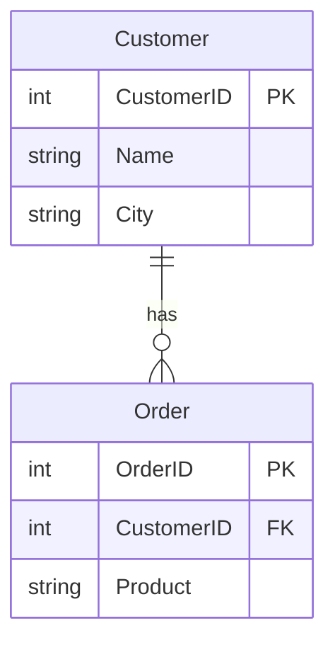
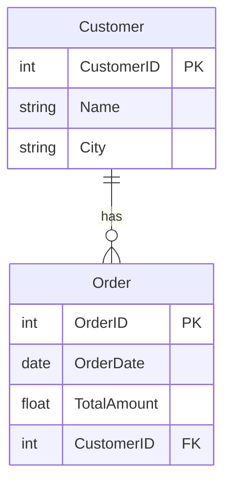

---

title: 2. Relationsmodellen och ER-diagram
author: Marcus Ackre Medina
type: lecture
topic: databaser
difficulty: 1
language: mermaid
status: adapted
marcus_voice: true
source: "Old_courses/2025/csharp/2_db/lectures/01_introduction/2_relations_er_diagram.md"
description: "Relationsmodellen är en metod för att strukturera och organisera data i databaser. Den bygger på koncept från mängdlära och predikatlogik."
tags: ["databaser", "diagram", "er-diagram", "relations", "relationsmodellen", "ssh", "verktyg", "visual-studio"]
week_fit: []
---

# 2. Relationsmodellen och ER-diagram

🟢


## Föreläsningsmaterial (20 minuter)

### 2.1 Relationsmodellen

Relationsmodellen är en metod för att strukturera och organisera data i databaser. Den bygger på koncept från mängdlära och predikatlogik.

#### 2.1.1 Grundläggande koncept

1. **Tabell (Relation):**

   - En samling relaterad data organiserad i rader och kolumner.
   - Exempel: En "Kunder" tabell.

   | ID  | Name          | Yrke  | Land    | AvdelningsId |
   | --- | ------------- | ----- | ------- | ------------ |
   | 1   | Saga Norén    | Polis | Sverige | 1337         |
   | 2   | Martin Rohde  | Polis | Danmark | 42           |
   | 3   | Linn Björkman | Polis | Sverige | 1337         |
   | 4   | Henrik Sabroe | Polis | Danmark | 42           |

2. **Rad (Tupel):**

   - En enskild post i en tabell.
   - Representerar en specifik instans av den entitet tabellen beskriver.
   - Exempel: En specifik kunds information.

   | ID  | Name            | Yrke           | Land    | AvdelningsId |
   | --- | --------------- | -------------- | ------- | ------------ |
   | 1   | Stefan Lindberg | Socialarbetare | Sverige | 1337         |

3. **Kolumn (Attribut):**

   - Definierar en specifik typ av data som lagras för varje rad.
   - Exempel: "Namn", "E-post", "Telefon" i kundtabellen.

   | Name       |
   | ---------- |
   | Saga Norén |

4. **Primärnyckel (Primary Key):**

   - Ett unikt identifierande attribut för varje rad.
   - Exempel: "ID" i persontabellen.

   | ID  |
   | --- |
   | 1   |

5. **Främmande nyckel (Foreign Key):**

   - Ett attribut som refererar till en primärnyckel i en annan tabell.
   - Skapar relationer mellan tabeller.

   | AvdelningsId |
   | ------------ |
   | 1337         |

#### 2.1.2 Exempel på en enkel relationsdatabas

Table: Customers

| CustomerID | Name           | City       |
| ---------- | -------------- | ---------- |
| 1          | Eva Thörnblad  | Stockholm  |
| 2          | Göran Wass     | Silverhöjd |
| 3          | Pekka Koljonen | Silverhöjd |

Table: Orders

| OrderID | CustomerID | Product  |
| ------- | ---------- | -------- |
| 1       | 1          | Book     |
| 2       | 2          | Pen      |
| 3       | 1          | Notebook |

<div class="mermaid" style="zoom: 1.4;">



</div>

### 2.2 Relationer mellan tabeller

1. **En-till-en (1:1):**

   - En rad i en tabell motsvarar exakt en rad i en annan tabell.
   - Exempel: En person och deras pass.

2. **En-till-många (1:N):**

   - En rad i en tabell kan relatera till flera rader i en annan tabell.
   - Exempel: En kund kan ha flera ordrar.

3. **Många-till-många (M:N):**
   - Flera rader i en tabell kan relatera till flera rader i en annan tabell.
   - Exempel: Studenter och kurser (en student kan läsa flera kurser, en kurs kan ha flera studenter).

### 2.3 ER-diagram (Entity-Relationship Diagram)

ER-diagram är ett visuellt verktyg för att representera datastrukturen i en databas.

#### 2.3.1 Syftet med ER-diagram

- Visualisera databasstruktur.
- Kommunicera databasdesign mellan utvecklare och intressenter.
- Planera och dokumentera databaser.

#### 2.3.2 Grundläggande symboler och notation

1. **Entitet:**

   - Representeras av en rektangel.
   - Motsvarar en tabell i databasen.
   - Exempel: [Customer]

2. **Attribut:**

   - Representeras av en oval kopplad till en entitet.
   - Motsvarar kolumner i en tabell.
   - Exempel: (Name) kopplad till [Customer]

3. **Relation:**

   - Representeras av en romb mellan entiteter.
   - Visar hur entiteter är kopplade till varandra.
   - Exempel: [Customer] -- (Lägger) -- [Order]

4. **Kardinalitet:**
   - Visar typen av relation mellan entiteter.
   - Vanliga notationer: 1 (exakt en), M eller \* (många), 0..1 (noll eller en)
   - Exempel: [Kund] 1 -- M [Order] (En kund kan ha många ordrar)

```
[Customer]----<orders>----[Order]
 |                         |
 |                         |
 |                         |
(ID)                     (ID)
(Name)                   (Date)
(Phone)                (TotalPrice)
```

<div class="mermaid" style="zoom: 1.4;">



</div>

---

## Övningsuppgifter (25 minuter)

### Övning 1: Identifiera relationer

**Instruktioner:**
I par, identifiera relationstypen (1:1, 1:N, M:N) för följande scenarier:

1. Land - Huvudstad
2. Författare - Bok
3. Student - Kurs
4. Anställd - Personnummer
5. Produkt - Leverantör

**Diskussion:**
Gå igenom svaren tillsammans och diskutera eventuella olika tolkningar.

### Övning 2: Skapa ett ER-diagram

**Instruktioner:**
Skapa ett enkelt ER-diagram för ett bibliotekssystem. Inkludera följande entiteter:

- Bok
- Författare
- Låntagare
- Utlåning

För varje entitet, lägg till minst tre relevanta attribut. Rita relationerna mellan entiteterna och ange kardinalitet.

**Redovisning:**
Be några deltagare att presentera sina diagram. Diskutera likheter och skillnader i designvalen.

### Avslutande diskussion

- Reflektera över fördelarna med att använda ER-diagram i databasdesign.
- Diskutera potentiella utmaningar vid skapandet av ER-diagram för komplexa system.
- Fundera på hur ER-diagram kan underlätta kommunikationen mellan olika intressenter i ett projekt.

---
Och kom ihåg: allt vi gått igenom här är grunden. Resten bygger på det. Så var inte rädd att experimentera.
