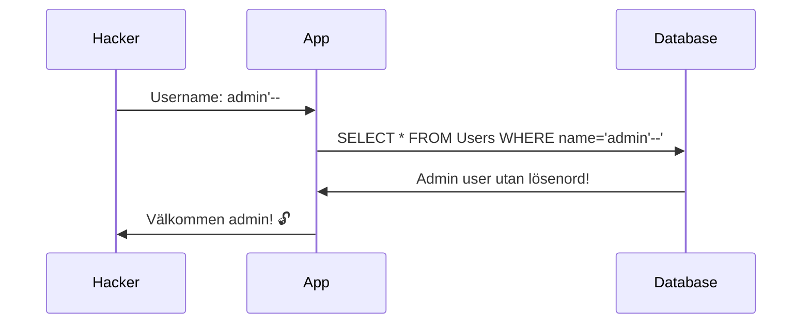

---

title: Fort Knox Protocol 🔐
author: Marcus Ackre Medina
type: lecture
topic: databaser
difficulty: 1
language: mixed
status: adapted
marcus_voice: true
source: "Old_courses/2025/2_databases/lectures/ef_core/part2_mysql_docker/lecture/02_security_backup_marp.md"
description: "- ✅ Root-användare + SuperSecret123"
tags: ["backup", "bash", "databaser", "fort", "git", "installation", "knox", "marp", "protocol", "security"]
week_fit: []
---

# Fort Knox Protocol 🔐

🟢


---

## MySQL Säkerhet & Backup

*Fredag Workshop - Del 2 av 2*
---

## Igår vs Idag

**Igår (Torsdag):**
- ✅ Docker + MySQL setup
- ✅ Migration från SQLite
- ✅ Root-användare + SuperSecret123
- ⚠️ INGEN säkerhet!

**Idag (Fredag):**
1. **Bobby Tables** - SQL Injection & EF skydd
2. **Read-Only Users** - Minsta behörighet-principen
3. **Backup & Restore** - Skydda datan
4. **Secrets Management** - Hårdkoda aldrig lösenord!

**Mål:** Från "Hello World" till Fort Knox! 💪

---

## Dagens Agenda

**Del 1: Bobby Tables (20 min)**
- Vad är SQL Injection?
- Hur EF Core skyddar oss
- När vi ändå kan bli hackade

**Del 2: Användarbehörigheter (20 min)**
- Root = farligt
- Skapa read-only user
- Skapa app-user med begränsade rättigheter

**Del 3: Backup & Restore (20 min)**
- mysqldump via Docker
- Återställa från backup
- Automatiska backups

---

## Bobby Tables - Klassikern 🧑‍💻

<div class="mermaid">



</div>

**xkcd.com/327** - "Her name is Robert'); DROP TABLE Students;--"

---

## SQL Injection Exempel

**Osäker kod (RAW SQL):**
```csharp
var heroName = Console.ReadLine(); // Användaren skriver: "Thanos' OR '1'='1"

using var connection = new MySqlConnection(connectionString);
connection.Open();

var sql = $"SELECT * FROM Heroes WHERE HeroName = '{heroName}'";
var command = new MySqlCommand(sql, connection);
var reader = command.ExecuteReader();
```

**Resultatet:**
```sql
SELECT * FROM Heroes WHERE HeroName = 'Thanos' OR '1'='1'
```

**Returnerar ALLA hjältar!** 😱

---

## Hur EF Core Skyddar Oss

**Säker kod (EF Core):**
```csharp
var heroName = Console.ReadLine(); // Användaren skriver: "Thanos' OR '1'='1"

var hero = db.Heroes
    .FirstOrDefault(h => h.HeroName == heroName);
```

**EF genererar:**
```sql
SELECT * FROM Heroes WHERE HeroName = @p0
-- Parameter @p0 = "Thanos' OR '1'='1"
```

**Resultat:** Ingen träff! EF använder **parametriserade queries**! ✅

---

## När EF INTE Skyddar

**Farlig kod:**
```csharp
var heroName = Console.ReadLine(); // Bobby Tables gör sitt...

var heroes = db.Heroes
    .FromSqlRaw($"SELECT * FROM Heroes WHERE HeroName = '{heroName}'")
    .ToList();
```

**Aldrig göra:**
- String interpolation i `FromSqlRaw`
- Konkatenera användarinput till SQL

**Gör istället:**
```csharp
var heroes = db.Heroes
    .FromSqlInterpolated($"SELECT * FROM Heroes WHERE HeroName = {heroName}")
    .ToList();
```

**Eller ännu bättre:** Använd LINQ! 🎯

---

## Root-användaren - Varför Farligt?

**Vad är root?**
- Superadmin med ALLA rättigheter
- Kan skapa/radera databaser
- Kan skapa/radera användare
- Kan ändra behörigheter

**Problem:**
```csharp
var connectionString = "Server=localhost;Database=heroesdb;" +
                      "User=root;Password=SuperSecret123;";
```

**Om hackare kommer in:**
1. Kan radera ALLA databaser
2. Kan skapa nya admin-användare
3. Kan exfiltrera all data
4. Kan stänga ner hela servern

**Lösning:** Principen om minsta behörighet!

---

## Principen om Minsta Behörighet

**Least Privilege Principle:**
*"Ge bara de rättigheter som absolut behövs - inget mer!"*

**Exempel:**

| Användare | Behörigheter | Användningsområde |
|-----------|-------------|-------------------|
| root | ALL | Endast för setup/migrations |
| app_user | SELECT, INSERT, UPDATE, DELETE | Din Heroes-app |
| readonly_user | SELECT | Rapporter/Analytics |
| backup_user | LOCK TABLES, SELECT | Backup-script |

**Varför?**
- Hackare som kommer in via app kan bara påverka app-data
- Ingen kan råka radera databaser
- Audit trail - vem gjorde vad?

---

## Skapa Read-Only User

**Logga in som root:**
```bash
docker exec -it mysql-heroes mysql -uroot -pSuperSecret123
```

**Skapa användare:**
```sql
CREATE USER 'readonly'@'%' IDENTIFIED BY 'ReadOnly123';
```

**Ge SELECT-rättigheter:**
```sql
GRANT SELECT ON heroesdb.* TO 'readonly'@'%';
FLUSH PRIVILEGES;
```

**Testa:**
```sql
EXIT;
```

```bash
docker exec -it mysql-heroes mysql -ureadonly -pReadOnly123 heroesdb
```

---

## Read-Only User - Vad Kan Den?

**Funkar:**
```sql
SELECT * FROM Heroes;
SELECT * FROM Addresses;
```

**Funkar INTE:**
```sql
INSERT INTO Heroes (RealName, HeroName, Phone)
VALUES ('Wade Wilson', 'Deadpool', '555-CHIMICHANGA');
-- ERROR 1142: INSERT command denied to user 'readonly'
```

```sql
UPDATE Heroes SET Phone = '555-HACK' WHERE Id = 1;
-- ERROR 1142: UPDATE command denied to user 'readonly'
```

```sql
DELETE FROM Heroes WHERE Id = 1;
-- ERROR 1142: DELETE command denied to user 'readonly'
```

**Perfekt för rapporter! 📊**

---

## Skapa App User

**Samma process, fler rättigheter:**
```sql
CREATE USER 'heroapp'@'%' IDENTIFIED BY 'HeroApp456';

GRANT SELECT, INSERT, UPDATE, DELETE ON heroesdb.* TO 'heroapp'@'%';

FLUSH PRIVILEGES;
```

**Vad kan heroapp INTE göra?**
- ❌ CREATE/DROP DATABASE
- ❌ CREATE/DROP TABLE (migrations kräver root!)
- ❌ ALTER TABLE
- ❌ Ändra användare/behörigheter

**Workflow:**
1. Migrations: root-användare
2. Drift: heroapp-användare

---

## Uppdatera HeroContext.cs

**Före (root):**
```csharp
var connectionString = "Server=localhost;Database=heroesdb;" +
                      "User=root;Password=SuperSecret123;";
```

**Efter (app user):**
```csharp
var connectionString = "Server=localhost;Database=heroesdb;" +
                      "User=heroapp;Password=HeroApp456;";
```

**Testa appen:**
```bash
dotnet run
# CRUD fungerar!
```

**Testa migrations:**
```bash
dotnet ef migrations add TestMigration
# Funkar! (genererar bara kod)

dotnet ef database update
# KRASCHAR! heroapp kan inte ändra schema!
```

---

## Migrations-strategi

**Utveckling:**
```csharp
#if DEBUG
    var connectionString = "Server=localhost;Database=heroesdb;" +
                          "User=root;Password=SuperSecret123;";
#else
    var connectionString = "Server=localhost;Database=heroesdb;" +
                          "User=heroapp;Password=HeroApp456;";
#endif
```

**Eller separata miljöer:**
- **Development:** root (lokalt)
- **Production:** heroapp (deployment)

**Migrations körs separat i produktion** (via CI/CD med root-credentials)

---

## Backup - Varför Viktigt?

**Scenarion som kräver backup:**
1. 💥 **Hårdvarukrasch** - Servern dör
2. 🐛 **Bug i koden** - DELETE utan WHERE (oops!)
3. 🧑‍💻 **Hackare** - Ransomware krypterar databasen
4. 👤 **Mänskligt fel** - "Jag testade DROP TABLE i produktion..."
5. 🔥 **Disaster** - Datacentret brinner

**3-2-1 Regeln:**
- **3** kopior av data
- **2** olika media (disk + cloud)
- **1** offsite (geografiskt separerad)

---

## mysqldump - MySQL Backup Tool

**Syntax:**
```bash
mysqldump -u[user] -p[password] [database] > backup.sql
```

**Med Docker:**
```bash
docker exec mysql-heroes mysqldump -uroot -pSuperSecret123 heroesdb \
  > heroes_backup_$(date +%Y%m%d_%H%M%S).sql
```

**Resultat:**
```
heroes_backup_20250116_143022.sql
```

**Innehåll:**
- CREATE TABLE statements
- INSERT statements med all data
- Komplett återställningsbar snapshot

---

## Backup Demo

**Gör backup:**
```bash
docker exec mysql-heroes mysqldump -uroot -pSuperSecret123 heroesdb \
  > heroes_backup.sql
```

**Kolla filen:**
```bash
head -n 30 heroes_backup.sql
```

**Ser ut som:**
```sql
-- MySQL dump 10.13  Distrib 8.0.40, for Linux (x86_64)
--
-- Host: localhost    Database: heroesdb
-- ------------------------------------------------------

DROP TABLE IF EXISTS `Heroes`;
CREATE TABLE `Heroes` (
  `Id` int NOT NULL AUTO_INCREMENT,
  `RealName` longtext NOT NULL,
  `HeroName` longtext NOT NULL,
  `Phone` longtext NOT NULL,
  PRIMARY KEY (`Id`)
) ENGINE=InnoDB AUTO_INCREMENT=2 DEFAULT CHARSET=utf8mb4;

INSERT INTO `Heroes` VALUES (1,'Tony Stark','Iron Man','555-STARK');
```

---

## Restore - Återställa Backup

**Scenario:** "Shit! Jag körde DELETE FROM Heroes utan WHERE!" 😱

**Återställ från backup:**
```bash
docker exec -i mysql-heroes mysql -uroot -pSuperSecret123 heroesdb \
  < heroes_backup.sql
```

**Steg-för-steg vad som händer:**
1. Läser backup-filen
2. Kör DROP TABLE (tar bort befintliga)
3. Kör CREATE TABLE (skapar nya)
4. Kör INSERT (återställer data)

**Resultat:** Databasen exakt som när backupen gjordes! 🎉

---

## Live Backup Test

**1. Kolla nuvarande data:**
```bash
docker exec -it mysql-heroes mysql -uroot -pSuperSecret123 heroesdb \
  -e "SELECT * FROM Heroes;"
```

**2. GÖR BACKUP:**
```bash
docker exec mysql-heroes mysqldump -uroot -pSuperSecret123 heroesdb \
  > before_disaster.sql
```

**3. SIMULERA KATASTROF:**
```bash
docker exec -it mysql-heroes mysql -uroot -pSuperSecret123 heroesdb \
  -e "DELETE FROM Heroes;"
```

**4. PANIK:** 😱

---

## Live Backup Test (Forts.)

**5. ÅTERSTÄLL:**
```bash
docker exec -i mysql-heroes mysql -uroot -pSuperSecret123 heroesdb \
  < before_disaster.sql
```

**6. KOLLA:**
```bash
docker exec -it mysql-heroes mysql -uroot -pSuperSecret123 heroesdb \
  -e "SELECT * FROM Heroes;"
```

**7. ANDAS UT:** 😌

**Tony Stark är tillbaka!**

---

## Automatiska Backups

**Linux/Mac (crontab):**
```bash
# Varje dag kl 02:00
0 2 * * * docker exec mysql-heroes mysqldump -uroot -pSuperSecret123 heroesdb \
  > /backups/heroes_$(date +\%Y\%m\%d).sql
```

**Windows (Task Scheduler):**
```batch

**15-minutersregeln:** Fastnar du i mer än 15 minuter — fråga klassen, sen AI, sen mig. I den ordningen.
@echo off
set BACKUP_DIR=C:\backups
set TIMESTAMP=%date:~0,4%%date:~5,2%%date:~8,2%

docker exec mysql-heroes mysqldump -uroot -pSuperSecret123 heroesdb ^
  > %BACKUP_DIR%\heroes_%TIMESTAMP%.sql
```

**Retention policy:**
- Behåll dagliga backups 7 dagar
- Behåll veckovisa backups 4 veckor
- Behåll månatliga backups 12 månader

---

## Secrets Management - Problemet

**ALDRIG göra:**
```csharp
// HeroContext.cs
var connectionString = "Server=localhost;Database=heroesdb;" +
                      "User=root;Password=SuperSecret123;"; // 😱
```

**Varför farligt?**
1. Commitas till Git → alla ser lösenordet
2. GitHub scanner efter secrets → varnar
3. Hackare söker på "Password=" i GitHub
4. Kan inte ha olika lösenord för dev/prod

**Lösning:** Environment Variables & Secrets!

---

## Environment Variables

**appsettings.json:**
```json
{
  "ConnectionStrings": {
    "HeroesDb": "Server=localhost;Database=heroesdb;User=heroapp;Password=PLACEHOLDER;"
  }
}
```

**HeroContext.cs:**
```csharp
protected override void OnConfiguring(DbContextOptionsBuilder optionsBuilder)
{
    var connectionString = Environment.GetEnvironmentVariable("HEROES_DB_CONNECTION")
        ?? throw new InvalidOperationException("DB connection string saknas!");

    optionsBuilder.UseMySql(connectionString,
        ServerVersion.AutoDetect(connectionString));
}
```

---

## Sätta Environment Variables

**Development (Linux/Mac):**
```bash
export HEROES_DB_CONNECTION="Server=localhost;Database=heroesdb;User=root;Password=SuperSecret123;"
dotnet run
```

**Development (Windows PowerShell):**
```powershell
$env:HEROES_DB_CONNECTION="Server=localhost;Database=heroesdb;User=root;Password=SuperSecret123;"
dotnet run
```

**Permanent (Linux/Mac - ~/.bashrc):**
```bash
echo 'export HEROES_DB_CONNECTION="..."' >> ~/.bashrc
```

**Permanent (Windows - System Properties → Environment Variables)**

---

## .NET User Secrets (Development)

**Installera verktyg:**
```bash
dotnet user-secrets init
```

**Lägg till secret:**
```bash
dotnet user-secrets set "ConnectionStrings:HeroesDb" \
  "Server=localhost;Database=heroesdb;User=root;Password=SuperSecret123;"
```

**HeroContext.cs:**
```csharp
protected override void OnConfiguring(DbContextOptionsBuilder optionsBuilder)
{
    var configuration = new ConfigurationBuilder()
        .AddUserSecrets<HeroContext>()
        .Build();

    var connectionString = configuration["ConnectionStrings:HeroesDb"];
    optionsBuilder.UseMySql(connectionString, ServerVersion.AutoDetect(connectionString));
}
```

**Secrets lagras:** `%APPDATA%\Microsoft\UserSecrets\` (INTE i repo!)

---

## Production Secrets

**Azure:**
- Azure Key Vault
- App Service Configuration

**AWS:**
- AWS Secrets Manager
- Systems Manager Parameter Store

**Kubernetes:**
- Sealed Secrets
- External Secrets Operator

**Docker Compose:**
```yaml
services:
  app:
    environment:
      - HEROES_DB_CONNECTION=${DB_CONNECTION}
    secrets:
      - db_password
```

---

## Sammanfattning - Fort Knox Checklist

✅ **SQL Injection:**
- Använd EF LINQ (inte FromSqlRaw)
- Parametrisera queries om du måste köra raw SQL

✅ **Användarbehörigheter:**
- Root endast för migrations
- App-user för CRUD operations
- Read-only user för rapporter

✅ **Backup:**
- Dagliga automatiska backups (mysqldump)
- Testa återställning regelbundet
- 3-2-1 regel (3 kopior, 2 media, 1 offsite)

✅ **Secrets:**
- Aldrig hårdkoda lösenord
- Environment variables eller User Secrets
- Olika credentials för dev/prod

---

## Imorgon Fortsätter Vi...

**Nästa steg efter Fort Knox:**
- Connection pooling & performance
- Indexering för snabbare queries
- Database monitoring (slow query log)
- Docker Compose för multi-container apps

**Men idag:** Fort Knox-övningarna! 💪

---

## Workshop-tid! 🛠️

**Era uppgifter (5 övningar):**

1. **Docker MySQL Setup** - Från scratch till körande MySQL
2. **Migrera Heroes till MySQL** - Step-by-step migration
3. **Bobby Tables** - Testa SQL injection (säkert sätt!)
4. **Read-Only User** - Skapa och testa begränsad användare
5. **Backup & Restore** - Full disaster recovery simulation

**Alla övningar finns i `/exercises/`**

**Hjälp varandra! Fråga om ni kör fast!**

**Live demo följer →**

---
Sådärja. Nu har du koll på det här. Nästa steg — testa själv. Det är då det fastnar.
