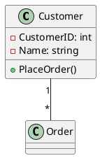

# UML — Programmeringstermer

## Unified Modeling Language (UML)
Standardiserat modelleringsspråk för att visualisera, specificera och dokumentera system.

## Klassdiagram
Diagramtyp som visar klasser, attribut, metoder och relationer mellan klasser i ett system.

## Association
Relation mellan två klasser, t.ex. "Customer har Orders". Markeras med ett streck `—` mellan klasserna.

## Multiplicitet (Kardinalitet)
Anger hur många instanser som är involverade i en relation:
- `1` — exakt en
- `*` — noll till många
- `0..1` — noll eller en
- `1..*` — en till många

## Aggregation
Del-helhet-relation där delen kan finnas utan helheten. Exempel: En Student kan finnas utan en Course. Markeras med `—◇—`.

## Composition
Starkare del-helhet-relation där delen inte kan finnas utan helheten. Exempel: Ett OrderItem kan inte finnas utan sin Order. Markeras med `—◆—`.

## Arv (Generalization)
En klass ärver från en annan klass. Markeras med `—▷—` där pilen pekar på basklassen.

## Navigerbarhet
Anger åt vilket håll en relation kan följas. Markeras med `—•—` eller `—→`.

## Stereotyp
Anpassning av UML för specifika ändamål, t.ex. `<<entity>>`, `<<interface>>`, `<<enum>>`.

## PlantUML
Textbaserat verktyg som genererar UML-diagram från ren textkod. Populärt för versionshantering av diagram.

