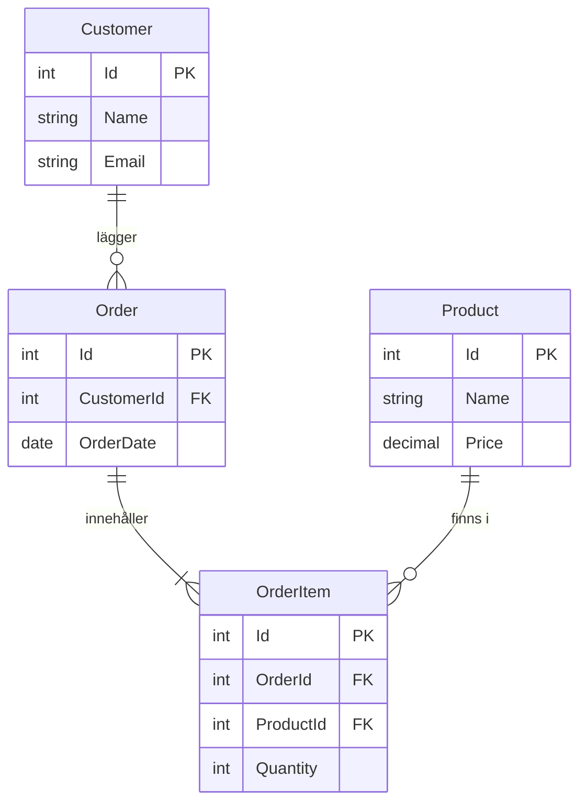

# 01 Intro Databaser — Programmeringstermer

## Databas · Databas

En organiserad samling av strukturerad data som lagras elektroniskt och kan sökas, sorteras och uppdateras.

Tänk på det som ett supersnabbt Excel-ark — men ett där tusentals personer kan söka och ändra data samtidigt utan att det kraschar.

```sql
-- En enkel databas har tabeller, precis som Excel har flikar
-- Tabellen "Products" kan ha tusentals rader och nås av hundratals användare
SELECT * FROM Products WHERE Price > 100;
```

Du behöver en databas så fort du vill spara data permanent och kunna söka i den snabbt. En textfil eller Excel räcker inte när din webbshop har 10 000 produkter och 500 order per dag.

> 🖼️ **Bild:** Jämförelse: Excel-ark med 5 rader vs databas med miljoner rader — och en stoppklocka som visar svarstiden

---

## DBMS · Databashanteringssystem

Database Management System — programvaran som hanterar databasen. Du pratar aldrig direkt med filerna på disken, du pratar alltid med DBMS:et.

Tänk på det som en bibliotekarie. Du ber om en bok (data), bibliotekarie hämtar den, stämplar ut den, håller koll på att den lämnas tillbaka. Du behöver inte veta exakt var boken stands i hyllan.

Vanliga DBMS: MySQL, SQL Server, PostgreSQL, SQLite.

> 🖼️ **Bild:** Diagram: App → DBMS → Databasfiler på disk. Pilen i mitten är "bibliotekarie"-lagret.

---

## RDBMS · Relationsdatabashanteringssystem

Relational Database Management System — ett DBMS där data lagras i tabeller med definierade relationer mellan dem.

Tänk på det som LEGO-bitar med specifika platser att koppla ihop. En kunds-bit kan kopplas till en order-bit, som kopplas till en produkt-bit. De kan kopplas ihop för att de är designade för det.

MySQL, SQL Server, PostgreSQL, SQLite — alla är RDBMS.



---

## SQL · SQL

Structured Query Language — standardspråket för att kommunicera med en relationsdatabas. Du SELECT:ar, INSERT:ar, UPDATE:ar och DELETE:ar.

Tänk på det som ett gemensamt "beställningsspråk" på en restaurang. Oavsett om kocken heter MySQL eller PostgreSQL förstår de samma beställning: "Jag vill ha en Customer med City = Göteborg."

```sql
-- Hämta alla kunder från Göteborg
SELECT Name, Email FROM Customer WHERE City = 'Göteborg';
```

SQL är så standardiserat att du kan lära dig det en gång och använda det i alla databaser, om än med små dialektskillnader.

---

## Tabell · Tabell (Table)

En datastruktur med rader och kolumner. Varje tabell representerar en sak (entitet) — kunder, produkter, ordrar.

Tänk på det som ett kontaktregister: varje rad är en person, varje kolumn är en uppgift om personen (namn, telefon, e-post). Skillnaden är att en databastabell kan ha miljoner rader och ändå sökas på en millisekund.

```sql
-- Tabellen Customer ser ut såhär i databasen:
-- | Id | Name       | Email              | City      |
-- | 1  | Anna Holm  | anna@example.com   | Göteborg  |
-- | 2  | Bo Lind    | bo@example.com     | Stockholm |
```

---

## Rad · Rad (Record / Row / Tuple)

En enstaka post i en tabell — en konkret instans av det tabellen beskriver.

Tänk på det som en person i kontaktregistret. En rad i Customer-tabellen = en specifik kund med alla sina uppgifter.

En rad kan inte existera utan en tabell, precis som en mening inte kan existera utan ett dokument.

---

## Kolumn · Kolumn (Column / Field / Attribute)

En egenskap hos alla poster i en tabell. Alla rader delar samma kolumner.

Tänk på det som en kolumn i ett kontaktregister: alla har ett fält för "telefonnummer", men alla har olika värden i det fältet.

Varje kolumn har en datatyp som bestämmer vad som får lagras: `INT`, `VARCHAR`, `DECIMAL`, `DATE`.

---

## Primary Key · Primärnyckel

En kolumn (eller kombination av kolumner) som unikt identifierar varje rad i tabellen. Inga två rader kan ha samma Primary Key, och den kan aldrig vara NULL.

Tänk på det som ett personnummer — det finns bara ett per person, och du kan alltid hitta rätt person med det.

```sql
CREATE TABLE Customer (
    Id INT PRIMARY KEY AUTO_INCREMENT,  -- Unik för varje kund
    Name VARCHAR(100) NOT NULL
);
```

Det vanligaste misstaget: att försöka använda namn eller e-post som Primary Key. Problemet uppstår när två kunder heter likadant, eller en person byter e-postadress.

> 🖼️ **Bild:** Tabell med rader markerade — en pil pekar på Id-kolumnen med texten "Primary Key — alltid unik"

---

## Foreign Key · Främmande nyckel

En kolumn som pekar på Primary Key i en annan tabell. Det är så tabeller kopplas ihop.

Tänk på det som en hänvisning i ett regelverk: "Se paragraf 3 i lagen om X." Foreign Key säger "se rad 7 i tabellen Customer."

```sql
CREATE TABLE Order (
    Id INT PRIMARY KEY AUTO_INCREMENT,
    CustomerId INT NOT NULL,
    FOREIGN KEY (CustomerId) REFERENCES Customer(Id)
);
-- CustomerId i Order pekar på Id i Customer
```

Om du försöker lägga till en Order med ett CustomerId som inte finns i Customer-tabellen — stoppar databasen dig. Det är meningen.

---

## CRUD · CRUD

Create, Read, Update, Delete — de fyra grundoperationerna mot all data. Alla system du någonsin bygger gör CRUD, oavsett om det är en mobilapp, webbtjänst eller databas.

Tänk på det som att redigera ett dokument: du skriver (Create), läser (Read), ändrar (Update) och tar bort (Delete).

```sql
-- Create
INSERT INTO Product (Name, Price) VALUES ('Kaffe', 29);

-- Read
SELECT * FROM Product WHERE Price < 50;

-- Update
UPDATE Product SET Price = 35 WHERE Id = 1;

-- Delete
DELETE FROM Product WHERE Id = 1;
```

---

## SQLite · SQLite

En filbaserad RDBMS utan server. Hela databasen bor i en enda fil på disk.

Tänk på det som ett fickformat av en databas — du bär med dig hela butiken i en liten plastpåse. Perfekt för appar och utvecklingsmiljöer, inte för webbservrar med hundratals användare.

SQLite används i Android, iOS, webbläsare, och är perfekt för att lära sig SQL utan att installera en hel server.

```sql
-- SQLite funkar precis som MySQL — samma SQL-syntax
-- Skillnaden är att det inte krävs en server
SELECT * FROM Product;
```

---

## MySQL · MySQL

En populär, gratis RDBMS med server. Världens mest använda databas i webbapplikationer.

Tänk på det som ett riktigt bageri med en bakerikök (server) som kan hantera beställningar från hundratals kunder (applikationer) samtidigt.

MySQL används av WordPress, Airbnb, Twitter (historiskt), och oräkneliga webbtjänster. Det du lär dig i MySQL gäller i stort sett direkt i PostgreSQL och SQL Server.

> 🖼️ **Bild:** Meme — "SQLite är som att laga mat hemma. MySQL är som att driva en restaurang."
