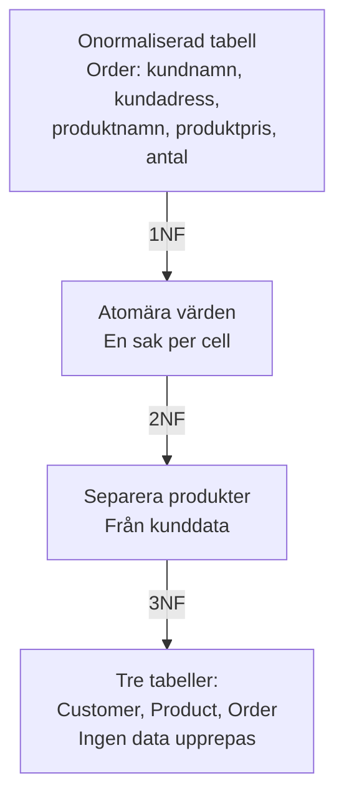

# 03 Normalisering och GDPR — Programmeringstermer

## Normalisering · Normalisering

Processen att strukturera en databas för att minimera onödig duplicering av data och minska risken för inkonsekvenser.

Tänk på det som att städa en liten lägenhet: du organiserar saker logiskt (kläder i garderob, mat i kylskåp) istället för att ha allt i en stor hög mitt på golvet. Normalisering organiserar din data.

Utan normalisering: en kunds adress finns på 47 ställen. När kunden byter adress — uppdaterar du 47 rader, eller missar du någon? Normalisering löser det.



---

## 1NF · Första normalformen

Krav: varje cell innehåller ett enda atomärt värde — inga listor, inga kommaseparerade värden, inga upprepade kolumner.

Tänk på det som att fylla i ett formulär: varje ruta är till för en sak. "Gillar pizza, pasta, sallad" ska inte stå i ett fält — det ska vara tre rader.

```sql
-- FEL: bryter 1NF
-- | OrderId | Products           |
-- | 1       | "Kaffe, Te, Juice" |

-- RÄTT: 1NF uppfylld
-- | OrderId | ProductId |
-- | 1       | 1         |
-- | 1       | 2         |
-- | 1       | 3         |
```

> 🖼️ **Bild:** Två tabeller sida vid sida — en med kommaseparerade värden i en cell (FEL), en med separata rader (RÄTT)

---

## 2NF · Andra normalformen

Krav: uppfyller 1NF, och alla icke-nyckelkolumner beror på HELA primärnyckeln — inte bara delar av den. Relevant när primärnyckeln är sammansatt (av flera kolumner).

Tänk på det som ett formulär med ett kombinerat kontonummer. Ditt namn ska inte bero på en del av kontonumret, det ska bero på hela kontot.

```sql
-- FEL: sammansatt PK (OrderId + ProductId), men ProductName beror bara på ProductId
-- | OrderId | ProductId | ProductName | Quantity |
-- Problem: ProductName beror inte på hela nyckeln

-- RÄTT: Flytta ProductName till Product-tabellen
-- Tabell Product: | ProductId | ProductName |
-- Tabell OrderItem: | OrderId | ProductId | Quantity |
```

---

## 3NF · Tredje normalformen

Krav: uppfyller 2NF, och inga icke-nyckelkolumner beror på andra icke-nyckelkolumner (inga transitiva beroenden).

Tänk på det som ett adressregister: postnummer → stad. Om du lagrar postnummer och stad i samma tabell som kunderna, duplicerar du stadsnamnet för varje kund med samma postnummer. Bryt ut det.

```sql
-- FEL: City beror på ZipCode, inte på CustomerId
-- | CustomerId | ZipCode | City      |
-- | 1          | 41102   | Göteborg  |
-- | 2          | 41102   | Göteborg  | <-- duplicerat

-- RÄTT: Bryt ut ZipCode → City till eget bord
-- | ZipCode | City      |
-- | 41102   | Göteborg  |
-- Customer-tabellen refererar bara till ZipCode
```

---

## Redundans · Redundans (Redundancy)

Onödig duplicering av samma data på flera ställen i databasen. Redundans är roten till inkonsekvens.

Tänk på det som att ha samma kontaktuppgift nedskriven på tio lappar. När numret ändras — hittar du alla lappar? Eller missar du en?

En välnormaliserad databas lagrar varje faktum exakt en gång. Ändrar du det på ett ställe — uppdateras det överallt.

---

## Transitivt beroende · Transitivt beroende

När kolumn C beror på kolumn B, och kolumn B beror på kolumn A (primärnyckeln). C beror alltså indirekt på A via B.

Tänk på det som ett påverkanskedjeproblem i politiken: lag A → krav B → konsekvens C. Om du ändrar A, ändras B, ändras C. Det är svårt att hålla koll på. I databaser: bryt kedjan.

```
CustomerId → ZipCode → City  (transitivt beroende)
Lösning: skapa en separat ZipCode-tabell
```

---

## Funktionellt beroende · Funktionellt beroende

Kolumn A bestämmer unikt värdet på kolumn B. Notation: `A → B`.

Tänk på det som personnummer → namn: när du anger personnumret, finns det bara ett möjligt namn. Personnummer bestämmer (funktionellt) namn.

```
CustomerId → Name        ✓ En kund har ett namn
CustomerId → City        ✓ En kund bor i en stad
ZipCode → City           ✓ Ett postnummer → en stad
Name → City              ✗ En person kan byta stad
```

---

## Denormalisering · Denormalisering

Att medvetet bryta normalisering för att förbättra läsprestanda. Du accepterar lite redundans för att slippa dyra JOIN-operationer.

Tänk på det som att ta med fika hemifrån till jobbet istället för att gå till kiosken varje gång. Lite redundant (du bär med dig mat), men sparar tid.

Används i analytics, rapportsystem och situationer där du läser extremt mycket men sällan skriver. Gör det medvetet och dokumenterat — annars är det bara en bugg.

```sql
-- Normaliserat: kräver JOIN varje gång
SELECT c.Name, o.Total FROM Customer c JOIN Order o ON c.Id = o.CustomerId;

-- Denormaliserat: CustomerName kopierad till Order-tabellen
SELECT CustomerName, Total FROM Order;  -- Ingen JOIN
```

---

## GDPR · GDPR (Dataskyddsförordningen)

General Data Protection Regulation — EU:s lag om hur personuppgifter får samlas in, lagras, användas och raderas. Gäller alla system som hanterar data om EU-medborgare.

Tänk på det som ett spelregelverk för hur du hanterar andras hemligheter: du får bara samla in vad du faktiskt behöver, du måste berätta varför, och personen har rätt att be dig radera allt.

Bryter du mot GDPR: böter upp till 4% av global omsättning eller 20 miljoner euro — det som är störst.

> 🖼️ **Bild:** Infografik: GDPR-principerna som ikoner — lås (säkerhet), sopkorg (raderingsrätt), formulär (samtycke), person (tillgång)

---

## Personuppgift · Personuppgift (Personal Data)

All information som direkt eller indirekt kan identifiera en levande person: namn, e-post, IP-adress, foto, personnummer, platsinformation.

Tänk på det som att allt som kan peka tillbaka till en person är personuppgifter. Även "blond kvinna i röd jacka" kan vara en personuppgift om det finns tillräckligt med kontext.

I din databas: behandla fält som Name, Email, Phone, Address, BirthDate alltid med GDPR i åtanke.

---

## Samtycke · Samtycke (Consent)

En av de sex rättsliga grunderna för att behandla personuppgifter. Personen måste aktivt ge sitt godkännande — förinbockade rutor räknas inte.

Tänk på det som en optin, inte en optout. "Du är nyanmäld till nyhetsbrev om du inte klickar ur" är inte giltigt samtycke.

---

## Raderingsrätten · Rätt till radering (Right to be Forgotten)

En persons rätt att begära att deras personuppgifter raderas från alla system — om det inte finns lagliga skäl att behålla dem.

Tänk på det som en "glöm mig"-knapp. Om en kund begär radering, räcker det inte att ta bort dem från Users-tabellen. Deras data kan finnas i Orders, Logs, Backups, Analytics...

```sql
-- Raderingsrätten kräver att du hittar ALL data om personen
SELECT * FROM Customer WHERE Email = 'anna@example.com';
SELECT * FROM Order WHERE CustomerId = 7;
SELECT * FROM Log WHERE UserId = 7;
-- ... och sedan raderar eller pseudonymiserar
```

---

## Pseudonymisering · Pseudonymisering

Ersätter identifierande uppgifter (namn, personnummer) med ett pseudonym-id. Data är fortfarande knuten till en person via en separat nyckel, men inte direkt läsbar.

Tänk på det som att döpa om alla deltagare i en studie till "Deltagare A", "Deltagare B". Du kan fortfarande analysera data, men utan att se vem som är vem.

Pseudonymiserad data är fortfarande personuppgifter under GDPR — den skiljer sig från anonymisering där kopplingen är permanent borttagen.

---

## Dataminimering · Dataminimering (Data Minimisation)

GDPR-principen att du bara får samla in den data du faktiskt behöver för ditt angivna syfte — ingenting mer.

Tänk på det som att bara ta kopia på det ID-kortet du faktiskt behöver se, inte fotokopiera hela plånboken. Behöver din webbshop verkligen kundens födelsedag för att skicka ett paket?

```sql
-- FEL: samla in allt "för att vara säker"
CREATE TABLE Customer (
    Id INT PRIMARY KEY,
    Name VARCHAR(100),
    Email VARCHAR(200),
    BirthDate DATE,        -- Behövs det verkligen?
    NationalId VARCHAR(20), -- Absolut inte om det inte krävs
    PhoneNumber VARCHAR(20)
);

-- RÄTT: bara det som faktiskt behövs för köpet
CREATE TABLE Customer (
    Id INT PRIMARY KEY,
    Name VARCHAR(100),
    Email VARCHAR(200),
    ShippingAddress VARCHAR(300)
);
```
