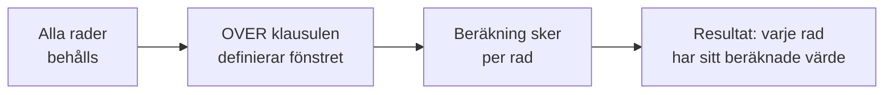
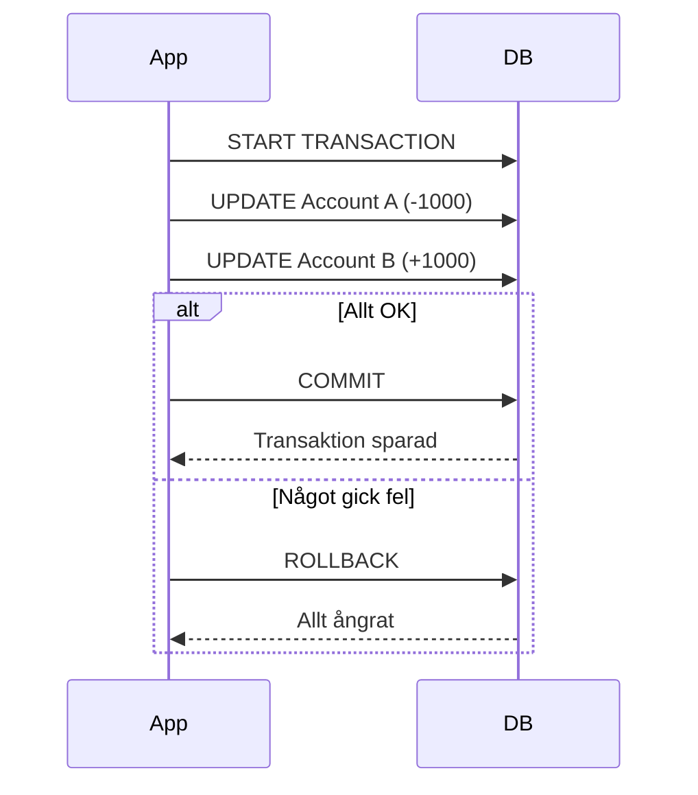
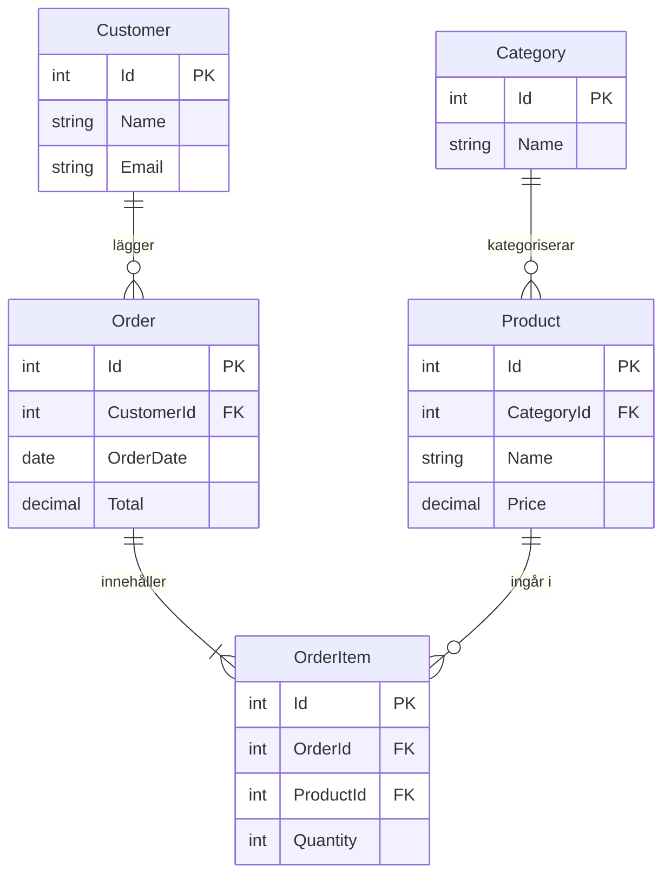

# 04 SQL Avancerat — Programmeringstermer

## Subquery · Underfråga

En SELECT-sats inuti en annan SELECT-sats. Innerfrågan körs först, och resultatet används av ytterfrågan.

Tänk på det som att fråga en kollega innan du svarar chefen: "Vad är snittpriset?" (innerfrågan) → "Ge mig alla produkter dyrare än det." (ytterfrågan).

```sql
-- Hämta alla produkter som kostar mer än genomsnittet
SELECT Name, Price
FROM Product
WHERE Price > (SELECT AVG(Price) FROM Product);

-- Hämta kunder som faktiskt har gjort en order
SELECT Name FROM Customer
WHERE Id IN (SELECT DISTINCT CustomerId FROM Order);
```

> 🖼️ **Bild:** Diagram som visar att innerfrågan körs och ger ett värde, som ytterfrågan sedan använder

---

## CTE · Common Table Expression

En tillfällig, namngiven resultatmängd som bara existerar under en query. Definieras med `WITH namn AS (...)` och gör komplexa frågor läsliga.

Tänk på det som att definiera ett begrepp i början av ett dokument: "Med 'aktiva kunder' menar vi kunder som beställt något senaste 30 dagarna." Sedan kan du använda det begreppet resten av texten.

```sql
WITH AktiveKunder AS (
    SELECT DISTINCT CustomerId
    FROM Order
    WHERE OrderDate >= CURDATE() - INTERVAL 30 DAY
)
SELECT c.Name, c.Email
FROM Customer c
JOIN AktiveKunder ak ON c.Id = ak.CustomerId;
```

CTE är ofta mer läslig än en subquery och kan återanvändas flera gånger i samma query. Inga prestandaskillnader mot subquery i de flesta situationer.

---

## Window Function · Fönsterfunktion

Beräknar ett värde för varje rad baserat på en grupp relaterade rader — utan att kollapsa resultatet som GROUP BY gör. Varje rad behåller sin identitet.

Tänk på det som ett löpband med ett rörligt fönster: för varje artikel på bandet tittar du bakåt och framåt i det synliga fönstret och beräknar något, men artikeln lämnar inte bandet.

```sql
-- Rangordna produkter inom varje kategori efter pris
SELECT
    Name,
    CategoryId,
    Price,
    RANK() OVER (PARTITION BY CategoryId ORDER BY Price DESC) AS Ranking
FROM Product;

-- Rullande 7-dagars försäljning
SELECT
    OrderDate,
    Total,
    SUM(Total) OVER (ORDER BY OrderDate ROWS BETWEEN 6 PRECEDING AND CURRENT ROW) AS Veckosum
FROM DailySales;
```



Vanliga window functions: `ROW_NUMBER()`, `RANK()`, `DENSE_RANK()`, `LAG()`, `LEAD()`, `SUM() OVER`, `AVG() OVER`.

---

## Stored Procedure · Sparad procedur

En sparad samling SQL-satser med ett namn — en slags funktion i databasen. Kan ta parametrar, innehålla logik och köras när som helst.

Tänk på det som ett recept: du skriver det en gång, sparar det, och kör det när du behöver laga den rätten. Du behöver inte skriva om hela instruktionen varje gång.

```sql
-- Skapa en stored procedure
CREATE PROCEDURE GetProductsByCategory(IN catId INT)
BEGIN
    SELECT Name, Price FROM Product WHERE CategoryId = catId;
END;

-- Köra den
CALL GetProductsByCategory(3);
```

Fördelar: återanvändbar kod, bättre prestanda (förkompilerad), minskad nätverkstrafik. Nackdel: svårare att versionshantera än applikationskod.

---

## Trigger · Trigger

En automatisk handling som körs när en specifik händelse inträffar i databasen: INSERT, UPDATE eller DELETE på en tabell.

Tänk på det som en larmklocka: du sätter upp en regel ("om någon öppnar det här kassaskåpet...") och databasen gör resten automatiskt utan att du behöver tänka på det.

```sql
-- Logga automatiskt varje prisändring
CREATE TRIGGER LogPrisandring
AFTER UPDATE ON Product
FOR EACH ROW
BEGIN
    IF OLD.Price != NEW.Price THEN
        INSERT INTO PriceLog (ProductId, OldPrice, NewPrice, ChangedAt)
        VALUES (NEW.Id, OLD.Price, NEW.Price, NOW());
    END IF;
END;
```

Triggers är kraftfulla men kan bli svåra att felsöka. Håll dem enkla och dokumenterade.

> 🖼️ **Bild:** Diagram: INSERT på tabell → trigger aktiveras automatiskt → logg skrivs

---

## View · Vy

En sparad SELECT-sats som ser ut och beter sig som en vanlig tabell. Data lagras inte i vyn — vyn är bara en namngiven fråga.

Tänk på det som ett favoritmärkt filter i din e-post: det är inte en kopia av mejlen, det är bara en sparad sökning som visar samma mejl varje gång du klickar.

```sql
-- Skapa en vy
CREATE VIEW AktivaProdukter AS
SELECT Id, Name, Price FROM Product WHERE IsActive = 1 AND Stock > 0;

-- Använd vyn som en vanlig tabell
SELECT * FROM AktivaProdukter WHERE Price < 100;
```

Vyer förenklar komplexa frågor, begränsar vad en användare ser (säkerhet), och gör koden mer läslig. Prestanda: en vy kompileras inte — samma query körs varje gång.

---

## Transaction · Transaktion

En grupp SQL-operationer som behandlas som en odelbar enhet. Antingen lyckas ALLA, eller misslyckas ALLA och allt rullas tillbaka.

Tänk på det som en banköverföring: du tar 1000 kr från konto A och sätter in på konto B. Antingen sker BÅDA stegen, eller INGET av dem. En transaktion som kraschade efter debiteringen men innan krediteringen vore en katastrof.

```sql
START TRANSACTION;

UPDATE Account SET Balance = Balance - 1000 WHERE Id = 1;
UPDATE Account SET Balance = Balance + 1000 WHERE Id = 2;

-- Om allt gick bra:
COMMIT;

-- Om något gick fel:
ROLLBACK;
```



ACID är transaktioners fyra garantier: Atomicity (allt eller inget), Consistency (databasen förblir konsistent), Isolation (transaktioner stör inte varandra), Durability (sparad data förblir sparad).

---

## Index · Index (avancerat)

En datastruktur som påskyndar sökningar på bekostnad av lite extra diskutrymme och långsammare INSERT/UPDATE.

Tänk på det som ett register i slutet av en bok: utan det läser du igenom hela boken för att hitta "kapillär". Med det hoppar du direkt till sidan.

```sql
-- Enkelt index på en kolumn
CREATE INDEX idx_email ON Customer(Email);

-- Sammansatt index (composite) — bra för WHERE på båda kolumnerna
CREATE INDEX idx_category_price ON Product(CategoryId, Price);

-- Ta bort index
DROP INDEX idx_email ON Customer;
```

När skapa index: kolumner du söker på ofta (WHERE), kolumner du JOIN:ar på, Foreign Keys. När inte: tabeller du skriver till extremt ofta, kolumner med få unika värden (Boolean, könskolumn).

> 🖼️ **Bild:** Graf: söktid utan index (linjär) vs med index (logaritmisk) när tabellen växer

---

## Full-Text Search · Fulltextsökning

Avancerad sökning i textkolumner med stöd för ordsökning, stemming (böjningsformer), och relevansrankning. Bättre än LIKE för riktig textsökning.

Tänk på det som skillnaden mellan Ctrl+F (LIKE) och Google (Full-Text Search). LIKE hittar exakta teckensträngar. Full-Text Search förstår att "löpning" och "löpare" är relaterade.

```sql
-- Aktivera full-text index
ALTER TABLE Product ADD FULLTEXT (Name, Description);

-- Sök med relevansrankning
SELECT Name, MATCH(Name, Description) AGAINST('espresso kaffe') AS Relevans
FROM Product
WHERE MATCH(Name, Description) AGAINST('espresso kaffe' IN NATURAL LANGUAGE MODE)
ORDER BY Relevans DESC;
```

---

## ER Diagram · Entity Relationship Diagram

Visuell representation av en databas: vilka tabeller som finns, deras kolumner, och hur de är kopplade till varandra.

Tänk på det som en kartritning av databasen. Innan du bygger ett hus ritar du upp det — på samma sätt ritar du ett ER-diagram innan du skapar tabellerna.



Rita alltid ER-diagrammet innan du skriver en enda CREATE TABLE. Fel i designen är billiga att fixa i ett diagram, dyra att fixa i produktion.
